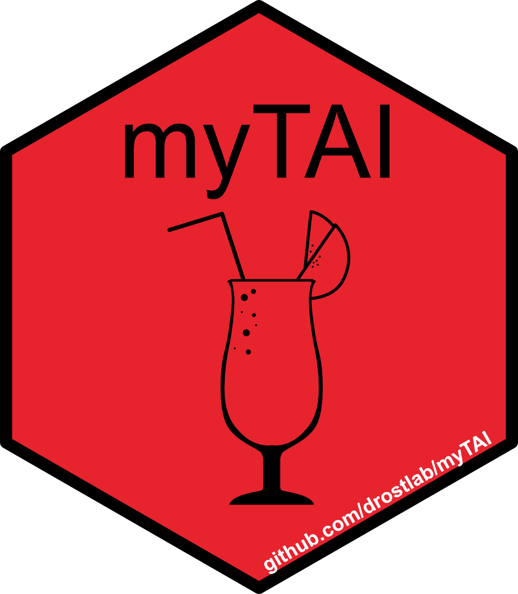
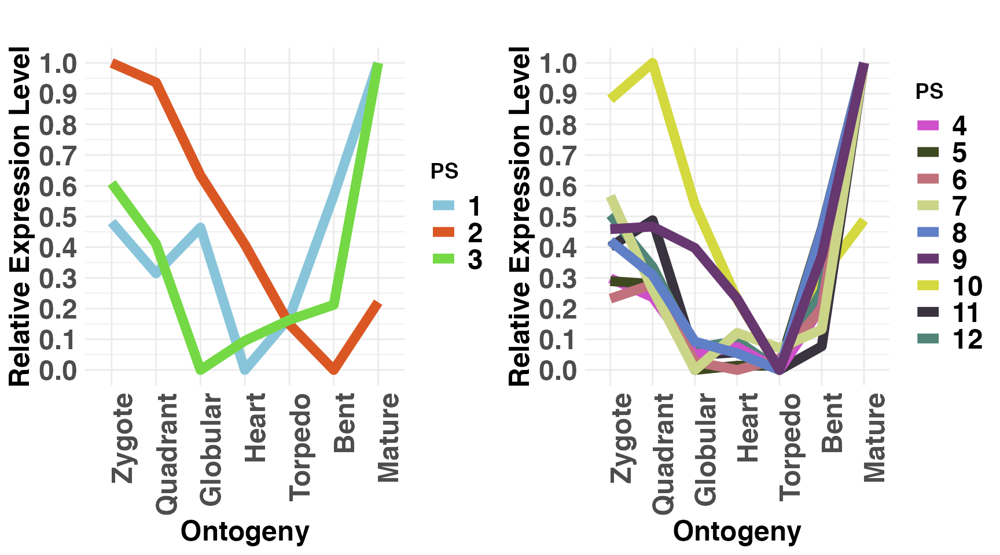

# myTAI 
[](https://github.com/r-hub/cranlogs.app)
[](https://github.com/r-hub/cranlogs.app)
[](https://academic.oup.com/bioinformatics/article/34/9/1589/4772684)
[](https://anaconda.org/bioconda/r-mytai)


# Evolutionary Transcriptomics with R

### Motivation

In the past years, a variety of studies aimed to uncover the molecular basis of morphological innovation and variation from the evolutionary developmental perspective. These studies often rely on transcriptomic data to establish the molecular patterns driving the complex biological processes underlying phenotypic plasticity.

Although transcriptome information is a useful start to study the molecular mechanisms underlying a biological process of interest (molecular phenotype), they rarely capture __how__ these expression patterns emerged in the first place or to __what extent__ they are possibly constrained, thereby neglecting the evolutionary history and developmental constraints of genes contributing to the overall pool of expressed transcripts. 

To overcome this limitation, the `myTAI` package introduces procedures summarized under the term `evolutionary transcriptomics` to integrate gene age information into classical gene expression analysis. `Gene age inference` can be performed with [various existing software](), but we recommend using [GenEra](https://github.com/josuebarrera/GenEra) or [orthomap](https://github.com/kullrich/orthomap), since they address published shortcomings of `gene age inference` ([see detailed discussion here](https://drostlab.github.io/myTAI/articles/Phylostratigraphy.html)). In addition, users can easily retrieve [previously precomputed gene age information](https://github.com/HajkD/published_phylomaps) via our data package [phylomapr](https://github.com/LotharukpongJS/phylomapr).

Evolutionary transcriptomics studies can serve as a first approach to screen _in silico_ for the potential existence of evolutionary and developmental constraints within a biological process of interest. This is achieved by quantifying transcriptome conservation patterns and their underlying gene sets in biological processes. The exploratory analysis functions implemented in `myTAI` provide users with a standardized, automated and statistically sound framework to detect and analyze patterns of evolutionary constraints in any transcriptome dataset of interest.

### Detailed documentation provided [here](https://drostlab.github.io/myTAI/articles/Introduction.html)

## Citation
Please cite the following paper when using `myTAI` for your own research. This will allow me to continue working on this software tool and will motivate me to extend its functionality and usability in the next years. Many thanks in advance!

> Drost et al. __myTAI: evolutionary transcriptomics with R__. _Bioinformatics_ 2018, 34 (9), 1589-1590. [doi:10.1093](https://academic.oup.com/bioinformatics/advance-article/doi/10.1093/bioinformatics/btx835/4772684)


### Dependencies

`myTAI` is using `OpenMP` to run cpp code in parallel, thus you might need to install additional software. 

**Mac:**
```bash
brew install llvm libomp
cd /usr/local/lib
ln -s /usr/local/opt/libomp/lib/libomp.dylib ./libomp.dylib
```

**Linux:**
1. Check if you have an OpenMP-enabled compiler: Open a terminal and run the command `gcc --version` or `g++ --version` to check if you have the GNU Compiler Collection (GCC) installed. OpenMP support is typically included in GCC.

    If you don't have GCC installed, you can install it using your distribution's package manager. For example, on Ubuntu, you can use sudo apt-get install build-essential to install GCC.

2. Install the libomp library: Open a terminal and run the command appropriate for your package manager:

    On Ubuntu or Debian-based systems: ```sudo apt-get install libomp-dev``` or ```sudo apt install libomp-dev```
   
    On Fedora or CentOS systems: ```sudo dnf install libomp-devel```
   
    On Arch Linux: ```sudo pacman -S libomp```

**Windows:**

On Windows, the most common OpenMP implementation is provided by Microsoft Visual C++ (MSVC) compiler, which includes OpenMP support by default. So, if you are using MSVC as your C++ compiler, you should have OpenMP support without any additional installations.

### Installation

Users can install `myTAI` from [CRAN](https://cran.r-project.org/web/packages/myTAI/index.html):


```r
# install myTAI 0.9.3
install.packages("myTAI", dependencies = TRUE)
```

### Short package description

Using `myTAI`, any existing or newly generated transcriptome dataset can be combined with evolutionary information (find [details here](https://drostlab.github.io/myTAI/articles/Introduction.html#retrieval-of-phylogenetic-or-taxonomic-information)) to retrieve novel insights about the evolutionary conservation of the transcriptome at hand. 

For the purpose of performing large scale evolutionary transcriptomics studies, the `myTAI` package implements the quantification, statistical assessment, and analytics functionality to allow researchers to study the evolution of biological processes by determining stages or periods of evolutionary conservation or variability in transcriptome data. 

We hope that `myTAI` will become the community standard tool to perform evolutionary transcriptomics studies and we are happy to add required functionality upon request.

### Scientific background

Today, phenomena such as morphological mutations, diseases or developmental processes are primarily investigated on the molecular level using transcriptomics approaches. Transcriptomes denote the total number of quantifiable transcripts present at a specific stage in a biological process. In disease or developmental (defect) studies, transcriptomes are usually measured over several time points. In treatment studies aiming to quantify differences in the transcriptome due to biotic stimuli, abiotic stimuli, or diseases usually treatment / disease versus non-treatment / non-disease transcriptomes are compared. In either case, comparing changes in transcriptomes over time or between treatments allows us to identify genes and gene regulatory mechanisms that might be involved in governing the biological process of investigation. Although classic transcriptomics studies are based on an established methodology, little is known about the evolution and conservation mechanisms underlying such transcriptomes. Understanding the evolutionary mechanism that change transcriptomes over time, however, might give us a new perspective on how diseases emerge in the first place or how morphological changes are triggered by changes of developmental transcriptomes.

Evolutionary transcriptomics aims to capture and quantify the evolutionary conservation of genes that contribute to the transcriptome during a specific stage of the biological process of interest. The resulting temporal conservation pattern
then enables to detect stages of development or other biological processes that
are evolutionarily conserved ([Drost et al., 2018](https://academic.oup.com/bioinformatics/advance-article/doi/10.1093/bioinformatics/btx835/4772684)). This quantification on the highest level is achieved through transcriptome indices (e.g. [Transcriptome Age Index or Transcriptome Divergence Index](https://drostlab.github.io/myTAI/articles/Introduction.html#transcriptome-age-index)) which aim to quantify the average evolutionary age [Barrera-Redondo et al., 2022](https://www.biorxiv.org/content/10.1101/2022.07.07.498977v1) or sequence conservation [Drost et al., 2015](https://academic.oup.com/mbe/article/32/5/1221/1125964) of genes that contribute to the transcriptome at a particular stage. In general, evolutionary transcriptomics can be used as a method to quantify the evolutionary conservation of transcriptomes at particular developmental stages and to investigate how transcriptomes underlying biological processes are constrained or channeled due to events in evolutionary history (Dollo's law) ([Drost et al., 2017](https://www.sciencedirect.com/science/article/pii/S0959437X16302040)).

__Please note, since myTAI relies on gene age inference and there has been an extensive debate about the best approaches for gene age inference in the last years,
please follow my [updated discussion about the gene age inference literature](https://drostlab.github.io/myTAI/articles/Phylostratigraphy.html). With [GenEra](https://github.com/josuebarrera/GenEra), we addressed all previously raised issues and we encourage users to run `GenEra` when aiming to infer gene ages for further `myTAI` analyses.__


## Install Developer Version

Some bug fixes or new functionality will not be available on CRAN yet, but in
the developer version here on GitHub. To download and install the most recent
version of `myTAI` run:

```r
# install developer version of myTAI
devtools::install_github("drostlab/myTAI")
```

## NEWS

The current status of the package as well as a detailed history of the
functionality of each version of `myTAI` can be found in the [NEWS](https://drostlab.github.io/myTAI/news/index.html) section.

## Tutorials

The following tutorials will provide use cases and detailed explanations of how to quantify transcriptome conservation with `myTAI` and how to interpret the results generated with this software tool.

- [Introduction to the myTAI Package](https://drostlab.github.io/myTAI/articles/Introduction.html)
- [Intermediate Concepts of Phylotranscriptomics](https://drostlab.github.io/myTAI/articles/Intermediate.html)
- [Advanced Topics of Phylotranscriptomics](https://drostlab.github.io/myTAI/articles/Advanced.html)
- [Perform Age Enrichment Analyses](https://drostlab.github.io/myTAI/articles/Enrichment.html)
- [Gene Expression Analysis with myTAI](https://drostlab.github.io/myTAI/articles/Expression.html)
- [Taxonomic Information Retrieval](https://drostlab.github.io/myTAI/articles/Taxonomy.html)
- [Discussing Genomic Phylostratigraphy](https://drostlab.github.io/myTAI/articles/Phylostratigraphy.html)


## Example

#### Load example data

```r
library(myTAI)
# example dataset covering 7 stages of A thaliana embryo development
data("PhyloExpressionSetExample")
# transform absolute expression levels to log2 expression levels
ExprExample <- tf(PhyloExpressionSetExample, log2)
```

#### Quantify transcriptome conservation using TAI

```r
# visualize global Transcriptome Age Index pattern
PlotSignature(ExprExample)
```


#### Quantify expression level distributions for each gene age category

```r
# plot expression level distributions for each age (=PS) category 
# and each developmental stage 
PlotCategoryExpr(ExprExample, "PS")
```


#### Quantify mean expression of individual gene age categories

```r
# plot mean expression of each age category seperated by old (PS1-3)
# versus young (PS4-12) genes
PlotMeans(ExprExample, Groups = list(1:3, 4:12))
```


#### Quantify relative mean expression of each age category seperated by old versus young genes

```r
# plot relative mean expression of each age category seperated by old (PS1-3)
# versus young (PS4-12) genes
PlotRE(ExprExample, Groups = list(1:3, 4:12))
```



```r
# plot the significant differences between gene expression distributions 
# of old (=group1) versus young (=group2) genes
PlotGroupDiffs(ExpressionSet = ExprExample,
               Groups        = list(group_1 = 1:3, group_2 = 4:12),
               legendName    = "PS",
               plot.type     = "boxplot")
```

## Getting started with `myTAI`

Users can also read the tutorials within ([RStudio](https://rstudio.com/)) :

```r
# source the myTAI package
library(myTAI)

# look for all tutorials (vignettes) available in the myTAI package
# this will open your web browser
browseVignettes("myTAI")

# or as single tutorials

# open tutorial: Introduction to Phylotranscriptomics and myTAI
 vignette("Introduction", package = "myTAI")

# open tutorial: Intermediate Concepts of Phylotranscriptomics
 vignette("Intermediate", package = "myTAI")

# open tutorial: Advanced Concepts of Phylotranscriptomics
 vignette("Advanced", package = "myTAI")

# open tutorial: Age Enrichment Analyses
 vignette("Enrichment", package = "myTAI")
 
# open tutorial: Gene Expression Analysis with myTAI
 vignette("Expression", package = "myTAI")
 
 # open tutorial: Taxonomic Information Retrieval with myTAI
 vignette("Taxonomy", package = "myTAI")
 
 # open tutorial: Discussing Genomic Phylostratigraphy
 vignette("Phylostratigraphy", package = "myTAI")
```

In the `myTAI` framework users can find:

#### Phylotranscriptomics Measures:

* `TAI()` : Function to compute the Transcriptome Age Index (TAI)
* `TDI()` : Function to compute the Transcriptome Divergence Index (TDI)
* `TPI()` : Function to compute the Transcriptome Polymorphism Index (TPI)
* `REMatrix()` : Function to compute the relative expression profiles of all phylostrata or divergence-strata
* `RE()` : Function to transform mean expression levels to relative expression levels
* `pTAI()` : Compute the Phylostratum Contribution to the global TAI
* `pTDI()` : Compute the Divergence Stratum Contribution to the global TDI
* `pMatrix()` : Compute Partial TAI or TDI Values
* `pStrata()` : Compute Partial Strata Values

#### Visualization and Analytics Tools:

* `PlotSignature()` : Main visualization function to plot evolutionary signatures across transcriptomes
* `PlotPattern()` : Base graphics function to plot evolutionary signatures across transcriptomes
* `PlotContribution()` : Plot Cumulative Transcriptome Index
* `PlotCorrelation()` : Function to plot the correlation between phylostratum values and divergence-stratum values
* `PlotRE()` : Function to plot the relative expression profiles
* `PlotBarRE()` : Function to plot the mean relative expression levels of phylostratum or divergence-stratum classes as barplot
* `PlotMeans()` : Function to plot the mean expression profiles of age categories
* `PlotMedians()` : Function to plot the median expression profiles of age categories
* `PlotVars()` : Function to plot the expression variance profiles of age categories
* `PlotDistribution()` : Function to plot the frequency distribution of genes within the corresponding age categories
* `PlotCategoryExpr()` : Plot the Expression Levels of each Age or Divergence Category as Barplot or Violinplot
* `PlotEnrichment()` : Plot the Phylostratum or Divergence Stratum Enrichment of a given Gene Set
* `PlotGeneSet()` : Plot the Expression Profiles of a Gene Set
* `PlotGroupDiffs()` : Plot the significant differences between gene expression distributions of PS or DS groups
* `PlotSelectedAgeDistr()` : Plot the PS or DS distribution of a selected set of genes

#### A Statistical Framework and Test Statistics:

* `FlatLineTest()` : Function to perform the __Flat Line Test__ that quantifies the statistical significance of an observed
phylotranscriptomics pattern (significant deviation from a frat line = evolutionary signal)
* `ReductiveHourglassTest()` : Function to perform the __Reductive Hourglass Test__ that statistically evaluates the existence of a phylotranscriptomic hourglass pattern (hourglass model)
* `EarlyConservationTest()` : Function to perform the __Reductive Early Conservation Test__ that statistically evaluates the existence of a monotonically increasing phylotranscriptomic pattern (early conservation model)
* `LateConservationTest()` : Function to perform the __Reductive Late Conservation Test__ that statistically evaluates the existence of a monotonically decreasing phylotranscriptomic pattern (early divergence model)
* `ReverseHourglassTest`: Function to perform the __Reverse Hourglass Test__ that statistically evaluates the existence of a reverse hourglass pattern (low-high-low)
* `EnrichmentTest()` : Phylostratum or Divergence Stratum Enrichment of a given Gene Set based on Fisher's Test
* `bootMatrix()` : Compute a Permutation Matrix for Test Statistics

All functions also include visual analytics tools to quantify the goodness of test statistics.

#### Differential Gene Expression Analysis

* `DiffGenes()` : Implements Popular Methods for Differential Gene Expression Analysis
* `CollapseReplicates()` : Combine Replicates in an ExpressionSet
* `CombinatorialSignificance()` : Compute the Statistical Significance of Each Replicate Combination
* `Expressed()` : Filter Expression Levels in Gene Expression Matrices (define expressed genes)
* `SelectGeneSet()` : Select a Subset of Genes in an ExpressionSet
* `PlotReplicateQuality()` : Plot the Quality of Biological Replicates
* `GroupDiffs()` : Quantify the significant differences between gene expression distributions of PS or DS groups

#### Taxonomic Information Retrieval

* `taxonomy()` : Retrieve Taxonomic Information for any Organism of Interest

#### Minor Functions for Better Usibility and Additional Analyses

* `MatchMap()` : Match a Phylostratigraphic Map or Divergence Map with a ExpressionMatrix
* `tf()` : Transform Gene Expression Levels
* `tfStability()` : Perform Permutation Tests Under Different Transformations
* `age.apply()` : Age Category Specific apply Function
* `ecScore()` : Compute the Hourglass Score for the EarlyConservationTest
* `lcScore()` : Compute the Hourglass Score for the LateConservationTest
* `geom.mean()` : Geometric Mean
* `harm.mean()` : Harmonic Mean
* `omitMatrix()` : Compute TAI or TDI Profiles Omitting a Given Gene
* `rhScore()` : Compute the Hourglass Score for the Reductive Hourglass Test
* `reversehourglassScore()`: Compute the Reverse Hourglass Score for the Reverse Hourglass Test

## Studies that successfully used `myTAI` to quantify transcriptome conservation:

> - __Evolutionary transcriptomics of metazoan biphasic life cycle supports a single intercalation origin of metazoan larvae__
> J Wang, L Zhang, S Lian, Z Qin, X Zhu, X Dai, Z Huang et al. - __Nature Ecology & Evolution__, 2020
>
> - __Pervasive convergent evolution and extreme phenotypes define chaperone requirements of protein homeostasis__
> Y Draceni, S Pechmann - __Proceedings of the National Academy of Sciences__, 2019
>
> - __Reconstructing the transcriptional ontogeny of maize and sorghum supports an inverse hourglass model of inflorescence development__ 
> S Leiboff, S Hake - __Current Biology__, 2019
>
> - __A unicellular relative of animals generates a layer of polarized cells by actomyosin-dependent cellularization__
> O Dudin, A Ondracka, X Grau-Bové, AAB Haraldsen et al. - __eLife__, 2019
>
> - __Evidence for active maintenance of phylotranscriptomic hourglass patterns in animal and plant embryogenesis__
>HG Drost, A Gabel, I Grosse, M Quint - __Molecular biology and evolution__, 2015
>
> - __Gene Expression Does Not Support the Developmental Hourglass Model in Three Animals with Spiralian Development__
L Wu, KE Ferger, JD Lambert - __Molecular biology and evolution__, 2019
>
> - __Transcriptome age of individual cell types in Caenorhabditis elegans__ F Ma, C Zheng - __Proceedings of the National Academy of Sciences__, 2023
>
> - __The Transcriptional Landscape of Polyploid Wheats and their Diploid Ancestors during Embryogenesis and Grain Development__
D Xiang, TD Quilichini, Z Liu, P Gao, Y Pan et al. - __The Plant Cell__, 2019
>
> - __Embryo-Like Features in Developing Bacillus subtilis Biofilms__ M Futo, L Opašić, S Koska, N Čorak, T Široki, V Ravikumar, A Thorsell, M Lenuzzi, D Kifer, M Domazet-Lošo, K Vlahoviček, I Mijakovic, T Domazet-Lošo - __Molecular Biology and Evolution__, 2021
>
> - __New Genes Interacted With Recent Whole-Genome Duplicates in the Fast Stem Growth of Bamboos__ G Jin, P-F Ma, X Wu, L Gu, M Long, C Zhang, DZ Li - __Molecular Biology and Evolution__, 2021
> 
> - __Developmental constraints on genome evolution in four bilaterian model species__
J Liu, M Robinson-Rechavi - __Genome biology and evolution__, 2018
>
> - __Mapping selection within Drosophila melanogaster embryo's anatomy__
I Salvador-Martínez et al. - __Molecular biology and evolution__, 2017
>
> - __Distribution and diversity of enzymes for polysaccharide degradation in fungi__
R Berlemont - __Scientific reports__, 2017
>
> - __The origins and evolutionary history of human non-coding RNA regulatory networks__
M Sherafatian, SJ Mowla - __Journal of bioinformatics and computational biology__, 2017
>
> - __Elucidating the endogenous synovial fluid proteome and peptidome of inflammatory arthritis using label-free mass spectrometry__
SM Mahendran, EC Keystone, RJ Krawetz et al. - __Clinical proteomics__, 2019
>
> - __Phylostratr: a framework for phylostratigraphy__
Z Arendsee, J Li, U Singh, A Seetharam et al. - __Bioinformatics__, 2019
>
> - __Pervasive convergent evolution and extreme phenotypes define chaperone requirements of protein homeostasis__
Y Draceni, S Pechmann - __BioRxiv__, 2019
>
> - __Environmental DNA reveals landscape mosaic of wetland plant communities__
ME Shackleton, GN Rees, G Watson et al. - __Global Ecology and Conservation__, 2019
>
> - __Algorithms for synteny-based phylostratigraphy and gene origin classification__
Z Arendsee - 2019
>
> - __High expression of new genes in trochophore enlightening the ontogeny and evolution of trochozoans__
F Xu, T Domazet-Lošo, D Fan, TL Dunwell, L Li et al. - __Scientific reports__, 2016
>
> - __Oxytocin receptor expression patterns in the human brain across development__ J Rokicki, T Kaufmann, A-MG de Lange, D van der Meer, S Bahrami, AM Sartorius, UK Haukvik, NE Steen, E Schwarz, DJ Stein, T Nærland, OA Andreassen, LT Westlye, DS Quintana - __Neuropsychopharmacol__, 2022
>
> - __The Phylotranscriptomic Hourglass Pattern in Fungi: An Updated Model__ Y Xie, HS Kwan, PL Chan, WJ Wu, J Chiou, J Chang __BioRxiv__, 2022
> 
> - __An ancient split of germline and somatic stem cell lineages in Hydra__ C Nishimiya-Fujisawa, H Petersen, TC-T Koubková-Yu, C Noda, S Shigenobu, J Bageritz, T Fujisawa, O Simakov, S Kobayashi, TW Holstein - __BioRxiv__, 2023
>


## Discussions and Bug Reports

I would be very happy to learn more about potential improvements of the concepts and functions
provided in this package.

Furthermore, in case you find some bugs or need additional (more flexible) functionality of parts
of this package, please let me know:

https://github.com/drostlab/myTAI/issues

## References

Domazet-Lošo T. and Tautz D. __A phylogenetically based transcriptome age index mirrors ontogenetic divergence patterns__. _Nature_ (2010) 468: 815-8.

Quint M, Drost HG, et al. __A transcriptomic hourglass in plant embryogenesis__. _Nature_ (2012) 490: 98-101.

Drost HG, Gabel A, Grosse I, Quint M. __Evidence for Active Maintenance of Phylotranscriptomic Hourglass Patterns in Animal and Plant Embryogenesis__. _Mol. Biol. Evol._ (2015) 32 (5): 1221-1231.

Drost HG, Bellstädt J, Ó'Maoiléidigh DS, Silva AT, Gabel A, Weinholdt C, Ryan PT, Dekkers BJW, Bentsink L, Hilhorst H, Ligterink W, Wellmer F, Grosse I, and Quint M. __Post-embryonic hourglass patterns mark ontogenetic transitions in plant development__. _Mol. Biol. Evol._ (2016) [doi:10.1093/molbev/msw039](https://academic.oup.com/mbe/article/33/5/1158/2580081) 


## Acknowledgement

I would like to thank several individuals for making this project possible.

First I would like to thank Ivo Grosse and Marcel Quint for providing me a place
and the environment to be able to work on fascinating topics of Evo-Devo research and for the fruitful discussions that led to projects like this one.

Furthermore, I would like to thank Alexander Gabel and Jan Grau for valuable discussions
on how to improve some methodological concepts of some analyses present in this package.

I would also like to thank my past Master Students: Sarah Scharfenberg, Anne Hoffmann, and Sebastian Wussow
who worked intensively with this package and helped me to improve the usability and logic of the package environment.


