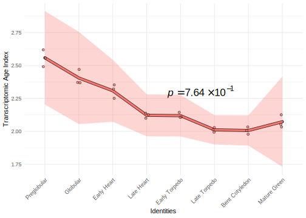
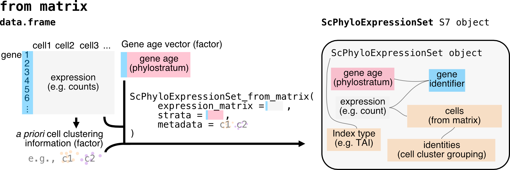

# myTAI <a href="https://drostlab.github.io/myTAI">   </a>
[](https://academic.oup.com/bioinformatics/article/34/9/1589/4772684)
[](https://bioconda.github.io/)

[](https://github.com/drostlab/myTAI/actions/workflows/R-CMD-check.yaml)
[](https://github.com/drostlab/myTAI/releases)

# Evolutionary Transcriptomics with R

```r
library(myTAI)
# obtain an example phylo-expression object
data("example_phyex_set")
# plot away!
myTAI::plot_signature(example_phyex_set)  
myTAI::plot_contribution(example_phyex_set)
myTAI::plot_gene_space(example_phyex_set)
```

<table>
  <tr>
    <td align="center">
      <a href="https://drostlab.github.io/myTAI/articles/myTAI.html">
        <picture>
          <source media="(prefers-color-scheme: dark)" srcset="docs/reference/figures/plot_signature-darkmode.svg">
          <source media="(prefers-color-scheme: light)" srcset="docs/reference/figures/plot_signature.svg">
          
        </picture>
      </a>
    </td>
    <td align="center">
      <a href="https://drostlab.github.io/myTAI/articles/tai-gallery.html#contribution-to-the-overall-tai-by-phylostratum">
        <picture>
          <source media="(prefers-color-scheme: dark)" srcset="docs/reference/figures/unnamed-chunk-15-1-darkmode.png">
          <source media="(prefers-color-scheme: light)" srcset="docs/articles/tai-gallery_files/figure-html/unnamed-chunk-15-1.png">
          
        </picture>
      </a>
    </td>
    <td align="center">
      <a href="https://drostlab.github.io/myTAI/articles/tai-gallery.html#dimension-reduction">
        <picture>
          <source media="(prefers-color-scheme: dark)" srcset="docs/reference/figures/unnamed-chunk-22-1-darkmode.png">
          <source media="(prefers-color-scheme: light)" srcset="docs/articles/tai-gallery_files/figure-html/unnamed-chunk-22-1.png">
          
        </picture>
      </a>
    </td>
  </tr>
</table>


### Detailed documentation provided [here](https://drostlab.github.io/myTAI)

## Package summary

Using `myTAI`, any existing or newly generated transcriptome dataset can be combined with evolutionary information (find [details here](https://drostlab.github.io/myTAI/articles/phylostratigraphy.html)) to retrieve novel insights about the evolutionary conservation of the transcriptome at hand. 

For the purpose of performing large scale evolutionary transcriptomics studies, the `myTAI` package implements the quantification, statistical assessment, and analytics functionality to allow researchers to study the evolution of biological processes by determining stages or periods of evolutionary conservation or variability in transcriptome data. 

We hope that `myTAI` will become the community standard tool to perform evolutionary transcriptomics studies and we are happy to add required functionality upon request.

<details> <summary> <b> Detailed background </b> </summary>

In the past years, a variety of studies aimed to uncover the molecular basis of 
morphological innovation and variation from the evolutionary developmental perspective. 
These studies often rely on transcriptomic data to establish the molecular patterns 
driving the complex biological processes underlying phenotypic plasticity.

Although transcriptome information is a useful start to study the molecular mechanisms 
underlying a biological process of interest (molecular phenotype), they rarely capture 
__how__ these expression patterns emerged in the first place or to __what extent__ they 
are possibly constrained, thereby neglecting the evolutionary history and developmental 
constraints of genes contributing to the overall pool of expressed transcripts. 

To overcome this limitation, the `myTAI` package introduces procedures summarized 
under the term `evolutionary transcriptomics` to integrate gene age information 
into classical gene expression analysis. `Gene age inference` can be performed 
with [various existing software](https://drostlab.github.io/myTAI/articles/phylostratigraphy.html), 
but we recommend using [GenEra](https://github.com/josuebarrera/GenEra) or [orthomap](https://github.com/kullrich/orthomap), 
since they address published shortcomings of `gene age inference` ([see detailed discussion here](https://drostlab.github.io/myTAI/articles/phylostratigraphy.html)). 
In addition, users can easily retrieve [previously precomputed gene age information](https://github.com/drostlab/published_phylomaps) via our data package [phylomapr](https://github.com/LotharukpongJS/phylomapr).

Evolutionary transcriptomics studies can serve as a first approach to screen _in silico_ 
for the potential existence of evolutionary and developmental constraints within a biological process of interest. 
This is achieved by quantifying transcriptome conservation patterns and their underlying gene sets in biological processes. 
The exploratory analysis functions implemented in `myTAI` provide users with 
a standardized, automated and statistically sound framework to detect and analyze 
patterns of evolutionary constraints in any transcriptome dataset of interest.

</details>

<details> <summary> <b> Scientific background </b> </summary>

Today, phenomena such as morphological mutations, diseases or developmental processes 
are primarily investigated on the molecular level using transcriptomics approaches. 
Transcriptomes denote the total number of quantifiable transcripts present at a 
specific stage in a biological process. In disease or developmental (defect) studies, 
transcriptomes are usually measured over several time points. In treatment studies 
aiming to quantify differences in the transcriptome due to biotic stimuli, abiotic stimuli,
or diseases usually treatment / disease versus non-treatment / non-disease transcriptomes are compared. 
In either case, comparing changes in transcriptomes over time or between treatments 
allows us to identify genes and gene regulatory mechanisms that might be involved in 
governing the biological process of investigation. Although classic transcriptomics 
studies are based on an established methodology, little is known about the evolution 
and conservation mechanisms underlying such transcriptomes. Understanding the evolutionary 
mechanism that change transcriptomes over time, however, might give us a new perspective 
on how diseases emerge in the first place or how morphological changes are triggered by
changes of developmental transcriptomes.

Evolutionary transcriptomics aims to capture and quantify the evolutionary conservation 
of genes that contribute to the transcriptome during a specific stage of the biological 
process of interest. The resulting temporal conservation pattern
then enables to detect stages of development or other biological processes that
are evolutionarily conserved ([Drost et al., 2018](https://academic.oup.com/bioinformatics/advance-article/doi/10.1093/bioinformatics/btx835/4772684)). This quantification on the highest level is achieved through transcriptome indices (e.g. [Transcriptome Age Index](https://drostlab.github.io/myTAI/articles/phylostratigraphy.html) or [Transcriptome Divergence Index](https://drostlab.github.io/myTAI/articles/other-strata.html)) which aim to quantify the average evolutionary age [Barrera-Redondo et al., 2023](https://genomebiology.biomedcentral.com/articles/10.1186/s13059-023-02895-z) or sequence conservation [Drost et al., 2015](https://academic.oup.com/mbe/article/32/5/1221/1125964) of genes that contribute to the transcriptome at a particular stage. In general, evolutionary transcriptomics can be used as a method to quantify the evolutionary conservation of transcriptomes at particular developmental stages and to investigate how transcriptomes underlying biological processes are constrained or channeled due to events in evolutionary history (Dollo's law) ([Drost et al., 2017](https://www.sciencedirect.com/science/article/pii/S0959437X16302040)).

__Please note, since myTAI relies on gene age inference and there has been an extensive debate about the best approaches for gene age inference in the last years,
please follow my [updated discussion about the gene age inference literature](https://drostlab.github.io/myTAI/articles/phylostratigraphy.html). With [GenEra](https://github.com/josuebarrera/GenEra), we addressed all previously raised issues and we encourage users to run `GenEra` when aiming to infer gene ages for further `myTAI` analyses.__

</details>

## Installation

`myTAIv2` is still work in progress. To install the development version, do:

```r
devtools::install_github("drostlab/myTAI")
```

To install the previous version of myTAI, and access the old vignettes, do:

```r
devtools::install_github("drostlab/myTAI@v1.0")
```

Soon, users will be able to install `myTAI` from [CRAN](https://CRAN.R-project.org/package=myTAI):

```r
# install myTAIv2 from CRAN
install.packages("myTAI", dependencies = TRUE)
```

## Citation
Please cite the following paper when using `myTAI` for your own research. This will allow us to continue working on this software tool and will motivate us to extend its functionality and usability in the next years. Many thanks in advance!

> Drost et al. __myTAI: evolutionary transcriptomics with R__. _Bioinformatics_ 2018, 34 (9), 1589-1590. [doi:10.1093](https://academic.oup.com/bioinformatics/advance-article/doi/10.1093/bioinformatics/btx835/4772684)


<details> <summary> <b> Studies that successfully used `myTAI` to quantify transcriptome novelty and conservation </b> </summary>

>
> - _Evolutionary trends in the emergence of skeletal cell types_ 
A Damatac, II , S Koska , K K Ullrich , T Domazet-Lošo , A Klimovich , M Kaucká… - __Evolution Letters__, 2025
>
> - _Phylostratigraphic analysis revealed that ancient ohnologue PtoWRKY53 innovated a vascular transcription regulatory network in Populus_ 
W Huang, M Quan, W Qi, L Xiao, Y Fang, J Zhou… - __New Phytologist__, 2025
>
> - _Pra-GE-ATLAS: Empowering Pinus radiata stress and breeding research through a multi-omics database_ 
V Roces, MJ Cañal, JL Mateo, L Valledor… - __Journal of Integrative Plant Biology__, 2025
>
> - _Developmental phylotranscriptomics in grapevine suggests an ancestral role of somatic embryogenesis_ 
S Koska, D Leljak-Levanic, N Malenica, K Bigovic Villi… - __Communications Biology__, 2025
>
> - _Proteomic analyses reveal the key role of gene co-option in the evolution of the scaly-foot snail scleritome_ 
WC Wong, YH Kwan, X He, C Chen, S Xiang, Y Xiao…  - __Communications Biology__, 2025
>
> - _Genome assembly of Stewartia sinensis reveals origin and evolution of orphan genes in Theaceae_ 
L Cheng, Q Han, Y Hao, Z Qiao, M Li, D Liu… - __Communications Biology__, 2025
> 
> - _A transcriptomic hourglass in brown algae_ 
JS Lotharukpong, M Zheng, R Luthringer, D Liesner, H-G Drost, SM Coelho - __Nature__, 2024
>
> - _Genome assemblies of 11 bamboo species highlight diversification induced by dynamic subgenome dominance_
PF Ma, YL Liu, C Guo, G Jin, ZH Guo, L Mao, YZ Yang… - __Nature Genetics__, 2024
>
> - _Hemichordate cis-regulatory genomics and the gene expression dynamics of deuterostomes_
A Pérez-Posada, CY Lin, TP Fan, CY Lin, YC Chen… - __Nature Ecology & Evolution__, 2024
> 
> - _Comparison between 16S rRNA and shotgun sequencing in colorectal cancer, advanced colorectal lesions, and healthy human gut microbiota_
D Bars-Cortina, E Ramon, B Rius-Sansalvador… - __BMC genomics__, 2024
>
> - _Heat stress reprograms herbivory-induced defense responses in potato plants_
J Zhong, J Zhang, Y Zhang, Y Ge, W He, C Liang… - __BMC Plant Biology__, 2024
>
> - _The transcriptomic signature of adaptations associated with perfume collection in orchid bees_
K Darragh, SR Ramírez - __Journal of Evolutionary Biology__, 2024
>
> - _Proteomic dynamics revealed sex‐biased responses to combined heat‐drought stress in Marchantia_
S Guerrero, V Roces, L García‐Campa, L Valledor… - __Journal of Integrative Plant Biology__, 2024
>
> - _Evolution of gene networks underlying adaptation to drought stress in the wild tomato Solanum chilense_
K Wei, S Sharifova, X Zhao, N Sinha, H Nakayama… - __Molecular Ecology__, 2024
>
> - _Conserved and specific gene expression patterns in the embryonic development of tardigrades_
C Li, Z Yang, X Xu, L Meng, S Liu, D Yang - __Evolution & Development__, 2024
>
> - _The functions and factors governing fungal communities and diversity in agricultural waters: insights into the ecosystem services aquatic mycobiota provide_
P Pham, Y Shi, I Khan, M Sumarah, J Renaud… - __Frontiers in Microbiology__, 2024
>
> - _An evolutionary timeline of the oxytocin signaling pathway_
AM Sartorius, J Rokicki, S Birkeland, F Bettella, C Barth… - __Communications Biology__, 2024
>
> - _The Evolution of Foraging Webs is Associated with Young Genes in Araneoidea Spiders_
A Jia, T Yang, W Hu, S Ma, Z Zhang, Y Wang - __Available at SSRN 4383994__
>
> - _Multiplexed transcriptomic analyses of the plant embryonic hourglass_
H Wu, R Zhang, KJ Niklas, MJ Scanlon - __BioRxiv__, 2024
>
> - _Brachiopod genome unveils the evolution of the BMP–Chordin network in bilaterian body patterning_
TD Lewin, K Shimizu, IJY Liao, ME Chen, K Endo… - __BioRxiv__, 2024
>
> - _The angiosperm seed life cycle follows a developmental reverse hourglass_
AA Sami, L Bentsink, MAS Artur - __BioRxiv__, 2024
>
> - _Evolutionary trends in the emergence of skeletal cell types_
A Damatac, S Koska, KK Ullrich, T Domazet-Loso… - __BioRxiv__, 2024
>
> - _Transcriptome age of individual cell types in Caenorhabditis elegans_ F Ma, C Zheng - __Proceedings of the National Academy of Sciences__, 2023
>
> - _Single-cell atlases of two lophotrochozoan larvae highlight their complex evolutionary histories_
L Piovani, DJ Leite, LA Yañez Guerra, F Simpson… - __Science Advances__, 2023
>
> - _oggmap: a Python package to extract gene ages per orthogroup and link them with single-cell RNA data_
KK Ullrich, NE Glytnasi - __Bioinformatics__, 2023
>
> - _Discovery of putative long non-coding RNAs expressed in the eyes of Astyanax mexicanus (Actinopterygii: Characidae)_
I Batista da Silva, D Aciole Barbosa, KF Kavalco… - __Scientific Reports__, 2023
>
> - _An ancient split of germline and somatic stem cell lineages in Hydra_
C Nishimiya-Fujisawa, H Petersen, TC-T Koubková-Yu, C Noda, S Shigenobu, J Bageritz, T Fujisawa, O Simakov, S Kobayashi, TW Holstein - __BioRxiv__, 2023
>
> - _Oxytocin receptor expression patterns in the human brain across development_ 
J Rokicki, T Kaufmann, A-MG de Lange, D van der Meer, S Bahrami, AM Sartorius, UK Haukvik, NE Steen, E Schwarz, DJ Stein, T Nærland, OA Andreassen, LT Westlye, DS Quintana - __Neuropsychopharmacology__, 2022
>
> - _The Phylotranscriptomic Hourglass Pattern in Fungi: An Updated Model_ Y Xie, HS Kwan, PL Chan, WJ Wu, J Chiou, J Chang __BioRxiv__, 2022
> 
> - _Embryo-Like Features in Developing Bacillus subtilis Biofilms_ M Futo, L Opašić, S Koska, N Čorak, T Široki, V Ravikumar, A Thorsell, M Lenuzzi, D Kifer, M Domazet-Lošo, K Vlahoviček, I Mijakovic, T Domazet-Lošo - __Molecular Biology and Evolution__, 2021
>
> - _New Genes Interacted With Recent Whole-Genome Duplicates in the Fast Stem Growth of Bamboos_ G Jin, P-F Ma, X Wu, L Gu, M Long, C Zhang, DZ Li - __Molecular Biology and Evolution__, 2021
> 
> - _Evolutionary transcriptomics of metazoan biphasic life cycle supports a single intercalation origin of metazoan larvae_
J Wang, L Zhang, S Lian, Z Qin, X Zhu, X Dai, Z Huang et al. - __Nature Ecology & Evolution__, 2020
>
> - _Pervasive convergent evolution and extreme phenotypes define chaperone requirements of protein homeostasis_
Y Draceni, S Pechmann - __Proceedings of the National Academy of Sciences__, 2019
>
> - _Reconstructing the transcriptional ontogeny of maize and sorghum supports an inverse hourglass model of inflorescence development_ 
S Leiboff, S Hake - __Current Biology__, 2019
>
> - _The Transcriptional Landscape of Polyploid Wheats and their Diploid Ancestors during Embryogenesis and Grain Development_
D Xiang, TD Quilichini, Z Liu, P Gao, Y Pan et al. - __The Plant Cell__, 2019
>
> - _Pervasive convergent evolution and extreme phenotypes define chaperone requirements of protein homeostasis_
Y Draceni, S Pechmann - __Proceedings of the National Academy of Sciences__, 2019
>
> - _A unicellular relative of animals generates a layer of polarized cells by actomyosin-dependent cellularization_
O Dudin, A Ondracka, X Grau-Bové, AAB Haraldsen et al. - __eLife__, 2019
>
> - _Gene Expression Does Not Support the Developmental Hourglass Model in Three Animals with Spiralian Development_
L Wu, KE Ferger, JD Lambert - __Molecular Biology and Evolution__, 2019
>
> - _Phylostratr: a framework for phylostratigraphy_
Z Arendsee, J Li, U Singh, A Seetharam et al. - __Bioinformatics__, 2019
>
> - _Algorithms for synteny-based phylostratigraphy and gene origin classification_
Z Arendsee - 2019
>
> - _Elucidating the endogenous synovial fluid proteome and peptidome of inflammatory arthritis using label-free mass spectrometry_
SM Mahendran, EC Keystone, RJ Krawetz et al. - __Clinical proteomics__, 2019
>
> - _Environmental DNA reveals landscape mosaic of wetland plant communities_
ME Shackleton, GN Rees, G Watson et al. - __Global Ecology and Conservation__, 2019
>
> - _Developmental constraints on genome evolution in four bilaterian model species_
J Liu, M Robinson-Rechavi - __Genome Biology and Evolution__, 2018
>
> - _Mapping selection within Drosophila melanogaster embryo's anatomy_
I Salvador-Martínez et al. - __Molecular Biology and Evolution__, 2017
>
> - _Distribution and diversity of enzymes for polysaccharide degradation in fungi_
R Berlemont - __Scientific reports__, 2017
>
> - _The origins and evolutionary history of human non-coding RNA regulatory networks_
M Sherafatian, SJ Mowla - __Journal of bioinformatics and computational biology__, 2017
>
> - _High expression of new genes in trochophore enlightening the ontogeny and evolution of trochozoans_
F Xu, T Domazet-Lošo, D Fan, TL Dunwell, L Li et al. - __Scientific reports__, 2016
>
> - _Evidence for active maintenance of phylotranscriptomic hourglass patterns in animal and plant embryogenesis_
>HG Drost, A Gabel, I Grosse, M Quint - __Molecular Biology and Evolution__, 2015
>
</details>

## NEWS

The current status of the package as well as a detailed history of the
functionality of each version of `myTAI` can be found in the [NEWS](https://drostlab.github.io/myTAI/news/index.html) section.

## Tutorials

The following tutorials will provide use cases and detailed explanations of how to quantify transcriptome conservation with `myTAI` and how to interpret the results generated with this software tool.

**Main**:
- [Getting started](https://drostlab.github.io/myTAI/articles/myTAI.html)
- [Bring your datasets into myTAI](https://drostlab.github.io/myTAI/articles/phylo-expression-object.html)
- [Statistical testing with myTAI](https://drostlab.github.io/myTAI/articles/tai-stats.html)
- [Transforming dataset for myTAI](https://drostlab.github.io/myTAI/articles/tai-transform.html)
- [Break TAI patterns using gaTAI](https://drostlab.github.io/myTAI/articles/tai-breaker.html)
- [Beautiful plots made via myTAI](https://drostlab.github.io/myTAI/articles/tai-gallery.html)

**Advanced**:
- [Gene age inference](https://drostlab.github.io/myTAI/articles/phylostratigraphy.html)
- [Other evolutionary and expression indices](https://drostlab.github.io/myTAI/articles/other-strata.html)

Users can also read the tutorials within ([RStudio](https://posit.co/)) :

```r
# source the myTAI package
library(myTAI)

# look for all tutorials (vignettes) available in the myTAI package
# this will open your web browser
browseVignettes("myTAI")
```

## Object classes in `myTAI`

Workflow to load your own dataset:

#### bulk

<a href="https://drostlab.github.io/myTAI/articles/phylo-expression-object.html#mock-bulk-dataset-for-bulkphyloexpressionset">
  <picture>
    <source media="(prefers-color-scheme: dark)" srcset="docs/articles/Figures/myTAI_phyex-darkmode.png">
    <source media="(prefers-color-scheme: light)" srcset="docs/articles/Figures/myTAI_phyex.png">
    
  </picture>
</a>

#### bulk with replicates

<a href="https://drostlab.github.io/myTAI/articles/phylo-expression-object.html#what-if-the-dataset-contains-replicates">
  <picture>
    <source media="(prefers-color-scheme: dark)" srcset="docs/articles/Figures/myTAI_phyex_group-darkmode.png">
    <source media="(prefers-color-scheme: light)" srcset="docs/articles/Figures/myTAI_phyex_group.png">
    
  </picture>
</a>

#### single cell

<a href="https://drostlab.github.io/myTAI/articles/phylo-expression-object.html#mock-single-cell-dataset-for-scphyloexpressionset">
  <picture>
    <source media="(prefers-color-scheme: dark)" srcset="docs/articles/Figures/myTAI_scphyex-darkmode.png">
    <source media="(prefers-color-scheme: light)" srcset="docs/articles/Figures/myTAI_scphyex.png">
    
  </picture>
</a>

## Discussions and Bug Reports

We would be very happy to learn more about potential improvements of the concepts and functions
provided in this package.

Furthermore, in case you find some bugs or need additional (more flexible) functionality of parts
of this package, please let us know:

https://github.com/drostlab/myTAI/issues


