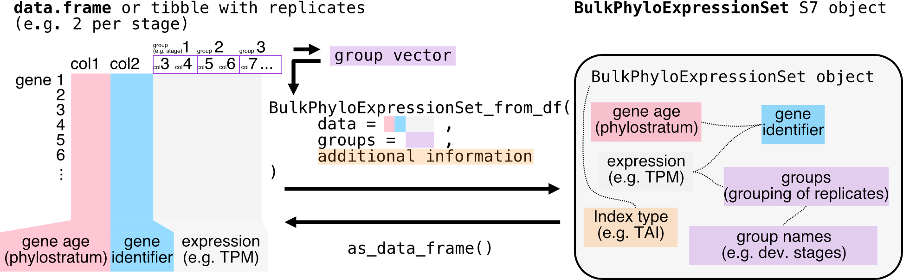

# Bring your datasets into myTAI

## S7 BulkPhyloExpressionSet and ScPhyloExpressionSet objects

Starting from `myTAIv2`, we moved on from the traditional `data.frame`
to the new [`S7 OOP system`](https://rconsortium.github.io/S7/) to
facilitate fast and flexible computation for evolutionary
transcriptomics analyses.

To illustrate this, we will use the example data `example_phyex_set`.
The `BulkPhyloExpressionSet` and `ScPhyloExpressionSet` objects are
designed to store gene expression data along with associated metadata
such as gene age information (or
[`phylorank`](https://drostlab.github.io/myTAI/articles/phylostratigraphy.md)),
experiment type and other relevant properties.

We will first focus on the `BulkPhyloExpressionSet` object, which is for
bulk RNA-seq data.

``` r
# inspect the object
example_phyex_set
```

More on `S7` and the `BulkPhyloExpressionSet` object

``` r
S7::prop_names(example_phyex_set)
```

Show output

    ##  [1] "strata"                        "strata_values"                
    ##  [3] "expression"                    "groups"                       
    ##  [5] "name"                          "species"                      
    ##  [7] "index_type"                    "identities_label"             
    ##  [9] "expression_collapsed"          "gene_ids"                     
    ## [11] "identities"                    "sample_names"                 
    ## [13] "num_identities"                "num_samples"                  
    ## [15] "num_genes"                     "num_strata"                   
    ## [17] "index_full_name"               "group_map"                    
    ## [19] "TXI"                           "TXI_sample"                   
    ## [21] "null_conservation_sample_size" ".null_conservation_txis"      
    ## [23] "null_conservation_txis"        ".bootstrapped_txis"           
    ## [25] "bootstrapped_txis"

``` r
# let's explore the properties using @
# for example:
example_phyex_set@strata |> head()
example_phyex_set@gene_ids |> head()
example_phyex_set@expression[1:4,1:5]
```

See how rich this `BulkPhyloExpressionSet` object is!

The `BulkPhyloExpressionSet` is designed to ensure efficient interaction
with `myTAIv2` functions. For example, if you try the
[`myTAI::stat_flatline_test()`](https://drostlab.github.io/myTAI/reference/stat_flatline_test.md)
function twice, i.e.

``` r
myTAI::stat_flatline_test(example_phyex_set)
myTAI::stat_flatline_test(example_phyex_set)
```

you will notice that the permutations are already pre-computed for the
second run so that you don’t need to wait a couple of seconds again.
Note, we will get to the `stat_flatline_test` function in the
[statistical testing
vignette](https://drostlab.github.io/myTAI/articles/tai-stats.md).

But how do you get your `.tsv` and `.csv` files and convert your
`data.frame` and `tibble` to a S7 `BulkPhyloExpressionSet` object?

We will mention the transcriptome age index (TAI) a lot. See
[📚](https://drostlab.github.io/myTAI/articles/phylostratigraphy.html#gene-age-information-in-tai)
for more details on the `TAI` and its formula:
$`TAI_s = \frac{\sum_{i=1}^{n} ps_i \cdot e_{is}}{\sum_{i=1}^{n} e_{is}}`$,
where $`e_{is}`$ is the expression level of gene $`i`$ at a given sample
$`s`$ (e.g. a biological replicate for a developmental stage), and
$`ps_i`$ is the evolutionary age of gene $`i`$.

## Constructing BulkPhyloExpressionSet and ScPhyloExpressionSet

The necessary and sufficient information needed for creating a
`BulkPhyloExpressionSet` (as well as a `ScPhyloExpressionSet`) object
is:  
(1) A matrix or data frame of gene expression values (genes x
samples).  
(2) A numerical value or factored string associated with each gene,
typically gene age ranks or
[`phylorank`](https://drostlab.github.io/myTAI/articles/phylostratigraphy.md)
for `TAI` (but also
[`deciled dNdS values`](https://drostlab.github.io/myTAI/articles/other-strata.md)
for `TDI` or
[`deciled tau values`](https://drostlab.github.io/myTAI/articles/other-strata.md)
for `TSI` etc.).


### Loading raw data

The raw outputs of (1) gene expression quantification and (2) gene age
inference can typically be found in the form of a tab-separated `.tsv`
or comma-separated `.csv` file format. One useful package to do this is
`readr`, using the functions
[`readr::read_csv()`](https://readr.tidyverse.org/reference/read_delim.html)
or
[`readr::read_tsv()`](https://readr.tidyverse.org/reference/read_delim.html).
For `.csv` files, if
[`readr::read_csv()`](https://readr.tidyverse.org/reference/read_delim.html)
doesn’t work, try
[`readr::read_csv2()`](https://readr.tidyverse.org/reference/read_delim.html)
in European locales.

### Mock (bulk) dataset for BulkPhyloExpressionSet

#### Bulk RNA-seq data without replicates

In this example, we are using a dataset with only one entry per stage
(no replicates).

``` r
# let's explore the example expression dataset
# for example:
example_expression |> head()
```

Show output

    ##      GeneID    Zygote  Quadrant  Globular     Heart   Torpedo      Bent
    ## 1 AT1G01090 11424.567 16778.168 34366.649 39775.641 56231.569 66980.367
    ## 2 AT1G01620  5879.892  4977.186 11613.344  7295.212 17289.631 11439.765
    ## 3 AT1G01910  6644.138  6081.019  5130.440  5406.838  5912.746  6820.958
    ## 4 AT1G02305 14799.835 19609.824  6599.929  5535.103  4785.300  3071.470
    ## 5 AT1G02560  9915.822  9965.721 19602.787 22256.097 27314.341 19444.084
    ## 6 AT1G02730 15164.101 13536.758 12995.267 13102.109 11251.254 14423.060
    ##      Mature
    ## 1  7772.562
    ## 2  8183.609
    ## 3 10914.040
    ## 4  3916.300
    ## 5 13198.600
    ## 6 14051.317

As you can see, there is one column as the gene identifier and the rest
of the columns are the expression values for each developmental stage.
Instead of developmental stage, one can also use experimental
conditions, e.g. `control`, `treatment`, etc.

Now we construct the input data.frame for
[`as_BulkPhyloExpressionSet()`](https://drostlab.github.io/myTAI/reference/as_BulkPhyloExpressionSet.md)

``` r
example_phyex_set.df |> head()
example_phyex_set.df |> str()
```

Show output

    ##            phylorank    GeneID    Zygote  Quadrant  Globular     Heart
    ## 1 Cellular Organisms AT1G01090 11424.567 16778.168 34366.649 39775.641
    ## 2 Cellular Organisms AT1G01620  5879.892  4977.186 11613.344  7295.212
    ## 3 Cellular Organisms AT1G01910  6644.138  6081.019  5130.440  5406.838
    ## 4 Cellular Organisms AT1G02305 14799.835 19609.824  6599.929  5535.103
    ## 5 Cellular Organisms AT1G02560  9915.822  9965.721 19602.787 22256.097
    ## 6 Cellular Organisms AT1G02730 15164.101 13536.758 12995.267 13102.109
    ##     Torpedo      Bent    Mature
    ## 1 56231.569 66980.367  7772.562
    ## 2 17289.631 11439.765  8183.609
    ## 3  5912.746  6820.958 10914.040
    ## 4  4785.300  3071.470  3916.300
    ## 5 27314.341 19444.084 13198.600
    ## 6 11251.254 14423.060 14051.317

    ## 'data.frame':    1757 obs. of  9 variables:
    ##  $ phylorank: Factor w/ 19 levels "Cellular Organisms",..: 1 1 1 1 1 1 1 1 1 1 ...
    ##  $ GeneID   : chr  "AT1G01090" "AT1G01620" "AT1G01910" "AT1G02305" ...
    ##  $ Zygote   : num  11425 5880 6644 14800 9916 ...
    ##  $ Quadrant : num  16778 4977 6081 19610 9966 ...
    ##  $ Globular : num  34367 11613 5130 6600 19603 ...
    ##  $ Heart    : num  39776 7295 5407 5535 22256 ...
    ##  $ Torpedo  : num  56232 17290 5913 4785 27314 ...
    ##  $ Bent     : num  66980 11440 6821 3071 19444 ...
    ##  $ Mature   : num  7773 8184 10914 3916 13199 ...

**Requirements for the input `data.frame` to the
[`as_BulkPhyloExpressionSet()`](https://drostlab.github.io/myTAI/reference/as_BulkPhyloExpressionSet.md)
function:**  
column 1 contains the phylorank information, which can be either numeric
or factors.  
column 2 contains the gene identifier (here called `GeneID`).  
column 3 onwards contain the expression data with the column titles
being the developmental stages or the experimental conditions.

The example `example_phyex_set.df` is now formatted to meet the
requirements for the
[`as_BulkPhyloExpressionSet()`](https://drostlab.github.io/myTAI/reference/as_BulkPhyloExpressionSet.md)
function.

The
[`BulkPhyloExpressionSet_from_df()`](https://drostlab.github.io/myTAI/reference/BulkPhyloExpressionSet_from_df.md)
function will automatically detect the first column as the phylorank and
the second column as the gene identifier. If your data is structured
differently, you can reassign the columns accordingly using
[`dplyr::relocate()`](https://dplyr.tidyverse.org/reference/relocate.html).

Now, we can use the
[`BulkPhyloExpressionSet_from_df()`](https://drostlab.github.io/myTAI/reference/BulkPhyloExpressionSet_from_df.md)
function to convert the correctly formatted input `data.frame` to a
`BulkPhyloExpressionSet` object.

There you have it, a `BulkPhyloExpressionSet` object!

``` r
example_phyex_set.remake
```

Show output

    ## PhyloExpressionSet object
    ## Class: myTAI::BulkPhyloExpressionSet 
    ## Name: reconstituted phyex_set_old 
    ## Species: NA 
    ## Index type: TXI 
    ## Identities : Zygote, Quadrant, Globular, Heart, Torpedo, Bent, Mature 
    ## Number of genes: 1757 
    ## Number of identities : 7 
    ## Number of phylostrata: 19 
    ## Number of samples: 7 
    ## Samples per condition: 1 1 1 1 1 1 1

You can further explore the properties of the `BulkPhyloExpressionSet`
object using the `@` operator, for example:
`example_phyex_set.remake@counts |> head()`.

… and plot your transcriptome age index!

``` r
example_phyex_set.remake |> 
    myTAI::plot_signature()
```

    ## Computing: [========================================] 100% (done)


#### What if the dataset contains replicates?

This is exactly the case for the new `example_phyex_set` dataset (not
like `example_phyex_set_old`), which contains replicates for each
developmental stage. The
[`as_BulkPhyloExpressionSet()`](https://drostlab.github.io/myTAI/reference/as_BulkPhyloExpressionSet.md)
function can handle this as well, as long as we use the `groups`
parameter to specify the grouping of replicates, i.e.



``` r
colnames(example_phyex_set.df)
```

Show output

    ##  [1] "phylorank" "GeneID"    "pg_1"      "pg_2"      "pg_3"      "gl_1"     
    ##  [7] "gl_2"      "gl_3"      "eh_1"      "eh_2"      "eh_3"      "lh_1"     
    ## [13] "lh_2"      "lh_3"      "et_1"      "et_2"      "et_3"      "lt_1"     
    ## [19] "lt_2"      "lt_3"      "bc_1"      "bc_2"      "bc_3"      "mg_1"     
    ## [25] "mg_2"      "mg_3"

As you can see, this dataset has three replicates per stage.

Done!

Along with the `groups` parameter, you can also specify the `name`,
`strata_labels` and other parameters to provide more descriptions for
your `BulkPhyloExpressionSet` object. This is useful for plotting and
visualisation purposes. Check this using `?` before the function
(i.e. `?myTAI::as_BulkPhyloExpressionSet()`).

### Mock single-cell dataset for ScPhyloExpressionSet

If you are interested in single cell RNA-seq data, the process is
similar, but you will need to ensure that your data is structured
correctly for single cell analysis, i.e. as a
[`seurat object`](https://satijalab.org/seurat/articles/pbmc3k_tutorial.html).

You can then use the
[`ScPhyloExpressionSet_from_seurat()`](https://drostlab.github.io/myTAI/reference/ScPhyloExpressionSet_from_seurat.md)
or `ScPhyloExpressionSet_from_matrix` function with adjustments to the
relevant metadata.


``` r
# Load the relevant packages
library(dplyr)
library(Seurat)

pbmc_raw <- read.table(
  file = system.file('extdata', 'pbmc_raw.txt', package = 'Seurat'),
  as.is = TRUE
)
```

The input file for
[`Seurat::CreateSeuratObject()`](https://satijalab.github.io/seurat-object/reference/CreateSeuratObject.html)
is a tab-separated file with the first column as gene identifiers and
the rest of the columns as expression values for each cell. The
`pbmc_raw` object is a data frame with gene expression data.

``` r
head(pbmc_raw)
```

Show output

    ##          ATGCCAGAACGACT CATGGCCTGTGCAT GAACCTGATGAACC TGACTGGATTCTCA
    ## MS4A1                 0              0              0              0
    ## CD79B                 1              0              0              0
    ## CD79A                 0              0              0              0
    ## HLA-DRA               0              1              0              0
    ## TCL1A                 0              0              0              0
    ## HLA-DQB1              1              0              0              0
    ##          AGTCAGACTGCACA TCTGATACACGTGT TGGTATCTAAACAG GCAGCTCTGTTTCT
    ## MS4A1                 0              0              0              0
    ## CD79B                 0              0              0              0
    ## CD79A                 0              0              0              0
    ## HLA-DRA               1              1              0              1
    ## TCL1A                 0              0              0              0
    ## HLA-DQB1              0              0              0              0
    ##          GATATAACACGCAT AATGTTGACAGTCA AGGTCATGAGTGTC AGAGATGATCTCGC
    ## MS4A1                 0              0              2              2
    ## CD79B                 0              1              2              4
    ## CD79A                 0              0              0              5
    ## HLA-DRA               0              0             14             28
    ## TCL1A                 0              0              3              0
    ## HLA-DQB1              0              0              1              6
    ##          GGGTAACTCTAGTG CATGAGACACGGGA TACGCCACTCCGAA CTAAACCTGTGCAT
    ## MS4A1                 4              4              2              3
    ## CD79B                 3              3              2              3
    ## CD79A                 2              2              5              8
    ## HLA-DRA              18              7             15             28
    ## TCL1A                 2              4              0              0
    ## HLA-DQB1              2              2              2              8
    ##          GTAAGCACTCATTC TTGGTACTGAATCC CATCATACGGAGCA TACATCACGCTAAC
    ## MS4A1                 3              4              2              3
    ## CD79B                 1              2              2              5
    ## CD79A                 1              5              5             12
    ## HLA-DRA               7             26             10             16
    ## TCL1A                 3              3              3              2
    ## HLA-DQB1              2              2              1              2
    ##          TTACCATGAATCGC ATAGGAGAAACAGA GCGCACGACTTTAC ACTCGCACGAAAGT
    ## MS4A1                 0              0              0              0
    ## CD79B                 0              0              0              0
    ## CD79A                 0              0              1              0
    ## HLA-DRA               7             22              0             10
    ## TCL1A                 0              0              0              0
    ## HLA-DQB1              0              3              0              0
    ##          ATTACCTGCCTTAT CCCAACTGCAATCG AAATTCGAATCACG CCATCCGATTCGCC
    ## MS4A1                 1              0              0              0
    ## CD79B                 0              0              0              0
    ## CD79A                 0              0              0              1
    ## HLA-DRA               6              0              4              3
    ## TCL1A                 0              0              0              0
    ## HLA-DQB1              0              0              1              0
    ##          TCCACTCTGAGCTT CATCAGGATGCACA CTAAACCTCTGACA GATAGAGAAGGGTG
    ## MS4A1                 0              0              0              0
    ## CD79B                 0              1              1              0
    ## CD79A                 0              0              0              0
    ## HLA-DRA               7             13              0              1
    ## TCL1A                 0              0              0              0
    ## HLA-DQB1              1              0              0              0
    ##          CTAACGGAACCGAT AGATATACCCGTAA TACTCTGAATCGAC GCGCATCTTGCTCC
    ## MS4A1                 0              0              0              0
    ## CD79B                 2              0              0              0
    ## CD79A                 0              0              0              0
    ## HLA-DRA               0              0              1              0
    ## TCL1A                 0              0              0              0
    ## HLA-DQB1              0              0              0              0
    ##          GTTGACGATATCGG ACAGGTACTGGTGT GGCATATGCTTATC CATTACACCAACTG
    ## MS4A1                 0              0              0              0
    ## CD79B                 0              0              0              0
    ## CD79A                 0              0              0              0
    ## HLA-DRA               1              1              0              0
    ## TCL1A                 0              0              0              0
    ## HLA-DQB1              0              0              0              0
    ##          TAGGGACTGAACTC GCTCCATGAGAAGT TACAATGATGCTAG CTTCATGACCGAAT
    ## MS4A1                 0              0              0              0
    ## CD79B                 0              0              0              0
    ## CD79A                 0              0              0              0
    ## HLA-DRA               0              0              0              0
    ## TCL1A                 0              0              0              0
    ## HLA-DQB1              0              0              0              0
    ##          CTGCCAACAGGAGC TTGCATTGAGCTAC AAGCAAGAGCTTAG CGGCACGAACTCAG
    ## MS4A1                 0              0              0              0
    ## CD79B                 0              0              0              0
    ## CD79A                 0              0              0              0
    ## HLA-DRA               0              1              1              1
    ## TCL1A                 0              0              0              0
    ## HLA-DQB1              0              0              0              0
    ##          GGTGGAGATTACTC GGCCGATGTACTCT CGTAGCCTGTATGC TGAGCTGAATGCTG
    ## MS4A1                 0              0              0              0
    ## CD79B                 0              0              1              0
    ## CD79A                 0              0              0              0
    ## HLA-DRA               0              0             10             10
    ## TCL1A                 0              0              0              0
    ## HLA-DQB1              0              0              0              1
    ##          CCTATAACGAGACG ATAAGTTGGTACGT AAGCGACTTTGACG ACCAGTGAATACCG
    ## MS4A1                 0              0              0              0
    ## CD79B                 1              1              2              2
    ## CD79A                 0              0              0              0
    ## HLA-DRA               4              1              6             28
    ## TCL1A                 0              0              0              0
    ## HLA-DQB1              1              0              2              0
    ##          ATTGCACTTGCTTT CTAGGTGATGGTTG GCACTAGACCTTTA CATGCGCTAGTCAC
    ## MS4A1                 0              0              0              0
    ## CD79B                 0              0              3              0
    ## CD79A                 0              0              0              0
    ## HLA-DRA              10             13              5              8
    ## TCL1A                 0              0              0              0
    ## HLA-DQB1              0              1              1              0
    ##          TTGAGGACTACGCA ATACCACTCTAAGC CATATAGACTAAGC TTTAGCTGTACTCT
    ## MS4A1                 0              0              0              0
    ## CD79B                 0              0              0              4
    ## CD79A                 0              0              0              8
    ## HLA-DRA             108             93             41             42
    ## TCL1A                 0              0              0              4
    ## HLA-DQB1             21             21              3              5
    ##          GACATTCTCCACCT ACGTGATGCCATGA ATTGTAGATTCCCG GATAGAGATCACGA
    ## MS4A1                 0              0              0              1
    ## CD79B                 1              0              0              0
    ## CD79A                 0              0              0              0
    ## HLA-DRA             138             77             76             15
    ## TCL1A                 0              0              0              0
    ## HLA-DQB1             11             11             10              1
    ##          AATGCGTGGACGGA GCGTAAACACGGTT ATTCAGCTCATTGG GGCATATGGGGAGT
    ## MS4A1                 0              0              0              0
    ## CD79B                 0              0              0              0
    ## CD79A                 1              0              0              0
    ## HLA-DRA              19            104              1              0
    ## TCL1A                 0              0              0              0
    ## HLA-DQB1              2             11              0              0
    ##          ATCATCTGACACCA GTCATACTTCGCCT TTACGTACGTTCAG GAGTTGTGGTAGCT
    ## MS4A1                 0              0              0              0
    ## CD79B                 0              0              0              0
    ## CD79A                 0              0              0              0
    ## HLA-DRA               0              0              2              1
    ## TCL1A                 0              0              0              0
    ## HLA-DQB1              0              0              0              0
    ##          GACGCTCTCTCTCG AGTCTTACTTCGGA GGAACACTTCAGAC CTTGATTGATCTTC
    ## MS4A1                 0              0              0              0
    ## CD79B                 0              0              0              0
    ## CD79A                 0              0              0              0
    ## HLA-DRA               1              0              2              7
    ## TCL1A                 0              0              0              0
    ## HLA-DQB1              0              0              0              1

Now, we create a Seurat object. i.e.

``` r
pbmc_small <- CreateSeuratObject(counts = pbmc_raw)
```

``` r
is(pbmc_small)
```

    ## [1] "Seurat"

Now, we can convert this Seurat object to a `ScPhyloExpressionSet`
object using the
[`ScPhyloExpressionSet_from_seurat()`](https://drostlab.github.io/myTAI/reference/ScPhyloExpressionSet_from_seurat.md)
function.

The next part is a bit tricky, as you need to provide the phylorank
information in a specific format with the same gene identifiers as that
of `pbmc_small`.

We will generate **random** phyloranks for each gene as integers.

``` r
gene_names <- pbmc_small |> rownames()
example_phylorank_sc <- 
    setNames(sample(1:10, length(gene_names), replace = TRUE), gene_names) |>
    as.factor()
```

``` r
example_phyex_set_sc <- 
    myTAI::ScPhyloExpressionSet_from_seurat(
        pbmc_small,
        strata = example_phylorank_sc)
```

Example of a downstream analysis

Here, we will go a bit deeper and cluster the `pbmc_small` object before
integrating this to the `myTAIv2` workflow.

``` r
# example workflow to cluster the single cell data
pbmc_small <- Seurat::NormalizeData(pbmc_small)
pbmc_small <- Seurat::FindVariableFeatures(pbmc_small, selection.method = "vst", nfeatures = 20)
pbmc_small <- Seurat::ScaleData(pbmc_small)
pbmc_small <- Seurat::RunPCA(pbmc_small, features = VariableFeatures(object = pbmc_small))
pbmc_small <- Seurat::FindNeighbors(pbmc_small, dims = 1:10)
pbmc_small.cluster <- Seurat::FindClusters(pbmc_small, resolution = 0.8)
```

    ## Modularity Optimizer version 1.3.0 by Ludo Waltman and Nees Jan van Eck
    ## 
    ## Number of nodes: 80
    ## Number of edges: 2352
    ## 
    ## Running Louvain algorithm...
    ## Maximum modularity in 10 random starts: 0.4014
    ## Number of communities: 2
    ## Elapsed time: 0 seconds

``` r
example_phyex_set_sc.cluster <- 
    myTAI::ScPhyloExpressionSet_from_seurat(
        seurat = pbmc_small.cluster,
        strata = example_phylorank_sc)
```

Now we have the `ScPhyloExpressionSet` object,

``` r
example_phyex_set_sc.cluster
```

… which you can now plot!

``` r
myTAI::plot_signature(example_phyex_set_sc.cluster)
```

    ## Warning: Using `size` aesthetic for lines was deprecated in ggplot2 3.4.0.
    ## ℹ Please use `linewidth` instead.
    ## ℹ The deprecated feature was likely used in the myTAI package.
    ##   Please report the issue at <https://github.com/drostlab/myTAI/issues>.
    ## This warning is displayed once per session.
    ## Call `lifecycle::last_lifecycle_warnings()` to see where this warning was
    ## generated.

    ## Computing: [========================================] 100% (done)


This example used an example Seurat object with a mock phylorank dataset
(random gene age assignment) and an example workflow. In practice, you
will have to follow the best standards for single cell RNA-seq data
analysis, including quality control, normalisation, and clustering
steps. And assign real phylorank information to the genes in your
dataset (to do this, see the [phylostratigraphy
vignette](https://drostlab.github.io/myTAI/articles/phylostratigraphy.md)).

## Summary

In this section, we have learned how to create `BulkPhyloExpressionSet`
and `ScPhyloExpressionSet` objects from raw gene expression data and
phylorank information. This object is essential for performing
evolutionary transcriptomics analyses using the `myTAI` package, and
provides a structured way to store and manipulate evolutionary
transcriptomics data, making it easier to perform various analyses and
visualisations.
