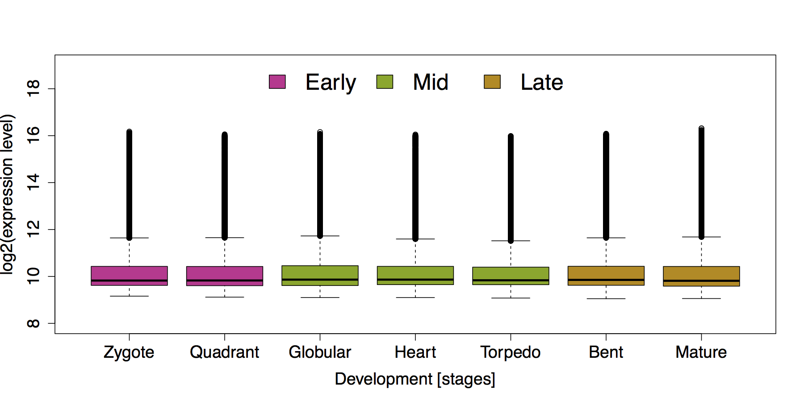
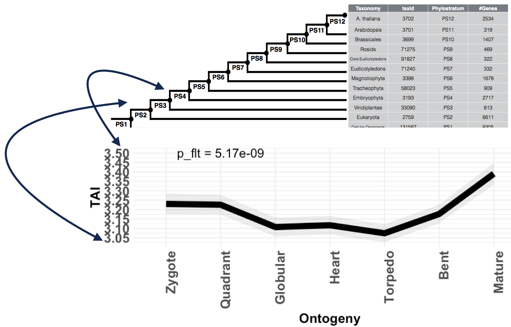

```{r, echo = FALSE, message = FALSE}
library(myTAI)
options(width = 750)
knitr::opts_chunk$set(
  comment = "#>",
  error = FALSE,
  tidy = FALSE)
```


# Table of Contents
1. [Scientific Introduction](#scientific-introduction-performing-evolutionary-transcriptomics-with-r)
2. [Installation](#installation)
3. [Motivation](#motivation)
4. [Retrieval of phylogenetic or taxonomic information](#retrieval-of-phylogenetic-or-taxonomic-information)
5. [Defining input data standards](#defining-input-data-standards)
6. [Performing a Standard Workflow for Evolutionary Transcriptomics Analyses](#performing-a-standard-workflow-for-evolutionary-transcriptomics-analyses)


## Scientific Introduction: Performing Evolutionary Transcriptomics with R

In the past years, a large body of scientific studies aimed at investigating the molecular basis of variation and conservation within biological processes. These transcriptomics studies allowed us to get a glimpse into the molecular patterns and processes that underly complex biological processes such as development or cell differentiation.

Although powerful for investigating the molecular mechanisms that determine the biological process of interest, these datasets rarely capture the evolutionary history of __how__ these expression patterns emerged or to __what extent__ they are possibly constrained. By combining
transcriptomics studies with a comparative approach, however, we can capture some evolutionary signatures that allow us to understand the variability or constraint of particular sets of genes. This evolutionary transcriptomics approach relies on the comparison of transcriptomes between species using orthologous or homologous genes as a phylogenetic variable. This method seeks to determine stages of biological processes in which gene expression patterns are more variable or more constrained than others. 

Finding such transcriptome conservation or variability patterns within a biological process of interest, allows us to reconstruct parts of the evolutionary history of that particular process and might guide us in developing methods to modify such processes.

The myTAI package provides an analytics tool to perform evolutionary transcriptomics studies and is designed to detect evolutionary signatures in transcriptome data. It furthermore, seeks to provide a consistent way to design a computationally reproducible analytics process that achieves a high degree of transparency when conducting evolutionary transcriptomics studies.

Alternatively, instead of investigating the transcriptome conservation of a biological process of interest, `comparative transcriptomics` ( [Pantalacci and Semon, 2014](http://onlinelibrary.wiley.com/doi/10.1002/jez.b.22595/abstract); [Roux et al., 2015](http://onlinelibrary.wiley.com/doi/10.1002/jez.b.22618/full) ) has been developed as a method to study the conservation and variation of gene expression profiles of orthologous genes between related species for a biological process of intest. 

For some biological studies, it can be useful to choose both approaches, `comparative transcriptomics` and `transcriptome conservation quantification`, to independently confirm
evolutionary constraints that might be present in a biological process of interest.

The advantage of `comparative transcriptomics` over `transcriptome conservation quantification` is that this method uses multiple species to confirm gene expression profile conservation within a biological process of interest. However, one should be aware that most `comparative transcriptomics` studies limit their quantification and inference on a subset of the transcriptome. Since `comparative transcriptomics` studies rely on transcripts of orthologous genes, the orthology inference method and the evolutionary distance between compared species can limit the set of investigated transcripts up to 1/3 of the actual transcriptome.

In contrast, the advantage of `transcriptome conservation quantification` over `comparative transcriptomics` is that although `transcriptome conservation quantification` captures less evolutionary signal it can be performed using only one reference species. Thus, hundreds of thousands of transcriptome datasets that are publically accessible can be revisited and investigated in the light of `transcriptome conservation` without having to conduct new experiments to fulfill the experimental design standards of `comparative transcriptomics` studies. 

Furthermore, although also possible in `comparative transcriptomics` studies, `transcriptome conservation quantification` allows to easily include miRNA or lncRNA expression levels to quantify transcriptome conservation. Hence, `transcriptome conservation quantification` experiments capture almost the entire transcriptome when screening for constrained stages or treatments in biological processes.

In conclusion, `transcriptome conservation quantification` experiments can serve as a first approach to screen for the potential existence of (evolutionary/developmental/etc.) constraints within a biological process of interest. If constraints were found in particular stages or treatments which might limit the biological process of interest, `comparative transcriptomics` experiments can be designed to confirm the existence of those constraints in multiple species. 

In this regard, the `myTAI` package serves as analytics tool to revisit existing transcriptome datasets to investigate them in the light of `transcriptome conservation`. 


## Installation

### Package dependencies
If users are interested in performing differential gene expression analyses with `myTAI`, they may install the `edgeR` package.

### Install the `edgeR` package

```r
source("http://bioconductor.org/biocLite.R")
biocLite("edgeR")
```

Users can download `myTAI` from [CRAN](https://cran.r-project.org/package=myTAI) :

```r
# install myTAI from CRAN
install.packages("myTAI", dependencies = TRUE)
```

## Motivation

Using embryo development of the plant _Arabidopsis thaliana_ as an example, we ask the user to imagine how one would investigate the differences of developmental transcriptomes across developmental stages. 




<p style="font-size:10px;"> Figure 1: Gene expression distributions (= developmental transcriptome) throughout seven stages of _A. thaliana_ embryo development. Embryo development is divided into three phases: early embryogenesis (purple), mid-embryogenesis (green), and late embryogenesis (brown). This boxplot illustrates that the overall distributions of log2 expression levels (y-axis) hardly differ between developmental stages (x-axis) although the difference on the global scale is statistically significant (Kruskal-Wallis Rank Sum Test: p < 2e-16). Hence, a clear visual pattern of gene expression differences between early, mid, and late embryogenesis on the global scale can not be inferred. Adapted from [Drost, 2016](http://digital.bibliothek.uni-halle.de/urn/urn:nbn:de:gbv:3:4-18221). </p>


The objective of performing evolutionary transcriptomics studies is to classify a transcriptome into different categories of genes sharing similar evolutionary origins (detectable homologs) or genes that share similar phylogenetic relationships (orthologous genes) and to study the overall expression patterns of these classified genes throughout the biological process of interest. Thus, by introducing a phylogenetic or taxonomic variable to a transcriptome dataset, we can determine stages or time points that are under stronger constraints than others, indicating switches between biological programs or functions.


<p style="font-size:10px;"> Figure 2: Gene expression distributions (= developmental transcriptome) throughout seven stages of _A. thaliana_ embryo development classified into distinctive age categories. Each box represents the developmental stage during _A. thaliana_ embryogenesis, the y-axis denotes the log2 expression levels of genes that fall into the corresponding age category shown on the x-axis. Hence, each boxplot represents the gene expression distribution of genes that are classified into the corresponding age class during a specific developmental stage. The gene age distribution of _A. thaliana_ genes range from PS1 to PS12 where PS1 represents the evolutionarily most distant age category (cellular org.) and PS12 the evolutionary most recent age category (_A. thaliana_ specific). Yellow dots in the boxplots denote the mean expression level of the corresponding expression distribution. This visualization illustrates that although the global gene expression distributions do not change visually between developmental stages (Fig. 1), the global gene expression distributions of age categories differ between stages of _A. thaliana_ embryo development, and thus, allow studying the effect of transcriptome evolution and conservation on embryo development. Adapted from [Drost, 2016](http://digital.bibliothek.uni-halle.de/urn/urn:nbn:de:gbv:3:4-18221). </p>

Conceptually, the idea behind evolutionary transcriptomics studies is to combine the phylogenetic relationship between species (usually retrieved from comparative genomics studies in terms of sequence homology) with transcriptome data of a reference species quantifying a particular biological process of interest (e.g. mutant gene expression versus WT gene expression, stress responses, cell differentiation, development, etc.). Usually, transcriptome data comes from Next Generation Sequencing technologies such as RNA-Seq or from Microarray experiments.


<p style="text-align: center; font-size:20px;"> Phylogenetic Information + Transcriptome Data </p>

Or in other words:

<p style="text-align: center; font-size:20px;"> Comparative Genomics + Transcriptomics = Evolutionary Transcriptomics </p>

In theory, any published or newly generated transcriptome dataset can be used to capture evolutionary signatures with `myTAI`.

`myTAI` is designed to receive phylogenetic information obtained from comparative genomics data and transcriptome data as input and internally combines these datasets to perform evolutionary transcriptomics analyses.


<p style="font-size:10px;"> Figure 3: Workflow describing the input and output of the myTAI package. The myTAI package takes phylogenetic information such as phylogenetic trees (see [Dunn, 2013](http://www.academia.edu/27635691/The_Comparative_Biology_of_Gene_Expression) ), genomic phylostratography based gene age inference (see [Domazet-Loso et al., 2007](http://www.sciencedirect.com/science/article/pii/S0168952507002995); [Capra et al., 2013](http://www.sciencedirect.com/science/article/pii/S016895251300111X); [Liebeskind et al., 2016](http://gbe.oxfordjournals.org/content/early/2016/06/03/gbe.evw113) ), by dNdS estimation of orthologous genes (see [Quint, Drost et al., 2012](http://www.nature.com/nature/journal/v490/n7418/full/nature11394.html) and [Drost et al., 2015](https://academic.oup.com/mbe/article/32/5/1221/1125964)), or phylogenetic reconciliation (see [Doyon et al, 2011](https://www.ncbi.nlm.nih.gov/pubmed/21949266) ) and a RNA-Seq or Microarray based transcriptome dataset as input. Internally, myTAI then combines the phylogenetic data and the transcriptome data an provides numerous functions to perform evolutionary trancriptomics analyses. Here, we examplify the output of the functions `PlotSignature()`, `PlotRE()` and `PlotCategoryExpr()`. </p>


## Retrieval of phylogenetic or taxonomic information

For the comparative genomics part there are different methods and tools to quantify sequence homolgy between genes, miRNAs, lncRNAs etc of a reference species and related species. For example, for phylogenetic or taxonomic information retrieval such as phylogenetic trees, genomic phylostratography based gene age inference, dNdS estimation of orthologous genes or phylogenetic reconciliation can be used. Below users can find the most recent tools and resources for retrieving or computing phylogenetic or taxonomic relationships for an organism of interest.


### Genomic phylostratography based gene age inference

As intensely discussed in the past years ([Capra et al., 2013](http://www.sciencedirect.com/science/article/pii/S016895251300111X); [Altenhoff et al., 2016](http://www.nature.com/nmeth/journal/v13/n5/pdf/nmeth.3830.pdf); [Liebeskind et al., 2016](http://gbe.oxfordjournals.org/content/early/2016/06/03/gbe.evw113)), gene age inference is not a trivial task and might be biased in some currently existing approaches ([Liebeskind et al., 2016](http://gbe.oxfordjournals.org/content/early/2016/06/03/gbe.evw113); [Yin et al., 2018](https://academic.oup.com/bib/article-lookup/doi/10.1093/bib/bby074); [Casola 2018](https://academic.oup.com/gbe/article/10/11/2906/5140197)).

In particular, Moyers & Zhang argue that [genomic phylostratigraphy](http://www.sciencedirect.com/science/article/pii/S0168952507002995) (a prominent BLAST based gene age inference method) 

1) underestimates gene age for a considerable fraction of genes, 

2) is biased for rapidly evolving proteins which are short, and/or their most conserved block of sites is small, and 

3) these biases create spurious nonuniform distributions of various gene properties among age groups, many of which cannot be predicted a priori ([Moyers & Zhang, 2015](http://mbe.oxfordjournals.org/content/32/1/258.long);  [Moyers & Zhang, 2016](http://mbe.oxfordjournals.org/content/33/5/1245); [Liebeskind et al., 2016](http://gbe.oxfordjournals.org/content/early/2016/06/03/gbe.evw113)). 

However, these arguments were based on simulated data and were inconclusive due to [errors in their analyses](http://mbe.oxfordjournals.org/content/33/11/3031.full?etoc). Furthermore, [Domazet-Loso et al., 2017](https://academic.oup.com/mbe/article-lookup/doi/10.1093/molbev/msw284) provide convincing evidence that there is __no__ phylostratigraphic bias. As a response,
[Moyers & Zhang, 2017](https://academic.oup.com/gbe/article/9/6/1519/3867914) recently published a counter-study stating that a phylostratigraphic trend claimed by [Domazet-Loso et al., 2017](https://academic.oup.com/mbe/article-lookup/doi/10.1093/molbev/msw284) to be robust to error disappears when genes likely to be error-resistant are analyzed. [Moyers & Zhang, 2017](https://academic.oup.com/gbe/article/9/6/1519/3867914) further suggest a more robust methodology for controlling for the effects of error by first restricting to those genes which can be simulated and then removing those genes which, through simulation, have been shown to be error-prone (see also [Moyers & Zhang, 2018](https://academic.oup.com/gbe/article/10/8/2037/5061555)).

In general, an objective benchmarking set representing the tree of life is still missing and therefore any procedure aiming to quantify gene ages will be biased to some degree. Based on this debate a recent study suggested to perform gene age inference by combining several common orthology inference algorithms to create gene age datasets and then characterize the error around each age-call on a per-gene and per-algorithm basis. Using this approach systematic error was found to be a large factor in estimating gene age, suggesting that simple consensus algorithms are not enough to give a reliable point estimate ([Liebeskind et al., 2016](http://gbe.oxfordjournals.org/content/early/2016/06/03/gbe.evw113)). This was also observed by [Moyers & Zhang, 2018](https://academic.oup.com/gbe/article/10/8/2037/5061555)) when running alternative tools such as `PSIBLAST`, `HMMER`, `OMA`, etc. However, by generating a consensus gene age and quantifying the possible error in each workflow step, [Liebeskind et al., 2016](http://gbe.oxfordjournals.org/content/early/2016/06/03/gbe.evw113) provide a very useful [database](http://geneages.org/) of
consensus gene ages for a variety of genomes. 

Alternatively, [Stephen Smith, 2016](https://bib.oxfordjournals.org/content/early/2016/04/20/bib.bbw034.full) argues that _de novo_ gene birth/death and gene family expansion/contraction studies should avoid drawing direct inferences of evolutionary relatedness from measures of sequence similarity alone, and should instead, where possible, use more rigorous phylogeny-based methods. For this purpose, I recommend researchers to consult the [phylomedb database](http://orthology.phylomedb.org/) to retrieve phylogeny-based gene orthology relationships and use these age estimates in combination with `myTAI`. Alternatively, users might find the simulation based removal approach propsed by [Moyers & Zhang, 2018](https://academic.oup.com/gbe/article/10/8/2037/5061555) more suitable. 

Evidently, these advancements in gene age research are very recent and gene age inference is a very young and active field of genomic research. Therefore, many more studies need to address the robust and realistic inference of gene age and a community standard is still missing.

Despite the ongoing debate about how to correctly infer gene age, users of `myTAI` can perform any gene age inference method they find most appropriate for their biological question and pass this gene age inference table as input to `myTAI`. To do so, users need to follow the following data format specifications to use their gene age inference table with `myTAI`. However, even when users rely on established procedures such as phylostratigraphy the gene age inference bias will be present
as 'systematic error' in all developmental stages for which TAI or TDI computations are performed. Thus, stages of constraint will be detectable in any case. Since TAI or TDI computations are indended to enable screening for conserved or constrained stages in developmental or biological processes for further downstream experimental studies, even simple approaches such as phylostratigraphy can give first evidence for the existence of transcriptomic contraints within a biological process. If researchers then wish to extract the exact candidate genes that might potentially cause such transcriptome constraints then I would advise to rely on more superior approaches of gene age inference as discussed above.

In my opinion, what is completely missing in this entire debate is the bioinformatics/technical aspect of using BLAST or any other BLAST-like tool for gene age inference. Recently, it was intesely discussed how BLAST hits are biased by the use of the default argument `max_target_seqs` ([Shah et al., 2018](https://academic.oup.com/bioinformatics/advance-article/doi/10.1093/bioinformatics/bty833/5106166)). The main issue of how this `max_target_seqs` is set is that:

> According to the BLAST documentation itself (2008), this parameter represents the 'number of aligned sequences to keep'. This statement is commonly interpreted as meaning that BLAST will return the top N database hits for a sequence query if the value of max_target_seqs is set to N. For example, in a recent article (Wang et al., 2016) the authors explicitly state 'Setting 'max target seqs' as '1' only the best match result was considered'.
> __To our surprise, we have recently discovered that this intuition is incorrect.__ Instead, BLAST returns the first N hits that exceed the specified E-value threshold, which may or may not be the highest scoring N hits. The invocation using the parameter '-max_target_seqs 1' simply returns the first good hit found in the database, not the best hit as one would assume. Worse yet, the output produced depends on the order in which the sequences occur in the database. For the same query, different results will be returned by BLAST when using different versions of the database even if all versions contain the same best hit for this database sequence. Even ordering the database in a different way would cause BLAST to return a different 'top hit' when setting the max_target_seqs parameter to 1.
> - Shah et al., 2018

The solution to this issue seems to be that any BLAST search must be performed with a significantly high `-max_target_seqs`, e.g. `-max_target_seqs 10000` (see https://gist.github.com/sujaikumar/504b3b7024eaf3a04ef5 for details) and best hits
must be filtered subsequently. It is not clear from any of the studies referenced above how the best BLAST hit was retrieved and which `-max_target_seqs` values were used to perform BLAST searches in the respective study. Thus, the comparability of the results between studies is impossible and any individual claim made in these studies might be biased. 

In addition, the `-max_target_seqs` argument issue seems not to be the only issue that might influence technical differences in BLAST hit results. [Gonzalez-Pech et al., 2018](https://academic.oup.com/bioinformatics/advance-article/doi/10.1093/bioinformatics/bty1018/5239655) discuss another problem of retrieving the best BLAST hits based on `E-value` thresholds. 

> Many users assume that BLAST alignment hits with E-values
less than or equal to the predefined threshold (e.g. 105 via the specification of  evalue 1e-5) are identified after the search is completed, in a final step to rank all alignments by E-value, from the
smallest (on the top of the list of results) to the largest E-value (at
the bottom of the list).
>__However, the E-value filtering step does not occur at the final
stage of BLAST; it occurs earlier during the scanning phase (Altschul
et al., 1997; Camacho et al., 2009). During this phase, a gapped
alignment is generated using less-sensitive heuristic parameters
(Camacho et al., 2009); alignments with an E-value that satisfies the
defined cut-off are included in the subsequent phase of the BLAST
algorithm (and eventually reported). During the final (trace-back)
phase, these gapped alignments are further adjusted using moresensitive heuristic parameters (Camacho et al., 2009), and the
E-value for each of these refined alignments is then recalculated.__
> - Gonzalez-Pech et al., 2018

This means that if one study mentioned above ran a BLAST search with a
BLAST parameter configuration of lets say `-max_target_seqs 250` (default value in BLAST) and `evalue 10` (default value in BLAST) and then subsequently selected the best hit which returned the smallest `E-value` and another study used the parameter configuration `-max_target_seqs 1` and `evalue 0.0001` then the results of both studies would not be comparable and the proposed gene age inference bias might simply result from a technical difference in running BLAST searches.

In more detail, even if one study for example ran BLAST with `evalue 10` (default value in BLAST) and then subsequently filtered for hits that resulted in `evalue < 0.0001` whereas another study ran BLAST directly with `evalue 0.0001`, according to [Gonzalez-Pech et al., 2018](https://academic.oup.com/bioinformatics/advance-article/doi/10.1093/bioinformatics/bty1018/5239655) these studies although referring to the same `E-value` threshold for filtering hits will result in different sets of filtered BLAST hits.

A recently introduced approach is called `synteny-based phylostratigraphy` ([Arendsee et al., 2019](https://bmcbioinformatics.biomedcentral.com/articles/10.1186/s12859-019-3023-y)). Here, the authors provide a comparative analysis of genes across evolutionary clades, augmenting standard phylostratigraphy with a detailed, synteny-based analysis. Whereas standard phylostratigraphy searches the proteomes of related species for similarities to focal genes, their `fagin` pipeline first finds syntenic genomic intervals and then searches within these intervals for any trace of similarity. It searches the (`in silico` translated) amino acid sequence of all unannotated ORFs as well as all known CDS within the syntenic search space of the target genomes. If no amino acid similarity is found within the syntenic search space, their `fagin` pipeline will search for nucleotide similarity. Finding nucleotide sequence similarity, but not amino acid similarity, is consistent with a `de novo` origin of the focal gene. If no similarity of any sort is found, their `fagin` pipeline will use the syntenic data to infer a possible reason. Thus, they detect indels, scrambled synteny, assembly issues, and regions of uncertain synteny ([Arendsee et al., 2019](https://bmcbioinformatics.biomedcentral.com/articles/10.1186/s12859-019-3023-y)).

Hence, all of the above mentioned approaches are far from being perfect and much more research is needed to systematically compare different approaches for gene age inference.   

The overall rational behind gene age inference is to assign each protein coding gene of an organism of interest with an evolutionary age estimate which aims to quantify its potential origin within the tree of life (detectable sequence homolog; orphan gene (see  [Tautz & Domazet-Loso, 2011](http://www.nature.com/nrg/journal/v12/n10/abs/nrg3053.html))). Hence, gene age inference generates a table storing the gene age in the first column and the corresponding gene id of the organism of iterest in the second column. This table is named _phylostratigraphic map_.


__Generate or retrieve phylostratigraphic maps:__

- [R package: phylostratr](https://github.com/arendsee/phylostratr) which implements `Phylostratigraphy` as an `R package` - Please consult the [Vignettes](https://github.com/arendsee/phylostratr/tree/master/vignettes) for examples. 
- [R package: fagin](https://github.com/arendsee/fagin): a synteny-based phylostratigraphy and finer classification of young genes (see also the [corresponding manuscript](https://bmcbioinformatics.biomedcentral.com/articles/10.1186/s12859-019-3023-y) and [example applications](https://github.com/arendsee/fagin-case-studies))
- [createPSmap.pl](https://github.com/AlexGa/Phylostratigraphy): generate a phylostratigraphic map (implemented by Alexander Gabel)
- [phylostratigraphy.pl](https://figshare.com/articles/A_developmental_hourglass_in_fungi/1284022): generate a phylostratigraphic (implemented by Cheng et al. 2015)
- [phylo_pipeline.py](https://mynotebook.labarchives.com/share/Shuqing_Xu/NTIuMHw2NDQyMi80MC9UcmVlTm9kZS8zNDEyODM1NjE2fDEzMi4w): a Python script to generate a phylostratigraphic map (implemented by Shuqing Xu)
- [Genomic-phylostratigraphy-tool](https://github.com/longjunwu/Genomic-phylostratigraphy-tool): a Python script to generate a phylostratigraphic map (implemented by Longjun Wu)
- [ORFanFinder](http://bioinformatics.oxfordjournals.org/content/early/2016/03/26/bioinformatics.btw122.full.pdf): generate a phylostratigraphic map
- `Protein Historian`: generate a gene age map
- download pre-computed and published [phylostratigraphic maps](https://github.com/HajkD/published_phylomaps)
- [Liebeskind et al., 2016](http://geneages.org/): use a gene age consensus approach to estimating gene ages for model organisms
- [orthoscape](https://bmcbioinformatics.biomedcentral.com/articles/10.1186/s12859-016-1427-5): a cytoscape application for grouping and visualization KEGG based gene networks by taxonomy and homology principles (implemented by Mustafin et al., 2017)
- [RecBlast](http://biorxiv.org/content/early/2017/03/02/112946): Cloud-Based Large Scale Orthology Detection (by Efrat Rapoport and Moran Neuhof)
- [protTrace](https://github.com/BIONF/protTrace): A simulation based framework to estimate the evolutionary traceability of protein


### dNdS estimation of orthologous genes

We recently proposed to use the classical dNdS measure to quantify the sequence conservation of protein coding genes between closely related species. This way, we combine the information about the selective pressure acting on a particular gene with its expression level during a particular time point or condition. We refer to this approach as Divergence Stratigraphy ([Drost et al., 2015 _Mol. Biol. Evol._](https://academic.oup.com/mbe/article/32/5/1221/1125964)). Analogous to gene age inference methods,
divergence stratigraphy generates a table storing the sequence conservation estimate in the first column and the corresponding gene id of the organism of iterest in the second column. This table is named _divergence stratigraphic map_.


__Generate or retrieve divergence stratigraphic maps:__

- [orthologr](https://github.com/HajkD/orthologr): generate a [divergence stratigraphic map](https://github.com/HajkD/orthologr/blob/master/vignettes/divergence_stratigraphy.Rmd) (implemented by Hajk-Georg Drost)
- [compute_dNdS.pl](https://figshare.com/articles/A_developmental_hourglass_in_fungi/1284022): generate a divergence stratigraphic map (implemented by Cheng et al. 2015)
- [MetaPhOrs](http://orthology.phylomedb.org/): retrieve phylogeny-based orthology and paralogy predictions
- download pre-computed and published [divergence stratigraphic maps](https://github.com/HajkD/published_phylomaps)
- [orthoscape](https://bmcbioinformatics.biomedcentral.com/articles/10.1186/s12859-016-1427-5): a cytoscape application for grouping and visualization KEGG based gene networks by taxonomy and homology principles (implemented by Mustafin et al., 2017)
- [RecBlast](http://biorxiv.org/content/early/2017/03/02/112946): Cloud-Based Large Scale Orthology Detection (by Efrat Rapoport and Moran Neuhof)


### Generate custom table


In general, users can construct their own gene age assignment methods and are not limited to the methods listed above. 
After formatting the corresponding results to the _age map_
specification (age assignment in the first column and gene id in the second column), users can use
any function in myTAI with their custom gene age assignment table.

## Getting Started with `myTAI`

`myTAI` takes an _age map_ and an expression dataset as input and combines both tables to the quantify transcriptome conservation for the biological process of interest. 

### Defining input data standards
The following code illustrates an example structure of an `age map`. Here we choose genomic phylostratigraphy and dNdS estimation as method to generate a _phylostratigraphic map_ and _divergence stratigraphic map_:

```{r,eval=FALSE}
# load myTAI
library(myTAI)

# load example data sets (stored in myTAI)
data(PhyloExpressionSetExample)
data(DivergenceExpressionSetExample)

# show an example phylostratigraphic map of Arabidopsis thaliana
head(PhyloExpressionSetExample[ , c("Phylostratum","GeneID")])

```

```
  Phylostratum      GeneID
1            1 at1g01040.2
2            1 at1g01050.1
3            1 at1g01070.1
4            1 at1g01080.2
5            1 at1g01090.1
6            1 at1g01120.1
```

In detail, a _phylostratigraphic map_ stores the gene age assignment generated with e.g. [phylostratigraphy](https://github.com/AlexGa/Phylostratigraphy) in the
first columns and the corresponding gene id in the second column.

Analogously, a divergence stratigraphic map stores the gene age assignment generated with e.g. [divergence stratigraphy](https://github.com/HajkD/orthologr/blob/master/vignettes/divergence_stratigraphy.Rmd) in the
first column and the corresponding gene id in the second column:

```{r,eval=FALSE}
# show an example structure of a Divergence Map
head(DivergenceExpressionSetExample[ , c("Divergence.stratum","GeneID")])

```

```
  Divergence.stratum      GeneID
1                  1 at1g01050.1
2                  1 at1g01120.1
3                  1 at1g01140.3
4                  1 at1g01170.1
5                  1 at1g01230.1
6                  1 at1g01540.2
```

Hence, `myTAI` relies on pre-computed _age maps_ fulfilling the aforementioned standard for all downstream analyses. It does not matter whether or not age maps contain categorized age values like in `phylostratigraphic maps` or e.g. phylogenetic distance values generated by phylogenetic inference. 

### Expression dataset specification

The aim of any evolutionary transcriptomics study is to quantify transcriptome conservation in biological processes.
For this purpose, users need to provide the transcriptome dataset of their studied biological process.

In the following examples we will use a `gene expression dataset` covering seven stages of _Arabidopsis thaliana_ embryo development. This data format is defined as `ExpressionMatrix` in the `myTAI` data format specification.

```
# gene expression set

       GeneID     Zygote   Quadrant   Globular      Heart    Torpedo       Bent    Mature
1 at1g01040.2  2173.6352  1911.2001  1152.5553  1291.4224  1000.2529   962.9772 1696.4274
2 at1g01050.1  1501.0141  1817.3086  1665.3089  1564.7612  1496.3207  1114.6435 1071.6555
3 at1g01070.1  1212.7927  1233.0023   939.2000   929.6195   864.2180   877.2060  894.8189
4 at1g01080.2  1016.9203   936.3837  1181.3381  1329.4734  1392.6429  1287.9746  861.2605
5 at1g01090.1 11424.5667 16778.1685 34366.6493 39775.6405 56231.5689 66980.3673 7772.5617
6 at1g01120.1   844.0414   787.5929   859.6267   931.6180   942.8453   870.2625  792.7542
```

The function `MatchMap()` allows users to join a _phylostratigraphic map_ with an _ExpressionMatrix_ to obtain a joined table referred to as _PhyloExpressionSet_. In some cases, the GeneIDs stored in the `ExpressionMatrix` and in the _phylostratigraphic map_ do not match. This is due to GeneID mappings between different databases and annotations. To map non matching GeneIDs between databases and annotations, please consult the [Functional Annotation Vignette](https://github.com/HajkD/biomartr/blob/master/vignettes/Functional_Annotation.Rmd) in the [biomartr](https://github.com/HajkD/biomartr) package. The `biomartr` package allows users to map GeneIDs between database annotations.

After matching a _phylostratigraphic map_ with an _ExpressionMatrix_ using the `MatchMap()` function, a standard _PhyloExpressionSet_ is returned storing the phylostratum assignment of a given gene in the first column, the _gene id_ of the corresponding gene in the second column, and the entire gene expression set (time series or treatments) starting with the third column. This format is crucial for all functions that are implemented in the `myTAI` package.

```{r,eval=FALSE}
library(myTAI)

# load the example data set
data(PhyloExpressionSetExample)

# construct an example Phylostratigraphic Map 
Example.PhylostratigraphicMap <- PhyloExpressionSetExample[ , 1:2]
# construct an example ExpressionMatrix
Example.ExpressionMatrix <- PhyloExpressionSetExample[ , 2:9]

# join a PhylostratigraphicMap with an ExpressionMatrix using MatchMap()
Example.PhyloExpressionSet <- MatchMap(Example.PhylostratigraphicMap, Example.ExpressionMatrix)

# look at a standard PhyloExpressionSet
head(Example.PhyloExpressionSet, 3)
```

```
Phylostratum      GeneID    Zygote  Quadrant  Globular    Heart  Torpedo     Bent   Mature
1            4 at1g01010.1  878.2158  828.2301  776.0703 753.9589 775.3377 756.2460 999.9118
2            2 at1g01020.1 1004.9710 1106.2621 1037.5141 939.0830 961.5249 871.4684 997.5953
3            3 at1g01030.1  819.4880  771.6396  810.8717 866.7780 773.7893 747.9941 785.6105
```


Analogous to a standard _PhyloExpressionSet_, a standard _DivergenceExpressionSet_ is a `data.frame` storing the divergence stratum assignment of a given gene in the first column, the gene id of the corresponding gene in the second column, and the entire gene expression set (time series or treatments) starting with the third column. 

The following `DivergenceExpressionSet` example illustrates the standard `DivergenceExpressionSet` data set format.

```{r,eval=FALSE}
# head of an example standard DivergenceExpressionSet
head(DivergenceExpressionSetExample, 3) 
```

```
  Divergence.stratum      GeneID    Zygote  Quadrant  Globular    Heart   Torpedo      Bent    Mature
1                  1 at1g01050.1 1501.0141 1817.3086 1665.3089 1564.761 1496.3207 1114.6435 1071.6555
2                  1 at1g01120.1  844.0414  787.5929  859.6267  931.618  942.8453  870.2625  792.7542
3                  1 at1g01140.3 1041.4291  908.3929 1068.8832  967.749 1055.1901 1109.4662  825.4633

```

A _DivergenceExpressionSet_ defines the joined table between a _divergence stratigraphic map_ and a _Expression Set_. A _DivergenceExpressionSet_ can be generated analogous to a _PhyloExpressionSet_ by joining a _divergence  stratigraphic map_ with an _ExpressionMatrix_ using the `MatchMap()` function. In some cases, the GeneIDs stored in the _ExpressionMatrix_ and in the _divergence stratigraphic map_ do not match. This is due to GeneID mappings between different databases and annotations. To map non matching GeneIDs between databases and annotations, please consult the [Functional Annotation Vignette](https://github.com/HajkD/biomartr/blob/master/vignettes/Functional_Annotation.Rmd) in the [biomartr](https://github.com/HajkD/biomartr) package.


Each function implemented in `myTAI` checks internally whether or not the _PhyloExpressionSet_ or _DivergenceExpressionSet_ standard is fulfilled.

```{r,eval=FALSE}
# used by all myTAI functions to check the validity of the PhyloExpressionSet standard
is.ExpressionSet(PhyloExpressionSetExample) 
```

```
[1] TRUE

```
In case the PhyloExpressionSet standard is violated, the `is.ExpressionSet()` function will return `FALSE` and the corresponding function within the `myTAI` package will return an error message.

```{r,eval=FALSE}
# used a non standard PhyloExpressionSet
head(PhyloExpressionSetExample[ , 2:5], 2)
```

```
       GeneID   Zygote Quadrant Globular
1 at1g01040.2 2173.635 1911.200 1152.555
2 at1g01050.1 1501.014 1817.309 1665.309

```

```{r, error = TRUE,eval=FALSE}
is.ExpressionSet(PhyloExpressionSetExample[ , 2:5]) 
```

```

Error in is.ExpressionSet(PhyloExpressionSetExample[, 2:5]) : 
  The present input object does not fulfill the ExpressionSet standard.
  
```

__It might be that you work with a `tibble` object which will not be recognized by `is.ExpressionSet`. In that case, please convert your `tibble` object 
to a `data.frame` using the function `as.data.frame()`.__

```{r, eval = FALSE}
# convert any tibble to a data.frame
PhyloExpressionSetExample <- as.data.frame(PhyloExpressionSetExample)
# now is.ExpressionSet() should return TRUE
is.ExpressionSet(PhyloExpressionSetExample)
```


__The PhyloExpressionSet and DivergenceExpressionSet formats are crucial for all functions that are implemented in the `myTAI` package__.

Keeping these standard data formats in mind will provide users with the most important requirements to get started with the `myTAI` package.

__Note__, that within the code of each function, the argument `ExpressionSet` always refers to either a PhyloExpressionSet or a DivergenceExpressionSet, whereas in specialized functions some arguments are specified as _PhyloExpressionSet_ when they take an PhyloExpressionSet as input data set, or specified as _DivergenceExpressionSet_ when they take an _DivergenceExpressionSet_ as input data set.

## Performing a Standard Workflow for Evolutionary Transcriptomics Analyses 

The main goal of any evolutionary transcriptomics study is to quantify transcriptome conservation at a particular stage or treatment. This is achieved by computing the average age of genes that contribute to the transcriptome at that stage or treatment. In other words, by multiplying the gene age value with the expression level of the corresponding gene and averaging over all genes, we obtain the mean age of the transcriptome. Hence, we can say that at a particular stage `genes that are most expressed at this stage or treatment have (on average) the evolutionary age XY`.


To obtain this mean age value, several measures were introduced:

#### Transcriptome Age Index

The first meansure named _Transcriptome Age Index_ (TAI) was introduced by Domazet-Loso and Tautz, 2010 and represents a weighted arithmetic mean of the transcriptome age during a corresponding developmental stage _s_. 


$TAI_s = \sum_{i = 1}^n \frac{ps_i * e_{is}}{\sum_{i = 1}^n e_{is}}$

where $ps_i$ denotes the phylostratum assignment of gene $i$ and $e_{is}$ denotes
the gene expression level of gene $i$ at developmental time point $s$. A lower value of TAI describes an older transcriptome age, whereas a higher value of TAI denotes a younger transcriptome age.

The following figure shows the TAI computations for the seven stages of _A. thaliana_ embryo development.

```{r, fig.width= 7, fig.height= 5,eval=TRUE}
data(PhyloExpressionSetExample)
# Plot the Transcriptome Age Index of a given PhyloExpressionSet 
# Test Statistic : Flat Line Test (default)
PlotSignature( ExpressionSet = PhyloExpressionSetExample,
               measure       = "TAI", 
               TestStatistic = "FlatLineTest",
               xlab          = "Ontogeny", 
               ylab          = "TAI" )
```

The x-axis shows the seven stages of _A. thaliana_ embryo development and the y-axis shows the corresponding mean transcriptome age (TAI) value. The lower the TAI value the older the mean transcriptome age and the higher the TAI value the younger the mean transcriptome age.

The interpretation of the TAI values on the y-axis is given by the next figure.



In this example, a TAI value of 3.5 quantifies that genes that contribute most the transcriptome at a particular stage emerged on average between phylostratum 3 and phylostratum 4. Due to the nature of the arithmetic mean, this value does not represent the true origin of individual genes, and thus the TAI measure is only helpful to screen for stages that express (on average) older or younger genes. Subsequent analyses such as mean expression of age categories, relative expression levels, and gene expression level distributions for each age category will then reveal which exact genes or age categories generate the overall TAI value.

To obtain a more detailed overview of which age categories contribute how much to
each developmental stage, the gene expression level distributions for each age caterory and each developmental stage can be visualized (using the `PlotCategoryExpr()` function).

```{r, fig.width= 9, fig.height= 5,eval=TRUE}
data(PhyloExpressionSetExample)
# category-centered visualization of PS 
# specific expression level distributions (log-scale)
PlotCategoryExpr(ExpressionSet = PhyloExpressionSetExample,
                     legendName    = "PS",
                     test.stat     = TRUE,
                     type          = "category-centered",
                     distr.type    = "boxplot",
                     log.expr      = TRUE)
```

This figure shows that in all developmental stages, genes coming from PS1-3 are (on average) more expressed than genes coming from PS4-12. Interestingly, the gene expression level distributions of PS4-12 become more equally distributed towards the Torpedo stage which has been marked as the most conserved stage by TAI analysis. This general trend can be visualized using the `PlotMeans()` function.

```{r, fig.width= 9, fig.height= 5,eval=TRUE}
data(PhyloExpressionSetExample)
# plot evolutionary old PS (PS1-3) vs
# evolutionary young PS (PS4-12)
PlotMeans(PhyloExpressionSetExample,
          Groups = list(c(1:3), c(4:12)), 
          legendName = "PS",
          adjust.range = TRUE)
```

Here, users will observe that indeed PS1-3 genes are (on average) higher expressed than PS4-12 genes.

Using a linear transformation of the mean expression levels into the interval $[0,1]$ (Quint et al., 2012 and Drost et al., 2015) we can compare mean expression patterns between Phylostrata independent from their actual mean expression magnitude. A relative expression level of 0 denotes the minimum mean expression level compared to all other stages and a relative expression level of 1 denotes the maximum mean expression level compared to all other stages.

The following figure illustrates the average gene expression profile for each phylostratum.

```{r, fig.width= 9, fig.height= 5,eval=TRUE}
data(PhyloExpressionSetExample)
# plot evolutionary old PS (PS1-3) vs
# evolutionary young PS (PS4-12)
PlotRE(PhyloExpressionSetExample,
          Groups = list(c(1:3), c(4:12)), 
          legendName = "PS",
          adjust.range = TRUE)
```

Users will observe, that PS4-12 genes are down-regulated towards the Torpedo stage (marked as most conserved by TAI analysis) and up-regulated after the Torpedo stage.

To cluster gene expression levels of PS4-12 genes we categorize _A. thaliana_ embryogenesis into three developmental modules (early, mid, and late) and cluster young genes (PS4-12) according to their fold-change pattern: High-Low-Low, High-Low-High, and Low-Low-High. 

```{r,eval=TRUE,echo=FALSE,fig.width= 7, fig.height= 15}
# select PS4-12 genes
PhyloExpressionSetExample.PS4_12 <-
        dplyr::filter(PhyloExpressionSetExample, Phylostratum %in% c(4:12))
# categorize A. thaliana embryogenesis into three 
# developmental modules (early, mid, and late)
Ath.Embryogenesis.DiffGenes <-
        DiffGenes(
        ExpressionSet = PhyloExpressionSetExample.PS4_12,
        nrep          = c(2, 3, 2),
        stage.names   = c("Early", "Mid", "Late")
        )

# cluster young genes (PS4-12) according to their fold-change pattern: High-Low-Low        
Ath.Embryo.High_Low_Low <-
        PhyloExpressionSetExample.PS4_12[which((Ath.Embryogenesis.DiffGenes[, "Early->Mid"] > 3) &
        (dplyr::between(Ath.Embryogenesis.DiffGenes[, "Mid->Late"], 1, 2))),]

# cluster young genes (PS4-12) according to their fold-change pattern: High-Low-High
Ath.Embryo.High_Low_High <-
        PhyloExpressionSetExample.PS4_12[which((Ath.Embryogenesis.DiffGenes[, "Early->Mid"] > 3) &
        (Ath.Embryogenesis.DiffGenes[, "Mid->Late"] < 0.2)),]

# cluster young genes (PS4-12) according to their fold-change pattern: Low-Low-High        
Ath.Embryo.Low_Low_High <-
        PhyloExpressionSetExample.PS4_12[which((dplyr::between(Ath.Embryogenesis.DiffGenes[, "Early->Mid"], 1, 2)) &
        (Ath.Embryogenesis.DiffGenes[, "Mid->Late"] < 0.2)),]
        
        
        par(mfrow = c(3, 1))
        matplot(
        t(Ath.Embryo.High_Low_Low[, 3:9]),
        type = "l",
        lty = 1,
        lwd = 2,
        col = "lightblue",
        xlab = "Ontogeny",
        ylab = "Expression Level",
        xaxt = "n",
        cex.lab = 1.5,
        cex.axis = 1.5,
        main = "High-Low-Low"
        )
        lines(
        colMeans(Ath.Embryo.High_Low_Low[, 3:9]),
        lwd = 6 ,
        col = "red",
        cex.lab = 1.5,
        cex.axis = 1.5,
        cex = 1.5
        )
        axis(1, 1:7, names(PhyloExpressionSetExample)[3:9])
        text(
        4,
        max(Ath.Embryo.High_Low_Low[, 3:9]) - 6000,
        labels = paste0(nrow(Ath.Embryo.High_Low_Low), " Genes"),
        cex = 2
        )
        
        matplot(
        t(Ath.Embryo.High_Low_High[, 3:9]),
        type = "l",
        lty = 1,
        lwd = 2,
        col = "lightblue",
        xlab = "Ontogeny",
        ylab = "Expression Level",
        xaxt = "n",
        cex.lab = 1.5,
        cex.axis = 1.5,
        main = "High-Low-High"
        )
        lines(
        colMeans(Ath.Embryo.High_Low_High[, 3:9]),
        lwd = 6 ,
        col = "red",
        cex.lab = 1.5,
        cex.axis = 1.5,
        cex = 1.5
        )
        axis(1, 1:7, names(PhyloExpressionSetExample)[3:9])
        text(
        4,
        max(Ath.Embryo.High_Low_High[, 3:9]) - 6000,
        labels = paste0(nrow(Ath.Embryo.High_Low_High), " Genes"),
        cex = 2
        )
        
        matplot(
        t(Ath.Embryo.Low_Low_High[, 3:9]),
        type = "l",
        lty = 1,
        lwd = 2,
        col = "lightblue",
        xlab = "Ontogeny",
        ylab = "Expression Level",
        xaxt = "n",
        cex.lab = 1.5,
        cex.axis = 1.5,
        main = "Low-Low-High"
        )
        lines(
        colMeans(Ath.Embryo.Low_Low_High[, 3:9]),
        lwd = 6 ,
        col = "red",
        cex.lab = 1.5,
        cex.axis = 1.5,
        cex = 1.5
        )
        axis(1, 1:7, names(PhyloExpressionSetExample)[3:9])
        text(
        4,
        max(Ath.Embryo.Low_Low_High[, 3:9]) - 6000,
        labels = paste0(nrow(Ath.Embryo.Low_Low_High), " Genes"),
        cex = 2
        )
```

As a result, we find that there are two distinct sets of young genes: High-high-low and low-low-high. Almost none of the genes have a high-low-high pattern. 

Finally, users can perform KEGG or GO Term enrichment analyses to obtain the annotated functions of these gene sets.

#### Transcriptome Divergence Index

Analogous to the TAI measure, the _Transcriptome Divergence Index_ (TDI) was introduced by Quint et al., 2012 and Drost et al., 2015 as a measure of average transcriptome selection pressure where $s$ denotes the corresponding developmental stage.

$TDI_s = \sum_{i = 1}^n \frac{ds_i * e_{is}}{\sum_{i = 1}^n e_{is}}$

where $ds_i$ denotes the divergence stratum assignment of gene $i$ and $e_{is}$ denotes
the gene expression level of gene $i$ at developmental time point $s$. 
A lower value of TDI describes an more conserved transcriptome (in terms of sequence dissimilarity), whereas a higher value of TDI denotes a more variable transcriptome.


To assess the statistical significance of all introduced measures and analyses, we developed several test statistics that are introduced in the following sections.

## Transcriptome Age Index Analyses

Evolutionary signatures of transcriptomes can be captured by computing transcriptome indices at different measured stages of development, combining these computed values to a transcriptome index profile across the measured stages, and comparing the resulting profile with a flat line. A profile not significantly deviating from a flat line indicates the absence of significant variations of the computed transcriptome index from stage to stage. In contrast, a profile significantly deviating from a flat line indicates the presence of significant variations from stage to stage. We refer to any transcriptome index profile significantly deviating from a flat line as phylotranscriptomic pattern or evolutionary signature.

Previously, we introduced three statistical tests to quantify the significance of observed TAI or TDI patterns: `Flat Line Test`, `Reductive Hourglass Test`, and `Reductive Early Conservation Test` ([Drost et al., 2015](https://academic.oup.com/mbe/article/32/5/1221/1125964)).

The `PlotPattern()` function introduced in the following sections is the main analytics function of myTAI. `PlotPattern()` allows users to visualize TAI or TDI patterns and internally performs the following statistical tests to assess their significance.

### Flat Line Test

The `PlotSignature()` function with option `TestStatistic = "FlatLineTest",` first computes the `TAI` (given a PhyloExpressionSet and argument specification `measure = "TAI"`) or the `TDI` (given a DivergenceExpressionSet and argument specification `measure = "TDI"`) profile as well as their standard deviation, and statistical significance.

```{r, fig.width= 7, fig.height= 5,eval=FALSE}
data(PhyloExpressionSetExample)
# Plot the Transcriptome Age Index of a given PhyloExpressionSet 
# Test Statistic : Flat Line Test (default)
PlotSignature( ExpressionSet = PhyloExpressionSetExample,
               measure       = "TAI", 
               TestStatistic = "FlatLineTest",
               xlab          = "Ontogeny", 
               ylab          = "TAI" )
```

The p-value (`p_flt`) above the TAI curve is returned by the `FlatLineTest`. As described in the
documentation of `PlotSignature()` (`?PlotSignature` or `?FlatLineTest`), the `FlatLineTest` is the default statistical test to quantify the statistical significance of the observed phylotranscriptomic pattern. In detail, the test quantifies any statistically significant deviation of the phylotranscriptomic pattern from a flat line. Here, we define any significant deviation of a phylotranscriptomic pattern from a flat line as evolutionary signature Furthermore, we define corresponding stages of deviation as evolutionary conserved or variable (less conserved) depending on the magnitude of `TAI` and corresponding p-values.

### Reductive Hourglass Test


In case the observed phylotranscriptomic pattern not only significantly deviates from a flat line but also visually resembles an _hourglass_ shape,
one can obtain a p-value quantifying the statistical significance of a visual _hourglass_ pattern based on the `ReductiveHourglassTest` (`?ReductiveHourglassTest`).

Since the `ReductiveHourglassTest` has been defined for a priori biological knowledge ([Drost et al., 2015](https://academic.oup.com/mbe/article/32/5/1221/1125964)), the `modules` argument within the `ReductiveHourglassTest()` function needs to be specified.

Three modules need to be specified: an __early-module__, __phylotypic module__ (mid), and a __late-module__.

For this example we divide _A. thaliana_ embryo development stored within the _PhyloExpressionSetExample_ into the following three modules:

* early = stages 1 - 2 (Zygote and Quadrant)
* mid = stages 3 - 5 (Globular, Heart, and Torpedo)
* late = stages 6 - 7 (Bent and Mature)

```{r, fig.width= 7, fig.height= 5,eval=FALSE}
# Plot the Transcriptome Age Index of a given PhyloExpressionSet 
# Test Statistic : Reductive Hourglass Test
PlotSignature( ExpressionSet = PhyloExpressionSetExample,
               measure       = "TAI",
               TestStatistic = "ReductiveHourglassTest",
               modules       = list(early = 1:2, mid = 3:5, late = 6:7),
               xlab          = "Ontogeny", 
               ylab          = "TAI" )
```

The corresponding p-value `p_rht` now denotes the p-value returned by the `ReductiveHourglassTest`
which is different from the p-value returned by the `FlatLineTest` (`p_flt`).


To make sure that correct modules have been selected to perform the `ReductiveHourglassTest`, users can use the `shaded.area` argument to visualize chosen modules:

```{r, fig.width= 7, fig.height= 5,eval=FALSE}
# Visualize the phylotypic period used for the Reductive Hourglass Test
PlotSignature( ExpressionSet = PhyloExpressionSetExample,
               measure       = "TAI",
               TestStatistic = "ReductiveHourglassTest",
               modules       = list(early = 1:2, mid = 3:5, late = 6:7),
               shaded.area   = TRUE, 
               xlab          = "Ontogeny", 
               ylab          = "TAI" )
```

__Note__ that for defining a priori knowledge for the `ReductiveHourglassTest` using the `modules` argument, modules need to start at stage 1, ..., N and do not correspond to the column position in the _PhyloExpressionSet/DivergenceExpressionSet_
which in contrast would start at position 3, ... N + 2.

In a biological context, it is not always clear which stages could define the ealy, mid, and late 
modules. For animal embryogenesis, it has been suggested to choose early, mid, and late modules
according to the morphological conservation of animal embryos (e.g. mid-stage vertebrate embryos seem to be morphologically conserved). For plants, in contrast no morphological conservation has been reported and thus the averge expression of embryo defective genes has been used to define modules (Drost et al. 2015).

### Reductive Early Conservation Test


The third test statistic that is implemented in the `myTAI` package is the `EarlyConservationTest`.

The `EarlyConservationTest` tests whether an observed phylotranscriptomic pattern follows
a low-high-high pattern (monotonically increasing function) supporting the Early Conservation Model of embryogenesis.


Analogous to the `ReductiveHourglassTest`, the `EarlyConservationTest` needs a priori biological knowledge [Drost et al., 2015](https://academic.oup.com/mbe/article/32/5/1221/1125964).
So again three `modules` have to be specified for the `EarlyConservationTest()` function.

Three modules need to be specified: an __early-module__, __phylotypic module__ (mid), and a __late-module__.

For this example we divide _A. thaliana_ embryo development stored within the _PhyloExpressionSetExample_ into the following three modules:

* early = stages 1 - 2 (Zygote and Quadrant)
* mid = stages 3 - 5 (Globular, Heart, and Torpedo)
* late = stages 6 - 7 (Bent and Mature)

```{r, fig.width= 7, fig.height= 5,eval=FALSE}
# Plot the Transcriptome Age Index of a given PhyloExpressionSet 
# Test Statistic : Reductive Early Conservation Test
PlotSignature( ExpressionSet = PhyloExpressionSetExample,
               measure       = "TAI",
               TestStatistic = "EarlyConservationTest",
               modules       = list(early = 1:2, mid = 3:5, late = 6:7),
               xlab          = "Ontogeny", 
               ylab          = "TAI" )
```

The corresponding p-value `p_ect` now denotes the p-value returned by the `EarlyConservationTest`
which is different from the p-value returned by the `FlatLineTest` (`p_flt`) and `ReductiveHourglassTest` (`p_rht`).

Since the present TAI pattern of the _PhyloExpressionSetExample_ doesn't support the Early Conservation Hypothesis,
the p-value `p_ect` = 1.

Again __note__ that for defining a priori knowledge for the `EarlyConservationTest` using the `modules` argument, modules need to start at stage 1, ..., N and do not correspond to the column position in the _PhyloExpressionSet/DivergenceExpressionSet_
which in contrast would start at position 3, ... N + 2.


To obtain the numerical _TAI_ values, the `TAI()` function can be used:

```{r,eval=FALSE}
# Compute the Transcriptome Age Index values of a given PhyloExpressionSet
TAI(PhyloExpressionSetExample) 
```

```
  Zygote Quadrant Globular    Heart  Torpedo     Bent   Mature 
3.229942 3.225614 3.107135 3.116693 3.073993 3.176511 3.390334 

```


### Reverse Hourglass Test

In case the observed phylotranscriptomic pattern not only significantly deviates from a flat line but also visually resembles an _reverse hourglass_ shape (low-high-low pattern),
one can obtain a p-value quantifying the statistical significance of a visual _reverse hourglass_ pattern based on the `ReverseHourglassTest` (`?ReverseHourglassTest`).

Since the `ReverseHourglassTest` has been defined for a priori biological knowledge ([Drost et al., 2015](https://academic.oup.com/mbe/article/32/5/1221/1125964)), the `modules` argument within the `ReverseHourglassTest()` function needs to be specified.

Three modules need to be specified: an __early-module__, __phylotypic module__ (mid), and a __late-module__.

For this example we divide _A. thaliana_ embryo development stored within the _PhyloExpressionSetExample_ into the following three modules:

* early = stages 1 - 2 (Zygote and Quadrant)
* mid = stages 3 - 5 (Globular, Heart, and Torpedo)
* late = stages 6 - 7 (Bent and Mature)

```{r, fig.width= 7, fig.height= 5,eval=FALSE}
# Plot the Transcriptome Age Index of a given PhyloExpressionSet 
# Test Statistic : Reverse Hourglass Test
PlotSignature( ExpressionSet = PhyloExpressionSetExample,
               measure       = "TAI",
               TestStatistic = "ReverseHourglassTest",
               modules       = list(early = 1:2, mid = 3:5, late = 6:7),
               xlab          = "Ontogeny", 
               ylab          = "TAI" )
```

The corresponding p-value `p_reverse_hourglass` now denotes the p-value returned by the `ReverseHourglassTest`
which is different from the p-value returned by the `FlatLineTest` (`p_flt`).


To make sure that correct modules have been selected to perform the `ReverseHourglassTest`, users can use the `shaded.area` argument to visualize chosen modules:

```{r, fig.width= 7, fig.height= 5,eval=FALSE}
# Visualize the phylotypic period used for the Reductive Hourglass Test
PlotSignature( ExpressionSet = PhyloExpressionSetExample,
               measure       = "TAI",
               TestStatistic = "ReverseHourglassTest",
               modules       = list(early = 1:2, mid = 3:5, late = 6:7),
               shaded.area   = TRUE, 
               xlab          = "Ontogeny", 
               ylab          = "TAI" )
```

__Note__ that for defining a priori knowledge for the `ReverseHourglassTest` using the `modules` argument, modules need to start at stage 1, ..., N and do not correspond to the column position in the _PhyloExpressionSet/DivergenceExpressionSet_
which in contrast would start at position 3, ... N + 2.

In a biological context, it is not always clear which stages could define the ealy, mid, and late 
modules. For animal embryogenesis, it has been suggested to choose early, mid, and late modules
according to the morphological conservation of animal embryos (e.g. mid-stage vertebrate embryos seem to be morphologically conserved). For plants, in contrast no morphological conservation has been reported and thus the averge expression of embryo defective genes has been used to define modules (Drost et al. 2015).

## Transcriptome Divergence Index Analyses

Analogous to the _TAI_ computations and visualization, the _TDI_ computations can be performed in a similar fashion:

```{r, fig.width= 7, fig.height= 5,eval=FALSE}
data(DivergenceExpressionSetExample)
# Plot the Transcriptome Divergence Index of a given DivergenceExpressionSet 
# Test Statistic : Flat Line Test (default)
PlotSignature( ExpressionSet = DivergenceExpressionSetExample,
               measure       = "TDI",
               TestStatistic = "FlatLineTest",
               xlab          = "Ontogeny", 
               ylab          = "TDI" )
```

Again, for the __ReductiveHourglassTest__ we divide _A. thaliana_ embryo development into three modules:

* early = stages 1 - 2 (Zygote and Quadrant)
* mid = stages 3 - 5 (Globular, Heart, and Torpedo)
* late = stages 6 - 7 (Bent and Mature)

```{r, fig.width= 7, fig.height= 5,eval=FALSE}
data(DivergenceExpressionSetExample)
# Plot the Transcriptome Divergence Index of a given DivergenceExpressionSet 
# Test Statistic : Reductive Hourglass Test
PlotSignature( ExpressionSet = DivergenceExpressionSetExample,
               measure       = "TDI",
               TestStatistic = "ReductiveHourglassTest",
               modules       = list(early = 1:2, mid = 3:5, late = 6:7),
               xlab          = "Ontogeny", 
               ylab          = "TDI" )
```


And for the __EarlyConservationTest__ we again divide _A. thaliana_ embryo development into three modules:

* early = stages 1 - 2 (Zygote and Quadrant)
* mid = stages 3 - 5 (Globular, Heart, and Torpedo)
* late = stages 6 - 7 (Bent and Mature)

```{r, fig.width= 7, fig.height= 5,eval=FALSE}
data(DivergenceExpressionSetExample)
# Plot the Transcriptome Divergence Index of a given DivergenceExpressionSet 
# Test Statistic : Reductive Early Conservation Test
PlotSignature( ExpressionSet = DivergenceExpressionSetExample,
               measure       = "TDI",
               TestStatistic = "EarlyConservationTest",
               modules       = list(early = 1:2, mid = 3:5, late = 6:7),
               xlab          = "Ontogeny", 
               ylab          = "TDI" )
```


To obtain the numerical TDI values for a given DivergenceExpressionSet simply run:

```{r,eval=FALSE}
# Compute the Transcriptome Divergence Index values of a given DivergenceExpressionSet
TDI(DivergenceExpressionSetExample) 
```

```
  Zygote Quadrant Globular    Heart  Torpedo     Bent   Mature 
4.532029 4.563200 4.485705 4.500868 4.466477 4.530704 4.690292

```

### `Phylostratum` or `Divergence Stratum` specific contribution to the global transcriptome index profile

Another way to visualize the cumulative contribution of each `Phylostratum` or `Divergence Stratum` to the global Transcriptome Age Index or Transcriptome Divergence Index profile was introduced by Domazet-Loso and Tautz, 2010 (Fig. 1b). The advantage of visualizing the cumulative contribution of each `Phylostratum` or `Divergence Stratum` to the global pattern is to study how the final (global) TAI or TDI
profile emerges from the cumulative TAI/TDI distribution of each `Phylostratum` or `Divergence Stratum`. This `Phylostratum` or `Divergence Stratum` specific contribution on the global TAI or TDI pattern can be visualized using `PlotContribution()`:

#### Example: `Phylostrata`

```{r, fig.width= 7, fig.height= 5, eval = FALSE}
data(PhyloExpressionSetExample)
# visualize phylostrata contribution to the global TAI pattern
 PlotContribution( ExpressionSet = PhyloExpressionSetExample,
                   legendName    = "PS",
                   xlab           = "Ontogeny",
                   ylab           = "Transcriptome Age Index",
                   y.ticks        = 10)
```

The `y.ticks` argument allows users to to adjust the number of ticks that shall be visualized on
the y-axis.

The exact values of the `Phylostratum` specific cumulative TAI profiles can be obtained
using the `pTAI()` function:

```{r,eval = FALSE}
pTAI(PhyloExpressionSetExample)
```
 
```
      Zygote  Quadrant  Globular     Heart   Torpedo      Bent    Mature
1  0.3929533 0.3935308 0.4142106 0.4115399 0.4216806 0.4178302 0.3883815
2  0.9521021 0.9547833 0.9748522 0.9674842 0.9632213 0.9285336 0.8661883
3  1.0502814 1.0477016 1.0576104 1.0556300 1.0549156 1.0187303 0.9722031
4  1.3861830 1.3810595 1.3837548 1.3928030 1.3876006 1.3632945 1.3656170
5  1.5527473 1.5489829 1.5360986 1.5500708 1.5468767 1.5531699 1.5769758
6  1.8114772 1.8171167 1.7806803 1.7968463 1.8020203 1.8223456 1.9207232
7  1.8766090 1.8739449 1.8317327 1.8530276 1.8573216 1.8776292 1.9952325
8  1.9417254 1.9357499 1.8877436 1.9089144 1.9117438 1.9478303 2.0778287
9  2.0339192 2.0294517 1.9823091 1.9982678 1.9915249 2.0413791 2.1878074
10 2.4215868 2.4361137 2.3489524 2.3347670 2.3028346 2.3797112 2.5142773
11 2.4900201 2.5079107 2.4104647 2.3980760 2.3651571 2.4422093 2.5961316
12 3.2299418 3.2256139 3.1071348 3.1166934 3.0739935 3.1765113 3.3903336
```

#### Example: `Divergence Strata`

Analogously, the `Divergence Stratum` specific influence on the global TDI pattern can be visualized using:

```{r, fig.width= 7, fig.height= 5, eval = FALSE}
data(DivergenceExpressionSetExample)
# visualize divergence stratum contribution to global TDI
 PlotContribution( ExpressionSet = DivergenceExpressionSetExample,
                   legendName    = "DS")
```

The exact values of the `Divergence Stratum` specific cumulative TDI values can be obtained
using the `pTDI()` function:

```{r,eval = FALSE}
pTDI(DivergenceExpressionSetExample)
```

```
      Zygote  Quadrant  Globular     Heart   Torpedo      Bent    Mature
1  0.2174378 0.2207644 0.2309211 0.2214881 0.2195601 0.2047938 0.1704023
2  0.4800055 0.4762352 0.4821244 0.4752145 0.4799418 0.4695871 0.4288670
3  0.7742988 0.7597816 0.7797646 0.7826244 0.8033702 0.8034316 0.7769026
4  1.1463780 1.1285545 1.1408903 1.1528497 1.1694967 1.1784113 1.1933157
5  1.5652686 1.5489672 1.5545589 1.5698173 1.5934158 1.6003011 1.6330444
6  2.0899161 2.0609661 2.0666314 2.1015199 2.1163138 2.1306059 2.1932280
7  2.6262330 2.6035894 2.6012719 2.6453427 2.6477490 2.6664143 2.8085434
8  3.2211299 3.1990804 3.1767694 3.2319604 3.2292835 3.2693046 3.4412353
9  3.8396769 3.8299654 3.7793476 3.8353941 3.8272391 3.8971210 4.0753877
10 4.5320286 4.5632002 4.4857052 4.5008685 4.4664774 4.5307040 4.6902921
```

In both cases (`Phylostrata` and `Divergence Strata`) the `pTAI()` and `pTDI()`
functions return a numeric matrix storing the cumulative TAI or TDI values
for each `Phylostratum` and `Divergence Stratum`. Note, that the TAI values
of `Phylostratum` 12 (in the `pTAI()` matrix) are equivalent to `TAI(PhyloExpressionSetExample)`.

```{r,eval = FALSE}
# show that the cumulative TAI value of PS 12 is
# equavalent to the global TAI() values
pTAI(PhyloExpressionSetExample)[12 , ]

# >  Zygote Quadrant Globular    Heart  Torpedo     Bent   Mature 
# > 3.229942 3.225614 3.107135 3.116693 3.073993 3.176511 3.390334 

TAI(PhyloExpressionSetExample)

# >  Zygote Quadrant Globular    Heart  Torpedo     Bent   Mature 
# > 3.229942 3.225614 3.107135 3.116693 3.073993 3.176511 3.390334
```

This can be explained by the definition of the TAI. Here the sum of all
partial TAI values over all `Phylostrata` is equals the global TAI values:

```{r,eval = FALSE}
# show that the colSum() of partial TAI values
# over all Phylostrata equals the global TAI() values
apply(pStrata(PhyloExpressionSetExample) , 2 , sum)

# >  Zygote Quadrant Globular    Heart  Torpedo     Bent   Mature 
# > 3.229942 3.225614 3.107135 3.116693 3.073993 3.176511 3.390334
```

Now, the `PlotContribution()` only differs from `apply(pStrata(PhyloExpressionSetExample) , 2 , sum)` by exchanging the `sum()` by `cumsum()`.


```{r,eval = FALSE}
# show that apply(pStrata(PhyloExpressionSetExample) , 2 , cumsum)
# is equivalent to pTAI()
apply(pStrata(PhyloExpressionSetExample) , 2 , cumsum)
```

```
      Zygote  Quadrant  Globular     Heart   Torpedo      Bent    Mature
1  0.3929533 0.3935308 0.4142106 0.4115399 0.4216806 0.4178302 0.3883815
2  0.9521021 0.9547833 0.9748522 0.9674842 0.9632213 0.9285336 0.8661883
3  1.0502814 1.0477016 1.0576104 1.0556300 1.0549156 1.0187303 0.9722031
4  1.3861830 1.3810595 1.3837548 1.3928030 1.3876006 1.3632945 1.3656170
5  1.5527473 1.5489829 1.5360986 1.5500708 1.5468767 1.5531699 1.5769758
6  1.8114772 1.8171167 1.7806803 1.7968463 1.8020203 1.8223456 1.9207232
7  1.8766090 1.8739449 1.8317327 1.8530276 1.8573216 1.8776292 1.9952325
8  1.9417254 1.9357499 1.8877436 1.9089144 1.9117438 1.9478303 2.0778287
9  2.0339192 2.0294517 1.9823091 1.9982678 1.9915249 2.0413791 2.1878074
10 2.4215868 2.4361137 2.3489524 2.3347670 2.3028346 2.3797112 2.5142773
11 2.4900201 2.5079107 2.4104647 2.3980760 2.3651571 2.4422093 2.5961316
12 3.2299418 3.2256139 3.1071348 3.1166934 3.0739935 3.1765113 3.3903336
```

```{r,eval = FALSE}
pTAI(PhyloExpressionSetExample)
```

```
      Zygote  Quadrant  Globular     Heart   Torpedo      Bent    Mature
1  0.3929533 0.3935308 0.4142106 0.4115399 0.4216806 0.4178302 0.3883815
2  0.9521021 0.9547833 0.9748522 0.9674842 0.9632213 0.9285336 0.8661883
3  1.0502814 1.0477016 1.0576104 1.0556300 1.0549156 1.0187303 0.9722031
4  1.3861830 1.3810595 1.3837548 1.3928030 1.3876006 1.3632945 1.3656170
5  1.5527473 1.5489829 1.5360986 1.5500708 1.5468767 1.5531699 1.5769758
6  1.8114772 1.8171167 1.7806803 1.7968463 1.8020203 1.8223456 1.9207232
7  1.8766090 1.8739449 1.8317327 1.8530276 1.8573216 1.8776292 1.9952325
8  1.9417254 1.9357499 1.8877436 1.9089144 1.9117438 1.9478303 2.0778287
9  2.0339192 2.0294517 1.9823091 1.9982678 1.9915249 2.0413791 2.1878074
10 2.4215868 2.4361137 2.3489524 2.3347670 2.3028346 2.3797112 2.5142773
11 2.4900201 2.5079107 2.4104647 2.3980760 2.3651571 2.4422093 2.5961316
12 3.2299418 3.2256139 3.1071348 3.1166934 3.0739935 3.1765113 3.3903336
```

This `pTAI()` matrix is what is being visualized inside `PlotContribution()`.

__Note__ that the `pStrata()` function returns the partial TAI or TDI values 
for each `Phylostratum` or `Divergence Stratum`, whereas `pMatrix()` returns
the partial TAI or TDI value for each gene.

```{r,eval = FALSE}
# compute partial TAI values for each Phylostratum
pStrata(PhyloExpressionSetExample)
```

```
       Zygote   Quadrant   Globular      Heart    Torpedo       Bent     Mature
1  0.39295331 0.39353082 0.41421061 0.41153988 0.42168061 0.41783018 0.38838151
2  0.55914875 0.56125250 0.56064163 0.55594427 0.54154068 0.51070341 0.47780681
3  0.09817938 0.09291830 0.08275821 0.08814585 0.09169432 0.09019669 0.10601483
4  0.33590159 0.33335787 0.32614435 0.33717297 0.33268496 0.34456426 0.39341385
5  0.16656429 0.16792339 0.15234382 0.15726786 0.15927610 0.18987539 0.21135880
6  0.25872990 0.26813378 0.24458170 0.24677547 0.25514358 0.26917571 0.34374736
7  0.06513175 0.05682826 0.05105236 0.05618130 0.05530130 0.05528356 0.07450933
8  0.06511643 0.06180498 0.05601089 0.05588683 0.05442226 0.07020109 0.08259620
9  0.09219381 0.09370185 0.09456557 0.08935340 0.07978112 0.09354879 0.10997873
10 0.38766762 0.40666192 0.36664326 0.33649918 0.31130963 0.33833215 0.32646984
11 0.06843326 0.07179705 0.06151227 0.06330899 0.06232254 0.06249801 0.08185437
12 0.73992167 0.71770319 0.69667019 0.71861745 0.70883635 0.73430205 0.79420194
```

```{r,eval = FALSE}
# compute partial TAI values for each gene
dplyr::glimpse(pMatrix(PhyloExpressionSetExample))
```

```
Observations: 25260
Variables:
$ Zygote   (dbl) 3.597950e-05, 2.484581e-05, 2.007498e-05, 1.683276e-05, 1.891073e-...
$ Quadrant (dbl) 3.203218e-05, 3.045853e-05, 2.066542e-05, 1.569402e-05, 2.812062e-...
$ Globular (dbl) 2.013329e-05, 2.909027e-05, 1.640631e-05, 2.063608e-05, 6.003300e-...
$ Heart    (dbl) 2.311604e-05, 2.800871e-05, 1.663988e-05, 2.379714e-05, 7.119708e-...
$ Torpedo  (dbl) 1.813626e-05, 2.713080e-05, 1.566972e-05, 2.525094e-05, 1.019572e-...
$ Bent     (dbl) 1.685284e-05, 1.950712e-05, 1.535178e-05, 2.254055e-05, 1.172208e-...
$ Mature   (dbl) 2.684331e-05, 1.695727e-05, 1.415911e-05, 1.362810e-05, 1.229886e-...
```

You can receive all gene specific partial TAI values by typing `pMatrix(PhyloExpressionSetExample)`.

Analogously, `pStrata()` and `pMatrix()` can be used for `Divergence Strata` by substituting `PhyloExpressionSetExample` by `DivergenceExpressionSetExample`.


### Mean Expression and Relative Expression of Single Phylostrata or Divergence Strata

__TAI__ or __TDI__ patterns are very useful to gain a first insight into the mean transcriptome age or mean sequence divergence of genes being most active during the corresponding developmental stage or experiment.

To further investigate the origins of the global __TAI__ or __TDI__ pattern it is useful to visualize the mean gene expression of each Phylostratum or Divergence-Stratum class.

### Mean Expression Levels of a PhyloExpressionSet and DivergenceExpressionSet

Visualizing the mean gene expression of genes corresponding to the same Phylostratum or Divergence Stratum class allows users to detect biological process specific groups of Phylostrata or Divergence Strata that are most expressed during the underlying biological process. This might lead to correlating specific groups of Phylostrata or Divergence Strata sharing similar evolutionary origins with common functions or functional contributions to a specific developmental process. 

```{r, fig.width= 7, fig.height= 5,eval=FALSE}
# Visualizing the mean gene expression of each Phylostratum class
PlotMeans( ExpressionSet = PhyloExpressionSetExample, 
           Groups        = list(1:12), 
           legendName    = "PS") 
```

Here we see that the mean gene expression of Phylostratum group: PS1-3 (genes evolved before the establishment of embryogenesis in plants) are more expressed during _A. thaliana_ embryogenesis than PS4-12 (genes evolved during or after the establishment of embryogenesis in plants).

In different biological processes different Phylostratum groups or combination of groups might resemble the majority of expressed genes. 

The `PlotMeans()` function takes an PhyloExpressionSet or DivergenceExpressionSet and visualizes for each Phylostratum the mean expression levels of all genes that correspond to this Phylostratum. The `Groups` argument takes a list storing the Phylostrata (classified into the same group) that shall be visualized on the same plot.

For this example we separate groups of Phylostrata into __evolutionary old Phylostrata__ (PS1-3) in one plot versus __evolutionary younger Phylostrata__ (PS4-12) into another plot:

```{r, fig.height= 5, fig.width=7,eval=FALSE}
# Visualizing the mean gene expression of each Phylostratum class
# in two separate plots (groups)
PlotMeans( ExpressionSet = PhyloExpressionSetExample, 
           Groups        = list(group_1 = 1:3, group_2 = 4:12), 
           legendName    = "PS") 
```

To obtain the numerical values (mean expression levels for all Phylostrata) run:

```{r,eval=FALSE}
# Using the age.apply() function to compute the mean expression levels 
# of all Phylostrata
age.apply( ExpressionSet = PhyloExpressionSetExample, 
           FUN           = colMeans ) 
```

```

     Zygote Quadrant Globular    Heart  Torpedo     Bent   Mature
1  2607.882 2579.372 2604.856 2525.704 2554.825 2622.757 2696.331
2  2597.258 2574.745 2467.679 2388.045 2296.410 2243.716 2321.709
3  2528.272 2363.159 2019.436 2099.079 2155.642 2196.875 2855.866
4  1925.320 1887.078 1771.399 1787.175 1740.823 1867.981 2358.893
5  2378.883 2368.593 2061.729 2077.087 2076.693 2564.904 3157.761
6  1658.253 1697.242 1485.401 1462.613 1492.861 1631.741 2304.683
7  1993.321 1717.659 1480.525 1590.009 1545.078 1600.264 2385.409
8  1781.653 1670.106 1452.180 1414.052 1359.376 1816.718 2364.070
9  1758.119 1764.748 1708.815 1575.727 1388.920 1687.314 2193.930
10 2414.456 2501.390 2163.810 1938.060 1770.039 1993.032 2127.015
11 1999.163 2071.456 1702.779 1710.290 1662.099 1726.865 2501.443
12 2126.189 2036.804 1896.964 1909.578 1859.485 1995.732 2387.343

```
Here the `age.apply()` function (`?age.apply`) takes a function as argument that itself receives a `data.frame` as argument (e.g. `colMeans()`).

Users may also specify a shaded area corresponding to the modules that were specified when
using the `PlotSignature()` function.

```{r, fig.height= 5, fig.width=7,eval=FALSE}
# Visualizing the mean gene expression of each Phylostratum class
# and draw an shaded area for the mid-module.
PlotMeans( ExpressionSet = PhyloExpressionSetExample, 
           Groups        = list(1:12),
           modules       = list(1:2,3:5,6:7),
           legendName    = "PS") 
```

The `PlotMedians()` and `PlotVars()` functions can be used to visualize the median and variance
of expression profiles that correspond to the age categories of interest. 

For a DivergenceExpressionSet run:

```{r, fig.width= 7, fig.height= 5,eval=FALSE}
data(DivergenceExpressionSetExample)
# Visualizing the mean gene expression of each Divergence Stratum class
PlotMeans( ExpressionSet = DivergenceExpressionSetExample, 
           Groups        = list(1:10), 
           legendName    = "DS",
           xlab          = "Ontogeny") 
```

To obtain the numerical values (mean expression levels for all Divergence Strata) run:

```{r,eval=FALSE}
# Using the age.apply() function to compute the mean expression levels
# of all Divergence Strata
age.apply( ExpressionSet = DivergenceExpressionSetExample, 
           FUN           = colMeans ) 
```

```

     Zygote Quadrant Globular    Heart  Torpedo     Bent   Mature
1  5222.189 5230.547 5254.464 4911.494 4807.936 4654.683 4277.490
2  3146.510 3020.156 2852.072 2807.367 2845.025 3002.967 3237.315
3  2356.008 2239.344 2257.539 2272.270 2360.816 2529.276 2912.164
4  2230.350 2180.706 2050.895 2049.035 2001.043 2127.165 2608.903
5  2014.600 1994.640 1884.899 1851.554 1858.913 1920.185 2210.391
6  2096.593 2018.440 1938.765 1961.828 1905.246 2005.523 2339.767
7  1836.290 1832.815 1734.319 1719.186 1659.044 1736.141 2201.981
8  1784.470 1762.151 1635.529 1624.682 1590.489 1711.439 1983.607
9  1649.254 1659.455 1522.214 1485.560 1453.689 1584.176 1767.276
10 1660.750 1735.086 1605.275 1473.854 1398.067 1438.258 1541.633

```

The `PlotMedians()` and `PlotVars()` functions can be used to visualize the median and variance
of expression profiles that correspond to the age categories of interest. Values can
be retrieved via `age.apply(PhyloExpressionSetExample, function(x) apply(x, 2, median))`
and `age.apply(PhyloExpressionSetExample, function(x) apply(x, 2, var))`.

### Relative Expression Levels of a PhyloExpressionSet and DivergenceExpressionSet

Introduced by Domazet-Loso and Tautz, (2010), relative expression levels are defined as a linear transformation of the mean expression levels (of each Phylostratum or Divergence-Stratum) into the interval $[0,1]$ (Quint et al., 2012 and Drost et al., 2015). This procedure allows users to compare mean expression patterns between Phylostrata or Divergence Strata independent from their actual magnitude. Hence, relative expression
profiles aim to correlate the mean expression profiles of groups of Phylostrata or
Divergence Strata due to the assumption that genes or groups of genes sharing a similar
expression profile might be regulated by similar gene regulatory mechanisms or contribute
to similar biological processes.

The `PlotRE()` function can be used (analogous to the `PlotMeans()` function) to visualize the relative expression levels of a given PhyloExpressionSet and DivergenceExpressionSet:

```{r, fig.width= 7, fig.height= 5,eval=FALSE}
# Visualizing the mean gene expression of each Phylostratum class
PlotRE( ExpressionSet = PhyloExpressionSetExample, 
        Groups        = list(1:12), 
        legendName    = "PS",
        xlab          = "Ontogeny") 
```

```{r, fig.width= 7, fig.height= 5,eval=FALSE}
data(DivergenceExpressionSetExample)
# Visualizing the mean gene expression of each Divergence Stratum class
PlotRE( ExpressionSet = DivergenceExpressionSetExample, 
        Groups        = list(1:10), 
        legendName    = "DS",
        xlab          = "Ontogeny") 
```

or again by assigning Phylostratum or Divergence Stratum groups that shall be visualized in different plots:

```{r,fig.height=5, fig.width=7,eval=FALSE}
# Visualizing the mean gene expression of each Phylostratum class
PlotRE( ExpressionSet = PhyloExpressionSetExample, 
        Groups        = list(group_1 = 1:3, group_2 = 4:12), 
        legendName    = "PS",
        xlab          = "Ontogeny") 
```

Users may also specify a shaded area corresponding to the modules that were specified when
using the `PlotSignature()` function.

```{r,fig.height=5, fig.width=7,eval=FALSE}
# Visualizing the mean gene expression of each Phylostratum class
PlotRE( ExpressionSet = PhyloExpressionSetExample, 
        Groups        = list(1:12),
        modules = list(1:2,3:5,6:7),
        legendName    = "PS",
        xlab          = "Ontogeny") 
```

The relative expression levels can be obtained using the `REMatrix()` function:

```{r,eval=FALSE}
# Getting the relative expression levels for all Phylostrata
REMatrix(PhyloExpressionSetExample) 
```

```

      Zygote  Quadrant   Globular      Heart    Torpedo       Bent    Mature
1  0.4816246 0.3145330 0.46389184 0.00000000 0.17067495 0.56880234 1.0000000
2  1.0000000 0.9363209 0.63348381 0.40823711 0.14904726 0.00000000 0.2206063
3  0.6083424 0.4109402 0.00000000 0.09521758 0.16284114 0.21213845 1.0000000
4  0.2985050 0.2366309 0.04946941 0.07499453 0.00000000 0.20573325 1.0000000
5  0.2893657 0.2799777 0.00000000 0.01401191 0.01365328 0.45908792 1.0000000
6  0.2323316 0.2786335 0.02706119 0.00000000 0.03592044 0.20084761 1.0000000
7  0.5666979 0.2620602 0.00000000 0.12099252 0.07133814 0.13232551 1.0000000
8  0.4203039 0.3092784 0.09237036 0.05442042 0.00000000 0.45520558 1.0000000
9  0.4586261 0.4668613 0.39738003 0.23205534 0.00000000 0.37067096 1.0000000
10 0.8811321 1.0000000 0.53841500 0.22974016 0.00000000 0.30490542 0.4881046
11 0.4015809 0.4877111 0.04846721 0.05741594 0.00000000 0.07716367 1.0000000
12 0.5052572 0.3359211 0.07100055 0.09489782 0.00000000 0.25811214 1.0000000

```
```{r,eval=FALSE}
# Getting the relative expression levels for all Divergence-Strata
REMatrix(DivergenceExpressionSetExample) 
```

```
      Zygote  Quadrant   Globular      Heart    Torpedo      Bent    Mature
1  0.9669643 0.9755188 1.00000000 0.64894653 0.54294759 0.3860827 0.0000000
2  0.7888009 0.4949178 0.10397567 0.00000000 0.08758660 0.4549387 1.0000000
3  0.1733953 0.0000000 0.02704324 0.04893726 0.18054185 0.4309208 1.0000000
4  0.3772372 0.2955661 0.08201140 0.07895260 0.00000000 0.2074848 1.0000000
5  0.4543752 0.3987496 0.09292474 0.00000000 0.02050713 0.1912595 1.0000000
6  0.4403615 0.2605017 0.07713944 0.13021586 0.00000000 0.2307754 1.0000000
7  0.3264585 0.3200581 0.13864386 0.11077270 0.00000000 0.1420009 1.0000000
8  0.4934416 0.4366671 0.11457069 0.08697865 0.00000000 0.3076689 1.0000000
9  0.6236387 0.6561674 0.21851855 0.10163374 0.00000000 0.4161087 1.0000000
10 0.7794318 1.0000000 0.61482564 0.22487531 0.00000000 0.1192539 0.4259882

```

The same result could also be obtained by using the `age.apply()` function in combination with the `RE()` function:

```{r,eval=FALSE}
# Getting the relative expression levels for all Phylostrata
age.apply( ExpressionSet = PhyloExpressionSetExample, 
           FUN           = RE ) 
```

```
      Zygote  Quadrant   Globular      Heart    Torpedo       Bent    Mature
1  0.4816246 0.3145330 0.46389184 0.00000000 0.17067495 0.56880234 1.0000000
2  1.0000000 0.9363209 0.63348381 0.40823711 0.14904726 0.00000000 0.2206063
3  0.6083424 0.4109402 0.00000000 0.09521758 0.16284114 0.21213845 1.0000000
4  0.2985050 0.2366309 0.04946941 0.07499453 0.00000000 0.20573325 1.0000000
5  0.2893657 0.2799777 0.00000000 0.01401191 0.01365328 0.45908792 1.0000000
6  0.2323316 0.2786335 0.02706119 0.00000000 0.03592044 0.20084761 1.0000000
7  0.5666979 0.2620602 0.00000000 0.12099252 0.07133814 0.13232551 1.0000000
8  0.4203039 0.3092784 0.09237036 0.05442042 0.00000000 0.45520558 1.0000000
9  0.4586261 0.4668613 0.39738003 0.23205534 0.00000000 0.37067096 1.0000000
10 0.8811321 1.0000000 0.53841500 0.22974016 0.00000000 0.30490542 0.4881046
11 0.4015809 0.4877111 0.04846721 0.05741594 0.00000000 0.07716367 1.0000000
12 0.5052572 0.3359211 0.07100055 0.09489782 0.00000000 0.25811214 1.0000000

```
Quint et al. (2012) introduced an additional way of visualizing the difference of relative expression levels between groups of Phylostrata/Divergence-Strata.

This bar plot comparing the mean relative expression levels of one Phylostratum/Divergence-Stratum group with all other groups can be plotted analogous to the `PlotMeans()` and `PlotRE()` functions:

```{r,fig.height=5, fig.width=7,eval=FALSE}
# Visualizing the mean relative expression of two Phylostratum groups
PlotBarRE( ExpressionSet = PhyloExpressionSetExample, 
           Groups        = list(group_1 = 1:3, group_2 = 4:12), 
           xlab          = "Ontogeny", 
           ylab          = "Mean Relative Expression", 
           cex           = 1.5) 
```

Here the argument `Groups = list(1:3, 4:12)` corresponds to dividing Phylostrata 1-12
into Phylostratum groups defined as _origin before embryogenesis_ (group one: PS1-3) and
_origin during or after embryogenesis_ (group two: PS4-12).
A [Kruskal-Wallis Rank Sum Test](http://stat.ethz.ch/R-manual/R-patched/library/stats/html/kruskal.test.html) is then performed to test the statistical significance of the different bars that are compared. The '*' corresponds to a statistically significant difference.

Additionally the ratio between both values represented by the bars to be compared can be visualized as function within the bar plot using the `ratio = TRUE` argument:

```{r, fig.height=5,fig.width=7,eval=FALSE}
# Visualizing the mean relative expression of two Phylostratum groups
PlotBarRE( ExpressionSet = PhyloExpressionSetExample, 
           Groups        = list(group_1 = 1:3, group_2 = 4:12), 
           ratio         = TRUE,
           xlab          = "Ontogeny", 
           ylab          = "Mean Relative Expression", 
           cex           = 1.5 ) 
```

It is also possible to compare more than two groups:
```{r, fig.width=7,eval=FALSE}
# Visualizing the mean relative expression of three Phylostratum groups
PlotBarRE( ExpressionSet = PhyloExpressionSetExample, 
           Groups        = list(group_1 = 1:3, group_2 = 4:6, group_3 = 7:12), 
           wLength       = 0.05,
           xlab          = "Ontogeny", 
           ylab          = "Mean Relative Expression", 
           cex           = 1.5 ) 
```

For the corresponding statistically significant stages, a _Posthoc_ test can be performed to detect the combinations of differing bars that cause the global statistical significance.

## Visualize age distributions 

Users can visualize the age distributions using the `PlotDistribution()` function.

For this purpose, the `PlotDistribution()` function was implemented:

```{r, fig.width= 7, fig.height= 5,eval=FALSE}
# Display the phylostratum distribution (gene frequency distribution) 
# of a PhyloExpressionSet as absolute frequency distribution
PlotDistribution( PhyloExpressionSet = PhyloExpressionSetExample, 
                  xlab               = "Phylostratum" )
```

or display it as relative frequencies: 

```{r, fig.width= 7, fig.height= 5,eval=FALSE}
# Plot phylostrata as relative frequency distribution
PlotDistribution( PhyloExpressionSet = PhyloExpressionSetExample, 
                  as.ratio           = TRUE, 
                  xlab               = "Phylostratum")
```

### Saving Plots on Local Machine

To save plots generated with `myTAI` on a local machine users can use the following functions
implemented in the R language: `png`, `pdf`, `svg`.

```{r, fig.width= 7, fig.height= 5,eval=FALSE}

# save the TAI profile to a local machine with png()
png("ExampleTAIProfile.png", width = 800, height = 600)

PlotPattern( ExpressionSet = PhyloExpressionSetExample, 
             type          = "l", 
             lwd           = 6, 
             xlab          = "Ontogeny", 
             ylab          = "TAI",
             cex           = 1, 
             cex.lab       = 1, 
             cex.axis      = 1.2 )

dev.off()
```


When using ggplot2 based functions such as `PlotSignature()`, `PlotMeans()`, `PlotRE()`, etc. users can rely on
the [cowplot package](https://github.com/wilkelab/cowplot).

```{r, fig.width= 7, fig.height= 5,eval=FALSE}
# store ggplot2 graphic in variable p
p <- PlotSignature(ExpressionSet = PhyloExpressionSetExample,
                   ylab          = "Transcriptome Age Index")

# save ggplot2 based TAI profile to a local machine with save_plot()
cowplot::save_plot("ExampleTAIProfile.pdf",
                   p,
                   base_height = 8,
                   base_width = 12 )
```

## References

Domazet-Loso T. and Tautz D. __A phylogenetically based transcriptome age index mirrors ontogenetic divergence patterns__. _Nature_ (2010) 468: 815-8.

Quint M. et al. __A transcriptomic hourglass in plant embryogenesis__. _Nature_ (2012) 490: 98-101.

Drost HG, Gabel A, Grosse I, Quint M. __Evidence for Active Maintenance of Phylotranscriptomic Hourglass Patterns in Animal and Plant Embryogenesis__. _Mol. Biol. Evol._ (2015) 32 (5): 1221-1231.
