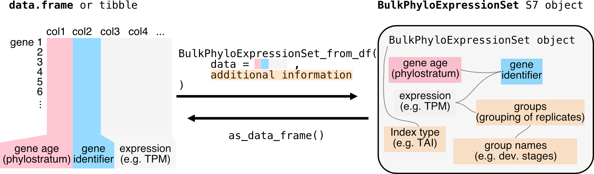

## S7 BulkPhyloExpressionSet and ScPhyloExpressionSet objects

Starting from `myTAIv2`, we moved on from the traditional `data.frame` to the new [`S7 OOP system`](https://rconsortium.github.io/S7/) to facilitate fast and flexible computation for evolutionary transcriptomics analyses.

To illustrate this, we will use the example data `example_phyex_set`. The `BulkPhyloExpressionSet` and `ScPhyloExpressionSet` objects are designed to store gene expression data along with associated metadata such as gene age information (or [`phylorank`](phylostratigraphy.html)), experiment type and other relevant properties.

We will first focus on the `BulkPhyloExpressionSet` object, which is for bulk RNA-seq data.

```{r message = FALSE}
library(myTAI)
data("example_phyex_set")
```

```{r echo=FALSE}
#### IMPORTANT & potentially TEMPORARY
#### I have to add this or else print and plot doesn't interact with the S7 object well.
S7::method(plot, TestResult) <- function(test_result) {
    library(ggplot2)
    p <- ggplot(data.frame(x = test_result@null_sample),
                aes(x = x)) +
        geom_histogram(
            aes(y = after_stat(density), fill = "Null Sample"),
            bins = 100,
            alpha = 0.7,
            colour = "gray66") +
        geom_vline(
            aes(xintercept = test_result@test_stat, colour = "Test Statistic"),
            linewidth = 1) +
        stat_function(fun = test_result@fitting_dist@pdf, args = test_result@params, aes(colour = "Fitted Null")) +
        scale_fill_manual(name = NULL, values = c("Null Sample" = "gray67")) +
        scale_colour_manual(name = NULL, values = c("Test Statistic" = "red", "Fitted Null" = "gray40")) +
        labs(x = "Score", y = "Density") +
        annotate("text",
                   x = test_result@test_stat - 0.05 * diff(range(test_result@null_sample)),
                   y = max(density(test_result@null_sample)$y) * 0.9,
                   label = exp_p(test_result@p_value),
                   parse=TRUE,
                   hjust = 1,
                   size = 3.5) +
        theme_minimal()

    return(p)
}

S7::method(print, BulkPhyloExpressionSet) <- function(x, ...) {
    # Print base information (inline parent method)
    cat("PhyloExpressionSet object\n")
    cat("Class:", class(x)[[1]], "\n")
    cat("Name:", x@name, "\n")
    cat("Species:", ifelse(is.null(x@species), "Not specified", x@species), "\n")
    cat("Index type:", x@index_type, "\n")
    cat(x@identities_label, ":", paste(as.character(x@identities), collapse = ", "), "\n")
    cat("Number of genes:", x@num_genes, "\n")
    cat("Number of", tolower(x@identities_label), ":", x@num_identities, "\n")
    cat("Number of phylostrata:", x@num_strata, "\n")
    
    # Print bulk-specific information
    cat("Number of samples:", x@num_samples, "\n")
    cat("Samples per condition:", table(x@groups), "\n")
}
```

```{r message = FALSE, eval=FALSE}
# inspect the object
example_phyex_set
```

<details> <summary>Show output</summary>
```{r message = FALSE, echo=FALSE}
print(example_phyex_set)
```
</details>

<details> <summary>More on `S7` and the `BulkPhyloExpressionSet` object</summary>

```{r message = FALSE, eval=FALSE}
S7::prop_names(example_phyex_set)
```
<details> <summary>Show output</summary>
```{r message = FALSE, echo=FALSE}
S7::prop_names(example_phyex_set)
```
</details>

```{r message = FALSE, eval = FALSE}
# let's explore the properties using @
# for example:
example_phyex_set@strata |> head()
example_phyex_set@gene_ids |> head()
example_phyex_set@expression[1:4,1:5]
```

See how rich this `BulkPhyloExpressionSet` object is!

The `BulkPhyloExpressionSet` is designed to ensure efficient interaction with `myTAIv2` functions. For example, if you try the `myTAI::stat_flatline_test()` function twice, i.e.

```{r message = FALSE, eval = FALSE}
myTAI::stat_flatline_test(example_phyex_set)
myTAI::stat_flatline_test(example_phyex_set)
``` 

you will notice that the permutations are already pre-computed for the second run so that you don't need to wait a couple of seconds again. Note, we will get to the `stat_flatline_test` function in the [statistical testing vignette](tai-stats.html).

</details>

But how do you get your `.tsv` and `.csv` files and convert your `data.frame` and `tibble` to a S7 `BulkPhyloExpressionSet` object?

:::{.note}
We will mention the transcriptome age index (TAI) a lot. See [📚](phylostratigraphy.html#gene-age-information-in-tai) for more details on the `TAI` and its formula: \( TAI_s = \frac{\sum_{i=1}^{n} ps_i \cdot e_{is}}{\sum_{i=1}^{n} e_{is}} \), where \( e_{is} \) is the expression level of gene \( i \) at a given sample \( s \) (e.g. a biological replicate for a developmental stage), and \( ps_i \) is the evolutionary age of gene \( i \).
:::

## Constructing BulkPhyloExpressionSet and ScPhyloExpressionSet

The necessary and sufficient information needed for creating a `BulkPhyloExpressionSet` (as well as a `ScPhyloExpressionSet`) object is:  
(1) A matrix or data frame of gene expression values (genes x samples).  
(2) A numerical value or factored string associated with each gene, typically gene age ranks or [`phylorank`](phylostratigraphy.html) for `TAI` (but also [`deciled dNdS values`](other_strata.html) for `TDI` or [`deciled tau values`](other_strata.html) for `TSI` etc.).



### Loading raw data

The raw outputs of (1) gene expression quantification and (2) gene age inference can typically be found in the form of a tab-separated `.tsv` or comma-separated `.csv` file format. One useful package to do this is `readr`, using the functions `readr::read_csv()` or `readr::read_tsv()`. For `.csv` files, if `readr::read_csv()` doesn't work, try `readr::read_csv2()` in European locales.

### Mock (bulk) dataset for BulkPhyloExpressionSet

#### Bulk RNA-seq data without replicates

In this example, we are using a dataset with only one entry per stage (no replicates).

```{r message = FALSE}
data("example_phyex_set_old")
example_expression <- 
    example_phyex_set_old@expression |> 
    as.data.frame() |> 
    tibble::rownames_to_column(var = "GeneID")
example_phylorank <-
    example_phyex_set_old@strata
```

```{r message = FALSE, eval = FALSE}
# let's explore the example expression dataset
# for example:
example_expression |> head()
```

<details> <summary>Show output</summary>
```{r message = FALSE, echo=FALSE}
example_expression |> head()
```
As you can see, there is one column as the gene identifier and the rest of the columns are the expression values for each developmental stage. Instead of developmental stage, one can also use experimental conditions, e.g. `control`, `treatment`, etc.

</details>
 
Now we construct the input data.frame for `as_BulkPhyloExpressionSet()`

```{r message = FALSE}
example_phyex_set.df <-
    data.frame(phylorank = example_phylorank) |>
    tibble::rownames_to_column(var = "GeneID") |>
    dplyr::select(phylorank, GeneID) |>
    dplyr::left_join(example_expression, by = "GeneID")
```

```{r message = FALSE, eval=FALSE}
example_phyex_set.df |> head()
example_phyex_set.df |> str()
```

<details> <summary>Show output</summary>
```{r message = FALSE, echo=FALSE}
example_phyex_set.df |> head()
example_phyex_set.df |> str()
```
</details>

::: {.important}
**Requirements for the input `data.frame` to the `as_BulkPhyloExpressionSet()` function:**  
column 1 contains the phylorank information, which can be either numeric or factors.  
column 2 contains the gene identifier (here called `GeneID`).  
column 3 onwards contain the expression data with the column titles being the developmental stages or the experimental conditions.
:::

The example `example_phyex_set.df` is now formatted to meet the requirements for the `as_BulkPhyloExpressionSet()` function.

::: {.tip}
The `as_BulkPhyloExpressionSet()` function will automatically detect the first column as the phylorank and the second column as the gene identifier. If your data is structured differently, you can reassign the columns accordingly using `dplyr::relocate()`.
:::

Now, we can use the `as_BulkPhyloExpressionSet()` function to convert the correctly formatted input `data.frame` to a `BulkPhyloExpressionSet` object.

```{r warning=FALSE, message=FALSE}
example_phyex_set.remake <- 
    myTAI::as_BulkPhyloExpressionSet(
        example_phyex_set.df,
        name = "reconstituted phyex_set_old")
```

There you have it, a `BulkPhyloExpressionSet` object!

```{r message = FALSE, eval=FALSE}
example_phyex_set.remake
```

<details> <summary>Show output</summary>
```{r message = FALSE, echo=FALSE}
print(example_phyex_set.remake)
```
</details>

You can further explore the properties of the `BulkPhyloExpressionSet` object using the `@` operator, for example: `example_phyex_set.remake@counts |> head()`.

... and plot your transcriptome age index!

```{r message = FALSE, fig.height=4, fig.width=6, fig.alt="plot signature function output for bulk RNAseq", dev.args = list(bg = 'transparent'), fig.align='center'}
example_phyex_set.remake |> 
    myTAI::plot_signature()
```


#### What if the dataset contains replicates?

This is exactly the case for the new `example_phyex_set` dataset (not like `example_phyex_set_old`), which contains replicates for each developmental stage. The `as_BulkPhyloExpressionSet()` function can handle this as well, as long as we use the `groups` parameter to specify the grouping of replicates, i.e.


```{r message = FALSE}
data("example_phyex_set") # not data("example_phyex_set_old")
example_expression <- 
    example_phyex_set@expression |> 
    as.data.frame() |> 
    tibble::rownames_to_column(var = "GeneID")
example_phylorank <-
    example_phyex_set@strata

example_phyex_set.df <-
    data.frame(phylorank = example_phylorank) |>
    tibble::rownames_to_column(var = "GeneID") |>
    dplyr::select(phylorank, GeneID) |>
    dplyr::left_join(example_expression, by = "GeneID")
```

```{r message = FALSE, eval=FALSE}
colnames(example_phyex_set.df)
```
<details> <summary>Show output</summary>
```{r message = FALSE, echo=FALSE}
colnames(example_phyex_set.df)
```
</details>

As you can see, this dataset has three replicates per stage.

```{r message = FALSE}
groups_example_phyex_set.df <- c(
            rep("Preglobular",3), 
            rep("Globular",3), 
            rep("Early Heart",3), 
            rep("Late Heart",3), 
            rep("Early Torpedo",3), 
            rep("Late Torpedo",3), 
            rep("Bent Cotyledon",3), 
            rep("Mature Green",3))

# we can add the group information using groups
example_phyex_set.remake <- 
    myTAI::as_BulkPhyloExpressionSet(
        example_phyex_set.df,
        groups = groups_example_phyex_set.df, # adding group information here
        name = "reconstituted phyex_set")
```

Done!

::: {.tip}
Along with the `groups` parameter, you can also specify the `name`, `strata_labels` and other parameters to provide more descriptions for your `BulkPhyloExpressionSet` object. This is useful for plotting and visualisation purposes. Check this using `?` before the function (i.e. `?myTAI::as_BulkPhyloExpressionSet()`.
:::

### Mock single-cell dataset for ScPhyloExpressionSet

If you are interested in single cell RNA-seq data, the process is similar, but you will need to ensure that your data is structured correctly for single cell analysis, i.e. as a [`seurat object`](https://satijalab.org/seurat/articles/pbmc3k_tutorial.html). 

You can then use the `as_ScPhyloExpressionSet()` function with adjustments to the relevant metadata.


```{r message = FALSE, warning=FALSE, eval = requireNamespace("Seurat", quietly = TRUE)}
# Load the relevant packages
library(dplyr)
library(Seurat)

pbmc_raw <- read.table(
  file = system.file('extdata', 'pbmc_raw.txt', package = 'Seurat'),
  as.is = TRUE
)
```

The input file for `Seurat::CreateSeuratObject()` is a tab-separated file with the first column as gene identifiers and the rest of the columns as expression values for each cell. The `pbmc_raw` object is a data frame with gene expression data.

```{r message = FALSE, eval=FALSE}
head(pbmc_raw)
```
<details> <summary>Show output</summary>
```{r message = FALSE, eval = requireNamespace("Seurat", quietly = TRUE), echo=FALSE}
head(pbmc_raw)
```
</details>


Now, we create a Seurat object. i.e.

```{r message = FALSE, warning = FALSE, eval = requireNamespace("Seurat", quietly = TRUE)}
pbmc_small <- CreateSeuratObject(counts = pbmc_raw)
```

```{r message = FALSE, eval = requireNamespace("Seurat", quietly = TRUE)}
is(pbmc_small)
```

Now, we can convert this Seurat object to a `ScPhyloExpressionSet` object using the `as_ScPhyloExpressionSet()` function.

The next part is a bit tricky, as you need to provide the phylorank information in a specific format with the same gene identifiers as that of `pbmc_small`.

We will generate **random** phyloranks for each gene as integers.

```{r message = FALSE, eval = requireNamespace("Seurat", quietly = TRUE)}
gene_names <- pbmc_small |> rownames()
example_phylorank_sc <- 
    setNames(sample(1:10, length(gene_names), replace = TRUE), gene_names) |>
    as.factor()
```

```{r message = FALSE, eval = requireNamespace("Seurat", quietly = TRUE)}
example_phyex_set_sc <- 
    myTAI::as_ScPhyloExpressionSet(
        pbmc_small,
        strata = example_phylorank_sc)
```

<details> <summary>Example of a downstream analysis</summary>
Here, we will go a bit deeper and cluster the `pbmc_small` object before integrating this to the `myTAIv2` workflow.

```{r message = FALSE, warning=FALSE, eval = requireNamespace("Seurat", quietly = TRUE)}
# example workflow to cluster the single cell data
pbmc_small <- Seurat::NormalizeData(pbmc_small)
pbmc_small <- Seurat::FindVariableFeatures(pbmc_small, selection.method = "vst", nfeatures = 20)
pbmc_small <- Seurat::ScaleData(pbmc_small)
pbmc_small <- Seurat::RunPCA(pbmc_small, features = VariableFeatures(object = pbmc_small))
pbmc_small <- Seurat::FindNeighbors(pbmc_small, dims = 1:10)
pbmc_small.cluster <- Seurat::FindClusters(pbmc_small, resolution = 0.8)
```

```{r message = FALSE, eval = requireNamespace("Seurat", quietly = TRUE)}
example_phyex_set_sc.cluster <- 
    myTAI::as_ScPhyloExpressionSet(
        pbmc_small.cluster,
        strata = example_phylorank_sc)
```

Now we have the `ScPhyloExpressionSet` object, 

```{r message = FALSE, eval = FALSE}
example_phyex_set_sc.cluster
```
<details> <summary>Show output</summary>
```{r echo=FALSE}
#### IMPORTANT & potentially TEMPORARY
#### I have to add this or else print and plot doesn't interact with the S7 object well.
S7::method(print, ScPhyloExpressionSet) <- function(x, ...) {
    # Print base information (inline parent method)
    cat("PhyloExpressionSet object\n")
    cat("Class:", class(x)[[1]], "\n")
    cat("Name:", x@name, "\n")
    cat("Species:", ifelse(is.null(x@species), "Not specified", x@species), "\n")
    cat("Index type:", x@index_type, "\n")
    cat(x@identities_label, ":", paste(as.character(x@identities), collapse = ", "), "\n")
    cat("Number of genes:", x@num_genes, "\n")
    cat("Number of", tolower(x@identities_label), ":", x@num_identities, "\n")
    cat("Number of phylostrata:", x@num_strata, "\n")
    
    # Print single-cell specific information
    cat("Expression layer used:", x@layer, "\n")
    cat("Total cells:", ncol(x@seurat), "\n")
    cat("Valid cells:", x@num_samples, "\n")
    cat("Cells per type:\n")
    print(table(x@groups))
}
```
```{r message = FALSE, echo=FALSE, eval=requireNamespace("Seurat", quietly = TRUE)}
print(example_phyex_set_sc.cluster)
```
</details>

... which you can now plot!

```{r message = FALSE, fig.height=4, fig.width=6, fig.alt="plot signature function output for single cell", dev.args = list(bg = 'transparent'), fig.align='center', eval = requireNamespace("Seurat", quietly = TRUE)}
myTAI::plot_signature(example_phyex_set_sc.cluster)
```

::: {.important}
This example used an example Seurat object with a mock phylorank dataset (random gene age assignment) and an example workflow. In practice, you will have to follow the best standards for single cell RNA-seq data analysis, including quality control, normalisation, and clustering steps. And assign real phylorank information to the genes in your dataset (to do this, see the [phylostratigraphy vignette](phylostratigraphy.html)).
:::
</details>

## Summary

In this section, we have learned how to create `BulkPhyloExpressionSet` and `ScPhyloExpressionSet` objects from raw gene expression data and phylorank information. This object is essential for performing evolutionary transcriptomics analyses using the `myTAI` package, and provides a structured way to store and manipulate evolutionary transcriptomics data, making it easier to perform various analyses and visualisations.
