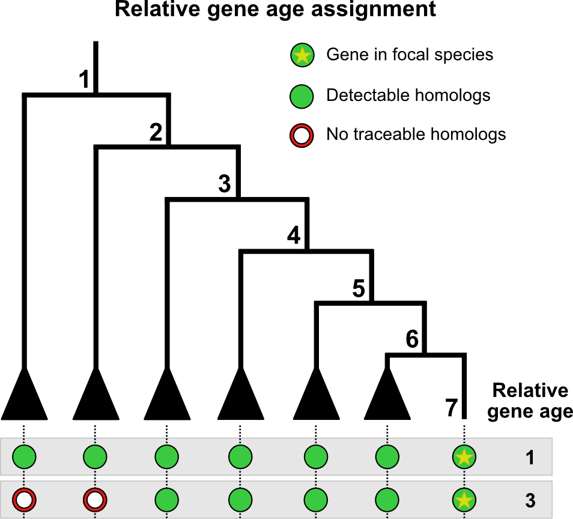

## What is genomic phylostratigraphy?

Genomic phylostratigraphy is a method to date the evolutionary emergence of a given gene (i.e. `gene age inference`), typically done for all genes in a genome. In practice, one performs homology searches against a taxonomically-informed database such as the NCBI NR, and then parse the output to obtain an evolutionary-informed readout.



<p style="font-size:10px;"> Overview of gene age inference. Here, we are searching two genes from the genome of interest against a taxonomically-informed database. The first gene is assigned as *relative age* 1 since homologues can be found as far as node 1. The second gene is assigned as *relative age* 3 since homologues can be found only up to node 3. Adapted from [Barrera-Redondo et al., 2023](https://link.springer.com/article/10.1186/s13059-023-02895-z). </p>

The output can be fed into `myTAIv2` and, combined with expression data, is used to compute the transcriptome age index (`TAI`). More specifically, gene age inference generates a table storing the gene age in the first column and the corresponding gene id of the organism of interest in the second column. This table is named _phylostratigraphic map_ (or _phylomap_).

:::{.note}
For quick users, there are several recent software developed for gene age inference such as [`GenEra`](https://github.com/josuebarrera/GenEra) and [`oggmap`](https://github.com/kullrich/oggmap).

<details> <summary>Example `GenEra` workflow</summary>
Assuming that the user has installed GenEra.  

(1) Download a taxonomically-resolved protein sequence database such as the NCBI nr, as well as prot.accession2taxid and taxonomy dump from the NCBI.  

(2) Run [`diamond makedb`](https://github.com/bbuchfink/diamond).  

```bash
diamond makedb \
 --in nr \
 --db nr \
 --taxonmap prot.accession2taxid \
 --taxonnodes taxdump/nodes.dmp \
 --taxonnames taxdump/names.dmp
```

(3) Run [`GenEra`](https://github.com/josuebarrera/GenEra).   
```bash
genEra -q [query_sequences.fasta] -t [query_taxid] -b [path/to/nr] -d [path/to/taxdump]
```

</details>
:::

But we hope you stay for the debate/discussion!

## Gene age information in TAI

`TAI` ([Domazet-Lošo & Tautz, 2010](https://www.nature.com/articles/nature09632)) is calculated as:

$$
{TAI}_s = \frac{\sum_{i=1}^{n} {ps}_i \cdot e_{is}}{\sum_{i=1}^{n} e_{is}}
$$

where \( e_{is} \) is the expression level of gene \( i \) at a given sample \( s \) (e.g. a biological replicate for a developmental stage), and \( {ps}_i \) is the evolutionary age of gene \( i \).  

For developmental time-course data, \( {TAI}_s \) can be grouped for each stage (if replicate data exists) and compared across developmental stages to obtain the overall TAI profile.  
For pairwise comparisons (see [📈](tai-stats.html)), \( {TAI}_s \) can be grouped as one of the conditions to be compared.  
For single cell data, (see [📊](phylo-expression-object.html)), \( {TAI}_s \) is the TAI for a given cell or cell type (if pseudo-bulked).  

Thus, TAI represents the expression-weighted mean gene age. Accurate inference of gene age that scales to all genes in the genome is thus key.

## The debate

Despite its simplicity, since the first studies ([Domazet-Loso et al., 2007](https://doi.org/10.1016/j.tig.2007.08.014)), the method and concept underlying genomic phylostratigraphy has been subject to intense discussions ([Capra et al., 2013](https://doi.org/10.1016/j.tig.2013.07.001); [Altenhoff et al., 2016](https://www.nature.com/articles/nmeth.3830.pdf); [Liebeskind et al., 2016](https://doi.org/10.1093/gbe/evw113); [Domazet-Loso et al., 2017](https://doi.org/10.1093/molbev/msw284); [Yin et al., 2018](https://doi.org/10.1093/bib/bby074); [Casola 2018](https://doi.org/10.1093/gbe/evy231); [Weisman et al., 2020](https://doi.org/10.1371/journal.pbio.3000862); [Futo et al., 2021](https://doi.org/10.1093/molbev/msaa217); [Weisman et al., 2022](https://doi.org/10.1016/j.cub.2022.04.085);  [Barrera-Redondo et al., 2023](https://link.springer.com/article/10.1186/s13059-023-02895-z); etc.).

The crux of the discussion focuses on the homology search bias, though several studies have also noted database bias (e.g., species representation and contamination) and evolutionary assumptions (e.g., Dollo parsimony).

### Homology search bias

The first phylostratigraphy studies used `BLASTp`, which performs pairwise protein sequence alignment, for the homology search step. At the time of these study (late-2000s/early-2010s), `BLASTp` was chosen as it balanced the requirements of sensitivity and speed when performing sequence homology searches against (at that time) a large databases.

The following discussions pertain to the potential biases with `BLASTp` in particular and pairwise sequence aligners in general.

<details>
  <summary>**`BLASTp` underestimates of gene age (for certain genes)**</summary>
  Moyers & Zhang argue that the use of `BLASTp` genomic phylostratigraphy
  
  1) underestimates gene age for a considerable fraction of genes, 
  
  2) is biased for rapidly evolving proteins which are short, and/or their most conserved block of sites is small, and 
  
  3) these biases create spurious nonuniform distributions of various gene properties among age groups, many of which cannot be predicted a priori ([Moyers & Zhang, 2015](https://doi.org/10.1093/molbev/msu286);  [Moyers & Zhang, 2016](https://doi.org/10.1093/molbev/msw008); [Liebeskind et al., 2016](https://doi.org/10.1093/gbe/evw113)).
  
  However, these arguments were based on simulated data and were inconclusive due to [errors in their analyses](https://doi.org/10.1093/molbev/msw202). Furthermore, [Domazet-Loso et al., 2017](https://doi.org/10.1093/molbev/msw284) provide convincing evidence that there is __no__ phylostratigraphic bias. As a response,
[Moyers & Zhang, 2017](https://doi.org/10.1093/gbe/evx109) published a counter-study stating that a phylostratigraphic trend claimed by [Domazet-Loso et al., 2017](https://doi.org/10.1093/molbev/msw284) to be robust to error disappears when genes likely to be error-resistant are analyzed. [Moyers & Zhang, 2017](https://doi.org/10.1093/gbe/evx109) further suggest a more robust methodology for controlling for the effects of error by first restricting to those genes which can be simulated and then removing those genes which, through simulation, have been shown to be error-prone (see also [Moyers & Zhang, 2018](https://doi.org/10.1093/gbe/evy161)).

In general, an objective benchmarking set representing the tree of life is still missing and therefore any procedure aiming to quantify gene ages will be biased to some degree. Based on this discussion [Liebeskind et al., 2016](https://doi.org/10.1093/gbe/evw113) suggest inferring gene age by combining several common orthology inference algorithms to create gene age datasets and then characterize the error around each age-call on a per-gene and per-algorithm basis. Using this approach systematic error was found to be a large factor in estimating gene age, suggesting that simple consensus algorithms are not enough to give a reliable point estimate ([Liebeskind et al., 2016](https://doi.org/10.1093/gbe/evw113)). This was also observed by [Moyers & Zhang, 2018](https://doi.org/10.1093/gbe/evy161) when running alternative tools such as `PSIBLAST`, `HMMER`, `OMA`, etc. However, by generating a consensus gene age and quantifying the possible error in each workflow step, [Liebeskind et al., 2016](https://doi.org/10.1093/gbe/evw113) provide a very useful [database](https://github.com/marcottelab/Gene-Ages) of
consensus gene ages for a variety of genomes. 

Alternatively, [Smith & Pease, 2016](https://doi.org/10.1093/bib/bbw034) argues that _de novo_ gene birth/death and gene family expansion/contraction studies should avoid drawing direct inferences of evolutionary relatedness from measures of sequence similarity alone, and should instead, where possible, use more rigorous phylogeny-based methods. For this purpose, we recommend researchers to consult the [phylomedb database](https://orthology.phylomedb.org/) to retrieve phylogeny-based gene orthology relationships and use these age estimates in combination with `myTAI`. Similarly, users can also retrieve gene ages from [EggNOG database](http://eggnog5.embl.de/#/app/home) using [`orthomap`](https://github.com/kullrich/orthomap). Alternatively, users might find the simulation based removal approach proposed by [Moyers & Zhang, 2018](https://doi.org/10.1093/gbe/evy161) more suitable.

</details> 


<details>
  <summary>**`BLASTp` parameters are complicated**</summary>
  
  In these extensive debates, one aspect that is often missed and can be directly corrected by an interested user is the bioinformatics/technical aspect of using `BLASTp` or any other BLAST-like tool for gene age inference. Namely, `BLASTp` hits are biased by the use of the default argument `max_target_seqs` ([Shah et al., 2018](https://doi.org/10.1093/bioinformatics/bty833)). The main issue of how this `max_target_seqs` is set is that:

> According to the BLAST documentation itself (2008), this parameter represents the 'number of aligned sequences to keep'. This statement is commonly interpreted as meaning that BLAST will return the top N database hits for a sequence query if the value of max_target_seqs is set to N. For example, in a recent article (Wang et al., 2016) the authors explicitly state 'Setting 'max target seqs' as '1' only the best match result was considered'.
> __To our surprise, we have recently discovered that this intuition is incorrect.__ Instead, BLAST returns the first N hits that exceed the specified E-value threshold, which may or may not be the highest scoring N hits. The invocation using the parameter '-max_target_seqs 1' simply returns the first good hit found in the database, not the best hit as one would assume. Worse yet, the output produced depends on the order in which the sequences occur in the database. For the same query, different results will be returned by BLAST when using different versions of the database even if all versions contain the same best hit for this database sequence. Even ordering the database in a different way would cause BLAST to return a different 'top hit' when setting the max_target_seqs parameter to 1.
> - Shah et al., 2018

The solution to this issue seems to be that any `BLASTp` search must be performed with a significantly high `-max_target_seqs`, e.g. `-max_target_seqs 10000` (see https://gist.github.com/sujaikumar/504b3b7024eaf3a04ef5 for details) and best hits
must be filtered subsequently. It is not clear from any of the studies referenced above how the best `BLASTp` hit was retrieved and which `-max_target_seqs` values were used to perform `BLASTp` searches in the respective study. Thus, the comparability of the results between studies is impossible and any individual claim made in these studies might be biased. 

In addition, the `-max_target_seqs` argument issue seems not to be the only issue that might influence technical differences in `BLASTp` hit results. [Gonzalez-Pech et al., 2018](https://doi.org/10.1093/bioinformatics/bty1018) discuss another problem of retrieving the best `BLASTp` hits based on `E-value` thresholds. 

> Many users assume that BLAST alignment hits with E-values
less than or equal to the predefined threshold (e.g. 10^-5^ via the specification of  evalue 1e-5) are identified after the search is completed, in a final step to rank all alignments by E-value, from the
smallest (on the top of the list of results) to the largest E-value (at
the bottom of the list).
>__However, the E-value filtering step does not occur at the final
stage of BLAST; it occurs earlier during the scanning phase (Altschul
et al., 1997; Camacho et al., 2009). During this phase, a gapped
alignment is generated using less-sensitive heuristic parameters
(Camacho et al., 2009); alignments with an E-value that satisfies the
defined cut-off are included in the subsequent phase of the BLAST
algorithm (and eventually reported). During the final (trace-back)
phase, these gapped alignments are further adjusted using moresensitive heuristic parameters (Camacho et al., 2009), and the
E-value for each of these refined alignments is then recalculated.__
> - Gonzalez-Pech et al., 2018

This means that if one study mentioned above ran a `BLASTp` search with a
BLAST parameter configuration of lets say `-max_target_seqs 250` (default value in BLAST) and `evalue 10` (default value in BLAST) and then subsequently selected the best hit which returned the smallest `E-value` and another study used the parameter configuration `-max_target_seqs 1` and `evalue 0.0001` then the results of both studies would not be comparable and the proposed gene age inference bias might simply result from a technical difference in running `BLASTp` searches.

In more detail, even if one study for example ran `BLASTp` with `evalue 10` (default value in BLAST) and then subsequently filtered for hits that resulted in `evalue < 0.0001` whereas another study ran `BLASTp` directly with `evalue 0.0001`, according to [Gonzalez-Pech et al., 2018](https://doi.org/10.1093/bioinformatics/bty1018) these studies although referring to the same `E-value` threshold for filtering hits will result in different sets of filtered `BLASTp` hits.

</details> 

### Alternatives to `BLASTp`

While BLASTP is considered the gold-standard tool for pairwise protein sequence alignment, newer approaches (such as [DIAMOND v2](https://github.com/bbuchfink/diamond) and [MMSeqs2](https://github.com/soedinglab/mmseqs2/)) have been developed, which can be used for gene age inference with the same sensitivity - just much faster. Redesigned parameters in these software can also overcome overlooked technical aspects of `BLASTp` such as the `-max_target_seqs`.

Beyond pairwise protein sequence aligners, gene ages can also be inferred via structural alignment, using synteny information and using orthogroups.

<details>
  <summary>**Accelerated and sensitive sequence alignment**</summary>
  
They retain the sensitivity of `BLASTp` while being thousands to hundred-folds faster. This speed-up is crucial as sequence databases increase in size. This is important for gene age inference and [DIAMOND v2](https://github.com/bbuchfink/diamond) and [MMSeqs2](https://github.com/soedinglab/mmseqs2/) have been employed in various phylostratigraphic and phylotranscriptomic analyses (either explicitly or under-the-hood in tools such as [OrthoFinder](https://github.com/davidemms/OrthoFinder), which uses DIAMOND by default) (see [Domazet-Loso et al., 2024](https://doi.org/10.1038/s41467-024-47017-w); [Ma & Zheng 2023](https://doi.org/10.1073/pnas.2216351120); [Manley et al., 2023](https://doi.org/10.1093/g3journal/jkad077)).

With `DIAMOND`, users can overcome the overlooked technical aspects of `BLASTp` such as the `max_target_seqs` issue by setting `--max-target-seqs` to `0` (or simply `-k0`). Furthermore, the `--ultra-sensitive` mode can be employed, which is as sensitive as `BLASTp` while being 80x faster (see [Fig 1. in the DIAMOND paper](https://www.nature.com/articles/s41592-021-01101-x/figures/1)).

[GenEra](https://github.com/josuebarrera/GenEra), a recently developed gene age inference tool, utilises [DIAMOND v2](https://github.com/bbuchfink/diamond) with appropriate parameter settings by default. Users can also specify the use of [MMSeqs2](https://github.com/soedinglab/mmseqs2/) ([Barrera-Redondo et al., 2023](https://doi.org/10.1186/s13059-023-02895-z)). Potential issues such as _homology detection failure_ can be overcome by providing a pair-wise evolutionary distance file as an input. Furthermore, users can set thresholds such as for `taxonomic representativeness` to filter evolutionarily inconsistent matches to the database, i.e. matches stemming from database contamination or horizontal gene transfer.

</details>

<details>
  <summary>**Protein structure-based gene age inference**</summary>
  
Advances in protein structure prediction have enabled the inference of protein structure across the tree of life in a speedy manner. With this new data, protein structure aligners such as [`FoldSeek`](https://github.com/steineggerlab/foldseek) can be used instead of sequence aligners for gene age inference. 

In the context of gene age inference, sequence-based alignments have not been extensively studied compared to sequence-based alignments. However, interested users can check out the `FoldSeek` option for [GenEra](https://github.com/josuebarrera/GenEra).

</details>

<details>
  <summary>**Synteny-based gene age inference**</summary>

A recently introduced approach is called `synteny-based phylostratigraphy` ([Arendsee et al., 2019](https://link.springer.com/article/10.1186/s12859-019-3023-y)). Here, the authors provide a comparative analysis of genes across evolutionary clades, augmenting standard phylostratigraphy with a detailed, synteny-based analysis. 

Whereas standard phylostratigraphy searches the proteomes of related species for similarities to focal genes, their `fagin` pipeline first finds syntenic genomic intervals and then searches within these intervals for any trace of similarity. 

`fagin` searches the (`in silico` translated) amino acid sequence of all unannotated ORFs as well as all known CDS within the syntenic search space of the target genomes. If no amino acid similarity is found within the syntenic search space, their `fagin` pipeline will search for nucleotide similarity. Finding nucleotide sequence similarity, but not amino acid similarity, is consistent with a `de novo` origin of the focal gene. If no similarity of any sort is found, their `fagin` pipeline will use the syntenic data to infer a possible reason. Thus, they detect indels, scrambled synteny, assembly issues, and regions of uncertain synteny ([Arendsee et al., 2019](https://link.springer.com/article/10.1186/s12859-019-3023-y)).

</details> 

<details>
  <summary>**Orthogroup-based gene age inference**</summary>
  The first studies in gene age inference used the framework of genomic phylostratigraphy, where each gene of the focal species is compared against a sequence database to find the most distantly related homologue ([Domazet-Loso et al., 2007](https://doi.org/10.1016/j.tig.2007.08.014)). Some more recent studies have instead inferred gene age using the node in the phylogeny that contains all members of an `orthogroup`.
  
  An orthogroup is a _group of genes descended from a single gene in the last common ancestor of a clade of species_. This framework has been very useful for phylogenetic inference and comparative transcriptomics. Since an orthogroup is a subset of all sequence homologues in the given dataset, a gene can hit genes outside of its orthogroup (using the same parameters on a pairwise sequence aligner).
  
  [OrthoFinder](https://github.com/davidemms/OrthoFinder) (a tool for phylogenetic orthology inference for comparative genomics) is commonly used in _orthogroup_-based gene age inference. The result of OrthoFinder includes the files `Orthogroups.tsv` (now [depreciated](https://github.com/davidemms/OrthoFinder#orthogroups-directory-deprecated)) and `Phylogenetic_Hierarchical_Orthogroups/N0.tsv`, which have been used for _orthogroup_-based TAI studies (e.g. [Ma & Zheng 2023](https://www.pnas.org/doi/full/10.1073/pnas.2216351120); [Nishimiya-Fujisawa et al., 2023](https://doi.org/10.1101/2023.07.04.546637 )). Incorporating these results into `myTAIv2` can be done using [`orthomap`](https://github.com/kullrich/orthomap) (see [documentation](https://orthomap.readthedocs.io/en/latest/)).

Methodologically, it should be stressed that while `Orthogroups.tsv` and `Phylogenetic_Hierarchical_Orthogroups/N0.tsv` contain orthogroups with more than one member (i.e. orthogroups with at least one orthologue or paralogue), users should be aware that these output files of OrthoFinder do not include singletons, which is a signature of a novel or species-specific gene. To incorporate singletons, users should include the genes in `Orthogroups_UnassignedGenes.tsv` output or, alternatively, singletons in the `Orthogroups.txt` file, and assign the singletons to the species-specific phylostrata in the study.

The _orthogroup_-based approach seems to be motivated by an assumption that the more restricted set of genes that consists of orthologues and in-paralogues (paralogues that arose after the species split) tends to have more similar attributes (e.g. conservation in function and/or expression pattern) than the larger set of genes that contains all sequence homologues. It follows that this framework should better reflect the 'gene age'. This assumption draws parallels to the `orthologue conjecture` (i.e. orthologues tend to have more conserved attributes than paralogues), which is heavily debated ([Gabaldon & Koonin 2013](https://www.nature.com/articles/nrg3456#Sec8); [Dunn et al., 2018](https://www.pnas.org/doi/abs/10.1073/pnas.1707515115); [Stamboulian et al., 2020](https://pubmed.ncbi.nlm.nih.gov/32657391/); etc.). In several cases, orthologues do not have more conserved attributes than paralogues. Indeed, 'shifts' or 'substitutions' in the expression profile of paralogues that arose before the species split are observed in single-cell studies ([Tarashansky et al., 2021](https://elifesciences.org/articles/66747); [Shafer et al., 2022](https://www.nature.com/articles/s41559-021-01580-3)).

Overall, it remains unclear whether inferring gene age using the _orthogroup_-based approach better captures evolutionary information than the classic genomic phylostratigraphy approach (all/unrestricted sequence homologues), given that several issues pertaining to genomic phylostratigraphy have been addressed (see [Barrera-Redondo et al., 2023](https://link.springer.com/article/10.1186/s13059-023-02895-z)).

</details> 

### Open questions

Regardless of the homology search algorithm choice, there remains some open issues with gene age inference.

<details>
  <summary>**Homology detection failure**</summary>
  
Small and fast-evolving genes are often wrongly annotated as young genes due to `homology detection failure`. This issue and potential solution in the context of gene age inference have been discussed by [Weisman et al., 2020](https://doi.org/10.1371/journal.pbio.3000862). 

> An alternative explanation for a lineage-specific gene is that nothing particularly special has happened in the gene's evolutionary history. The gene has homologs outside of the lineage (no de novo origination), and no novel function has emerged (no neofunctionalization), but despite this lack of novelty, computational similarity searches (e.g., BLAST) have failed to detect the out-of-lineage homologs. We refer to such unsuccessful searches as *homology detection failure*. As homologs diverge in sequence from one another, the statistical significance of their similarity declines. *Over evolutionary time, with a constant rate of sequence evolution, the degree of similarity may fall below the chosen significance threshold, resulting in a failure to detect the homolog*.
> - Weisman et al., 2020

Users can run their test, [`abSENSE`](https://github.com/caraweisman/abSENSE) to detect the _probability that a homolog of a given gene would fail to be detected by a homology search_. We note that a recently developed tool [`GenEra`](https://github.com/josuebarrera/GenEra) can automate `abSENSE` analysis for every gene in a given genome and provide an output compatible with `myTAIv2`.

:::{.important}
One drawback of the `homology detection failure test` approach is that a large percentage of genes are removed as *not* passing the test. This *may* be due to the conservative nature of the test and its assumptin regarding protein sequence evolution as detected via pairwise sequence alignment.

Downstream, the removal of genes can affects on the TAI computation since less genes are used to compute the TAI. Regardless, users can run `myTAI::select_genes()` with the gene passing from the `homology detection failure test` to filter the `BulkPhyloExpressionSet` or `ScPhyloExpressionSet` object before running `myTAI::plot_signature()`.
:::

</details> 

<details>
  <summary>**Dollo parsimony**</summary>
  
*Dollo parsimony*, which precludes the possibility that an identical character (gene) can be gained more than once, is a major conceptual assumption for gene age inference ([Galvez-Morante et al., 2024](https://doi.org/10.1093/gbe/evae062)).

This assumption has been found to overestimate ancestral gene content (i.e., pushing more genes to be evolutionarily older) on simulated data, when compared to a maximum likelihood-based approach that allows a gene family to be gained more than once within a tree (via convergent evolution and horizontal gene transfer).

A suitable method to overcome this limitation is yet to be developed for user-friendly gene age inference.

</details> 

<details>
  <summary>**Sequence contamination**</summary>
  
As we amass more and more genomic data across the tree of life, we inevitably accumulate sequences that are taxonomically mislabeled ([Steinegger & Salzberg 2020](https://link.springer.com/article/10.1186/s13059-020-02023-1)). These mislabeled sequences are thought to typically arise from sequencing contamination and biases gene age inference by overestimating the real age of the gene (i.e. as evolutionarily older).

The gene age inference software, `GenEra`, accounts for potential contamination to some extent. Upstream software can be employed to further address potential contamination but these are typically applied to query genomes and not the database (see [Balint et al., 2024](https://www.nature.com/articles/s41467-024-45024-5) and [Nevers et al., 2025](https://www.nature.com/articles/s41587-024-02147-w)).

To the best of our knowledge, while several bioinformatic solutions exists for query genome contamination, database sequence contamination remains a challenge.

</details> 

## Summary

Despite the ongoing debate about how to correctly infer gene age, users of `myTAIv2` can perform any gene age inference method they find most appropriate for their biological question and pass this gene age inference table as input to `myTAIv2`. 

To do so, users need to follow the data format specification vignette to use their gene age inference information with `myTAIv2`:  
→ [📊](phylo-expression-object.html)

As these discussions show, even when users rely on established procedures such as phylostratigraphy, the gene age inference bias will be present
as 'systematic error' in all developmental stages for which TAI computations are performed. Thus, _stages of constraint (or vice versa) will be detectable in any case._ 

Since TAI computation is intended to enable screening for conserved or constrained stages in developmental or biological processes for further downstream experimental studies, even simple approaches such as phylostratigraphy can give first evidence for the existence of transcriptomic constraints within a biological process.

Indeed, it has been observed that differences in gene age inference methods (e.g. [blastp e-value parameter](https://www.nature.com/articles/nature11394), or [mmseqs2 clustering coverage parameter](https://www.nature.com/articles/s41467-024-47017-w)) does not influence the overall TAI or other macro-evolutionary trends. We nevertheless encourage users to test different methods (and parameters) as described in this vignette and consider their strengths/limitation.

For other methods that can assign an evolutionarily-informed or expression-informed index for each gene (analogous to TAI) such as TDI, TSI, etc., see here:  
→ [🧬](other-strata.html) 

:::{.important}
Interested instead in studying a small set of genes and date their evolutionary age? We recommend more manual workflows that take multiple contexts (e.g. domain information, 3D protein structure and genomic synteny) into account. This vignette describes high throughput bioinformatic methods that scales to all genes in a given organism.
:::
